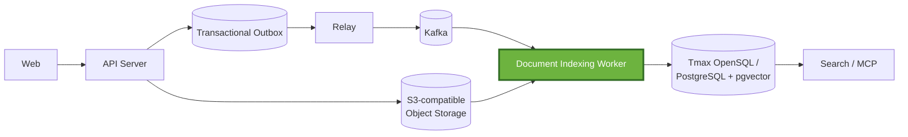
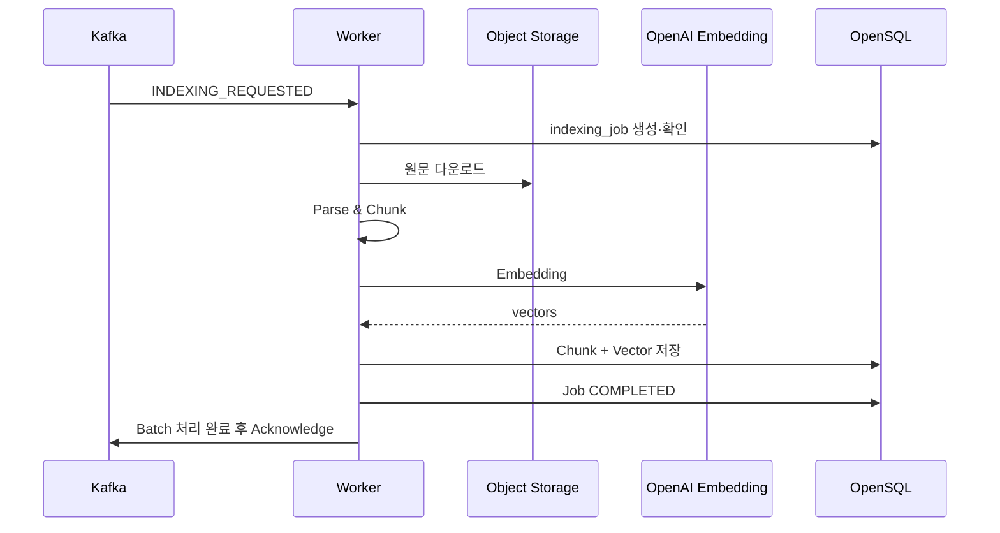
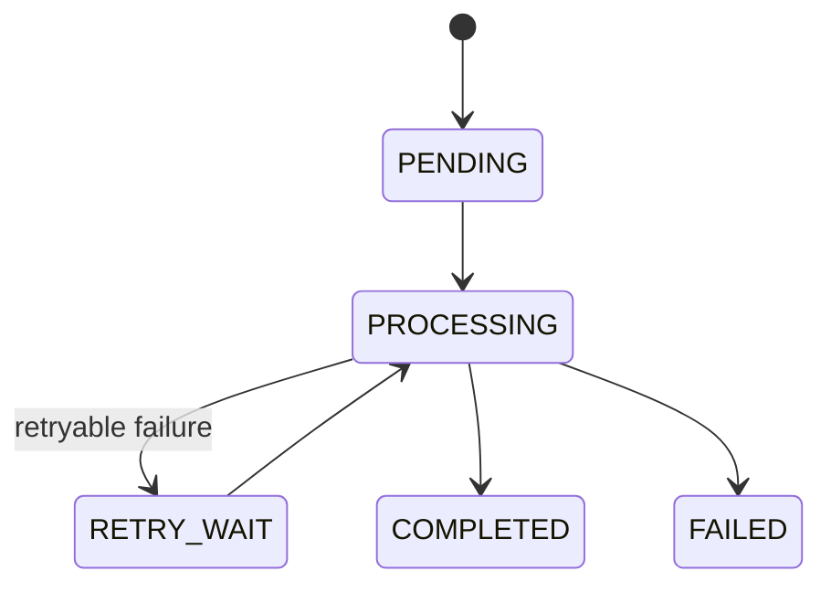

# AI Document Indexing Worker


Tmax OpenSQL 기반 AI 문서 관리 시스템의 비동기 인덱싱 Worker다. Kafka로
전달된 문서 이벤트를 받아 원문 다운로드, 파싱, 청킹, 임베딩, pgvector
저장까지 수행한다.

장시간 수행되는 AI 작업에서 발생할 수 있는 **Worker 장애, 중복 이벤트,
외부 API 장애, DB 장애**를 고려해 재처리와 멱등성을 중심으로 설계했다.

> 2026 공개SW 개발자대회 TmaxTibero 기업과제<br>
> **「Tmax OpenSQL 기반 AI 문서 관리 및 벡터 동기화 시스템」**

## 프로젝트 소개

전체 시스템은 업로드된 문서를 검색 가능한 벡터 데이터로 변환하고, 의미
기반 검색과 MCP 검색에서 활용할 수 있도록 동기화한다. 이 저장소는 업로드
API나 검색 API가 아니라 **Kafka 이후의 문서 인덱싱과 삭제 후처리**를
담당한다.

Worker가 처리하는 주요 범위는 다음과 같다.

-   `INDEXING_REQUESTED`와 `DOCUMENT_DELETED` Kafka 이벤트 소비
-   S3 호환 Object Storage에서 원문 다운로드 및 SHA-256 무결성 확인
-   PDF, DOCX, HWP, TXT, Markdown 파싱
-   설정 가능한 토큰·문단 기반 청킹
-   OpenAI 임베딩 생성과 1,536차원 결과 검증
-   `document_chunk` UPSERT, 문서 버전 완료 및 검색 버전 조건부 승격
-   `indexing_job` 기반 상태·재시도·Worker 인계 추적
-   문서 삭제 이벤트 처리와 삭제 누락 보정 스윕

| 과제 관점 | 전체 시스템의 역할 | 이 저장소의 역할 |
|---|---|---|
| 문서 업로드와 버전 관리 | Server가 원문과 문서 버전을 생성 | 생성된 `document`·`document_version`을 조회 |
| 변경 이벤트 동기화 | Outbox와 Relay가 Kafka에 이벤트 발행 | Kafka 이벤트를 소비해 인덱싱 또는 삭제 수행 |
| 자동 임베딩 | 업로드 이후 비동기 파이프라인 구성 | 파싱·청킹·OpenAI 임베딩·벡터 저장 수행 |
| 의미·키워드 검색 | Search/MCP가 검색 인터페이스 제공 | pgvector와 Nori 토큰 데이터를 준비 |
| 처리 안정성 | 각 컴포넌트가 소유 구간의 실패를 관리 | 수동 ACK, 멱등 저장, Job 재획득, 재시도 담당 |

## 시스템 아키텍처

아래에서 강조된 Worker가 이 저장소의 범위다. Web, Server, Outbox, Relay,
Search/MCP의 세부 구현은 다른 컴포넌트의 책임이다.



Kafka를 경계로 업로드 요청과 인덱싱을 분리하므로 파일 파싱과 외부 임베딩
API 호출이 업로드 응답 시간을 직접 점유하지 않는다. 대신 Kafka 중복
전달과 Worker 중단을 전제로 DB 결과가 같은 상태로 수렴하도록 설계한다.

## Worker가 해결하는 문제와 핵심 설계

### 비동기 인덱싱

**Problem**\
문서 다운로드·파싱·임베딩은 처리 시간이 길고 외부 시스템에 의존하므로
업로드 요청과 동기적으로 처리하기 어렵다.

**Decision**\
Server → Outbox → Relay → Kafka → Worker로 인덱싱 경로를 분리하고,
다운로드·파싱·임베딩은 DB 트랜잭션 밖에서 수행한다.

**Result**\
업로드와 인덱싱의 실행 수명을 분리하고, 장시간 외부 I/O 동안 DB
트랜잭션을 점유하지 않는다.

### 문서 단위 순서와 병렬 처리

**Problem**\
같은 문서의 이벤트는 순서가 중요하지만 서로 다른 문서까지 모두 직렬
처리하면 처리량이 떨어진다.

**Decision**\
Kafka record key를 기준으로 Batch를 그룹화하고, 같은 key의 record는 그룹
내부에서 순차 처리하며 서로 다른 key 그룹은 제한된 Executor에서 병렬
처리한다.

**Result**\
같은 key 범위의 처리 순서를 유지하면서 서로 독립적인 문서 작업은 병렬로
처리한다.

같은 문서 순서 보장은 Producer가 같은 `documentId`에 같은 Kafka key를
사용한다는 전제에 의존한다. Worker는 record key와 payload의
`documentId`가 일치하는지 별도로 검증하지 않는다.

### 장애 후 재처리와 멱등성

**Problem**\
Worker가 처리 도중 종료되면 미완료 작업을 다시 수행해야 하지만,
at-least-once 환경에서는 정상적인 중복 이벤트도 발생할 수 있다.

**Decision**\
`source_event_id`와 최초 Kafka `(topic, partition, offset)`을
`indexing_job`에 기록하고, 결정적 청킹·청크 UPSERT·검색 버전 fencing을
함께 사용한다.

**Result**\
동일 이벤트의 재발행은 멱등하게 무시하고, 동일 Kafka record의 재전달은
복구 가능한 Job을 다시 획득해 처리하며, 재실행 결과가 같은 DB 상태로
수렴하도록 한다.

## 인덱싱 처리 흐름



지원 MIME type은 다음과 같다.

-   PDF: `application/pdf`
-   DOCX:
    `application/vnd.openxmlformats-officedocument.wordprocessingml.document`
-   HWP: `application/x-hwp`, `application/haansofthwp`
-   Text/Markdown: `text/plain`, `text/markdown`

청킹 전략은 Worker 인스턴스의 전역 설정으로 선택한다.

-   `FIXED_TOKEN`: 전체 추출 텍스트를 토큰 상한으로 분할한다.
-   `PARAGRAPH`: 문단 경계를 유지하고 긴 문단만 분할한다.
-   `PARAGRAPH_OVERLAP`: 긴 문단을 overlap을 두고 분할한다.

Kafka Batch 처리, key별 병렬 실행, acknowledgment와 poll lifecycle의
상세 설계는 [Processing Model](링크_추가_예정)에서 설명한다.

## Job 상태와 멱등성



Worker는 `indexing_job`에 처리 상태와 Kafka record identity를 영속화하여
프로세스 메모리에 의존하지 않고 작업을 추적한다. 동일 이벤트 재수신
판정, Job 재획득 조건, 상태별 복구 방식의 상세 내용은 [Failure
Handling](링크_추가_예정)에서 설명한다.

## 장애 대응

| 장애 시나리오 | 대응 |
|---|---|
| Worker가 batch ACK 전에 종료 | 미커밋 Kafka record 재전달 후 복구 가능한 기존 Job 재처리 |
| 동일 이벤트 중복 발행 | `source_event_id`와 최초 Kafka record identity를 기준으로 멱등 처리 |
| 동일 Kafka record 재전달 | 저장된 `(topic, partition, offset)`으로 redelivery를 판별하고 Job 재획득 |
| OpenAI 429·5xx·네트워크 오류 등 | OpenAI client retry 이후 Worker 수준의 제한된 retry와 backoff |
| Object Storage·파싱의 일시 오류 | 재시도 가능한 오류로 처리 |
| DB 접근 실패 | Batch 완료를 보류하고 NACK 및 DB health gate를 통해 재처리 |
| 영구 오류 또는 재시도 한도 도달 | `FAILED` 상태로 종결 |
| 문서 삭제 이벤트 누락 | 삭제 대상 잔여 chunk를 주기적으로 탐색해 멱등 삭제 |

상세한 장애 감지 조건, 상태 전이, retry 정책, redelivery/republish 판정과 현재 보장 범위는 [Failure Handling & Recovery](링크_추가_예정)에 정리했습니다.

## OpenSQL 활용

Worker는 Tmax OpenSQL을 인덱싱 결과와 작업 상태의 영속 저장소로
사용한다. `document_chunk`에 청크와 1,536차원 임베딩을 저장하고,
`indexing_job`에 처리 상태와 Kafka record identity를 기록한다.

| 데이터 | Worker의 사용 방식 |
|---|---|
| `document` | tenant와 삭제 여부 확인, 더 높은 `embedding_version_no`만 검색 버전으로 승격 |
| `document_version` | 원본 위치·MIME·hash·버전 정보를 읽고, 완료 시 chunk 수와 `indexed_at` 갱신 |
| `document_chunk` | `(document_version_id, chunk_no)` 기준 UPSERT, Nori 토큰·JSONB metadata·`vector(1536)` 저장 |
| `indexing_job` | 이벤트 멱등 키, 처리 상태, 시도 횟수, Worker, 오류, Kafka 위치 기록 |

물리 스키마와 migration은 이 저장소에 포함되어 있지 않으며 Server/Core가
소유한 공용 스키마가 미리 준비되어 있어야 한다. Hibernate 설정도
`ddl-auto: none`이다.

HNSW/IVFFlat 검색 인덱스, OpenCrypto 기반 암호화, OpenSQL cluster HA
구성, 검색 API와 MCP 인터페이스는 전체 시스템의 다른 구성 요소가
담당하며 이 Worker의 구현 범위에는 포함되지 않는다.

## 설계 문서

| 문서 | 내용 |
|---|---|
| [Architecture](링크_추가_예정) | Worker의 책임과 경계, 시스템 컨텍스트, 주요 컴포넌트와 설계 결정 |
| [Processing Model](링크_추가_예정) | Kafka Batch, Partition, 순서 보장, 병렬 처리, ACK/NACK과 poll lifecycle |
| [Failure Handling](링크_추가_예정) | 장애 모델, 멱등성, 재처리 전략, 상태 전이와 보장 범위 |

## 테스트

기본 테스트는 외부 서비스 없이 H2와 test double을 사용해 listener
ACK/NACK, key별 순서, 파서, 청킹 결정성, retry 분류, publication 호출을
검증한다.

```bash
./gradlew test
```

`integration` tag 테스트는 실제 PostgreSQL/pgvector 공용 스키마를 사용해
Job 상태 전이, 고유 제약, 청크 삭제와 파이프라인 재시도를 검증한다.
안전을 위해 DB 이름에 `test` 또는 `integration`이 포함되어야 한다.

```bash
set -a
source .env
set +a
./gradlew integrationTest
```

실제 OpenAI 연동 테스트는 `OPENAI_API_KEY`가 설정된 경우에만 실행된다.

## 시작하기

### 요구 사항

-   JDK 21 또는 Docker
-   Kafka broker
-   Server/Core migration이 적용된 Tmax OpenSQL 또는 PostgreSQL +
    pgvector DB
-   원문이 저장된 S3 호환 Object Storage
-   OpenAI API key

이 저장소에는 Docker Compose와 DB migration이 없다. Worker만 실행하기
전에 외부 의존성과 공용 스키마를 먼저 준비해야 한다.

### 환경 변수

`.env.example`을 복사하고 빈 값을 실행 환경에 맞게 채운다.

```bash
cp .env.example .env
```

필수 런타임 설정은 다음과 같다.

| 환경 변수 | 설명 |
|---|---|
| `DB_URL` | OpenSQL/PostgreSQL JDBC URL |
| `DB_USERNAME`, `DB_PASSWORD` | DB 인증 정보 |
| `KAFKA_BOOTSTRAP_SERVERS` | Kafka bootstrap servers |
| `INDEXING_STORAGE_BUCKET` | 원문 Object Storage bucket |
| `OPENAI_API_KEY` | OpenAI embedding API key |
| `AWS_ACCESS_KEY_ID`, `AWS_SECRET_ACCESS_KEY` | AWS SDK 기본 자격 증명 체인에서 환경변수를 사용할 때 필요 |

주요 선택 설정은 다음과 같다.

| 환경 변수 | 기본값 | 설명 |
|---|---|---|
| `INDEXING_WORKER_ID` | 실행 시 UUID 생성 | Job과 로그에 기록할 Worker 식별자 |
| `INDEXING_KAFKA_TOPIC` | `doc.events.v1` | 소비 topic |
| `INDEXING_SUPPORTED_SCHEMA_VERSIONS` | `1` | 허용 이벤트 schema version 목록 |
| `INDEXING_BATCH_SIZE` | `10` | `max.poll.records` |
| `INDEXING_CONSUMER_CONCURRENCY` | `5` | 배치 작업·파싱 executor 크기. Kafka listener concurrency가 아님 |
| `INDEXING_MAX_ATTEMPTS` | `5` | Job 최대 시도 횟수 |
| `INDEXING_RETRY_BASE_DELAY` | `PT30S` | 선형 backoff 기준 간격 |
| `INDEXING_CHUNKING_STRATEGY` | `FIXED_TOKEN` | `FIXED_TOKEN`, `PARAGRAPH`, `PARAGRAPH_OVERLAP` |
| `INDEXING_MAX_TOKENS_PER_CHUNK` | `512` | 청크당 토큰 상한 |
| `INDEXING_OVERLAP_TOKENS` | `64` | overlap 전략의 겹침 토큰 수 |
| `INDEXING_MAX_CHUNKS` | `5000` | 문서당 청크 상한 |
| `INDEXING_MAX_TOTAL_TOKENS` | `2000000` | 문서당 전체 토큰 상한 |
| `INDEXING_MAX_FILE_SIZE_BYTES` | `209715200` | 다운로드 전 확인할 원문 크기 상한 |
| `INDEXING_PARSE_TIMEOUT` | `PT60S` | 파싱 제한 시간 |
| `INDEXING_EMBEDDING_MAX_TOKENS_PER_REQUEST` | `300000` | 임베딩 요청 분할 기준 |
| `INDEXING_STORAGE_ENDPOINT` | 빈 값 | MinIO 등 S3 호환 endpoint override |
| `INDEXING_STORAGE_REGION` | `us-east-1` | Storage region |
| `INDEXING_STORAGE_DOWNLOAD_TIMEOUT` | `PT30S` | Storage API call timeout |
| `FAULT_INJECTION_ENABLED` | `false` | 장애 재현용 blocking 활성화 |
| `FAULT_INJECTION_PHASE` | `EMBEDDING` | blocking phase |

DB health gate와 삭제 sweep 간격 등 나머지 설정은
[`application.yml`](src/main/resources/application.yml)에서 확인할 수
있다.

### 로컬 실행

```bash
set -a
source .env
set +a

./gradlew bootRun
```

JAR로 실행하려면 다음 명령을 사용한다.

```bash
./gradlew bootJar
java -jar build/libs/spr1n6-osscontest-worker-0.0.1-SNAPSHOT.jar
```

### Docker 실행

```bash
docker build -t osscontest-indexing-worker .

docker run --rm \
  --name aidocs-worker \
  --env-file .env \
  osscontest-indexing-worker
```

DB, Kafka, Object Storage 주소는 컨테이너에서 접근 가능한 주소여야 한다.
종료는 다음과 같이 수행한다.

```bash
docker stop aidocs-worker
```

Docker image는 non-root `worker` 사용자로 실행되며, health check는 HTTP
endpoint가 아니라 Java PID 1의 생존 여부를 확인한다.

## 기술 스택

| 영역 | 기술 |
|---|---|
| Language / Runtime | Kotlin 2.3.21, Java 21 |
| Build | Gradle Wrapper 8.14 |
| Application | Spring Boot 4.1.0, Spring Kafka, Spring Data JPA, Spring JDBC, Micrometer |
| Embedding | Spring AI 2.0.0 BOM, OpenAI `text-embedding-3-small`, 1,536 dimensions |
| Database | Tmax OpenSQL/PostgreSQL 호환 SQL, pgvector, JSONB, Hibernate Vector |
| Storage | AWS SDK for Java 2.46.7 BOM, S3-compatible API |
| Parsing | PDFBox 3.0.3, Apache POI 5.3.0, hwplib 1.1.9 |
| Tokenization | jtokkit 1.1.0 (`CL100K_BASE`), Lucene Nori 9.11.1 |
| Container | Eclipse Temurin 21, multi-stage Docker build |

## 프로젝트 구조

```text
src/main/kotlin/com/osscontest/worker/indexing
├── consumer/      # Kafka batch listener, event validation, ACK/NACK, DB health gate
├── retrieval/     # S3-compatible 원문 다운로드
├── parsing/       # MIME별 parser와 timeout guard
├── chunking/      # 청킹 전략, 토큰화, 청크 한도
├── embedding/     # OpenAI embedding, 결과 검증, Nori 토큰 생성
├── pipeline/      # Job 획득, 단계 조율, retry와 recovery 판정
├── publication/   # DB entity/repository, chunk UPSERT, 완료 transaction
├── deletion/      # 삭제 이벤트 후처리와 보정 sweep
└── fault/         # 환경변수 기반 장애 주입
```

## 관련 문서

-   [Architecture](링크_추가_예정)
-   [Processing Model](링크_추가_예정)
-   [Failure Handling](링크_추가_예정)
-   [코드 컨벤션](docs/CODE_CONVENTIONS.md)

상세 문서와 실제 코드가 충돌하면 현재 코드와 `application.yml`을
기준으로 판단한다.

## Contributing

변경 전 패키지 경계와 공용 DB 계약을 확인하고, 최소한 `./gradlew test`를
통과시킨다. 실제 DB 계약이나 OpenAI 연동을 변경하는 경우 전용
integration DB에서 `./gradlew integrationTest`도 실행한다.

## License

현재 저장소에는 `LICENSE` 파일이 포함되어 있지 않다. 배포·재사용 전에
프로젝트 소유자가 정한 라이선스를 확인해야 한다.
