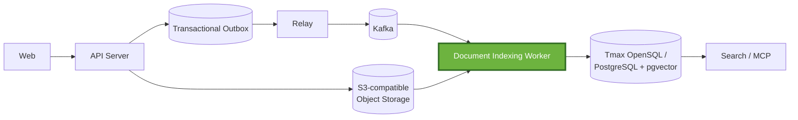
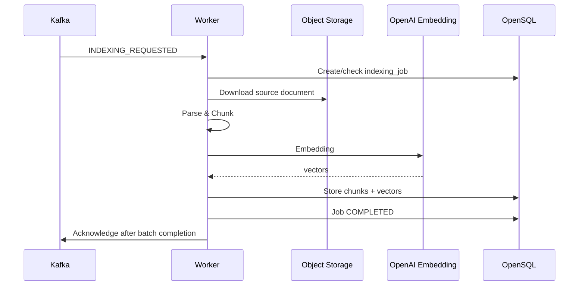
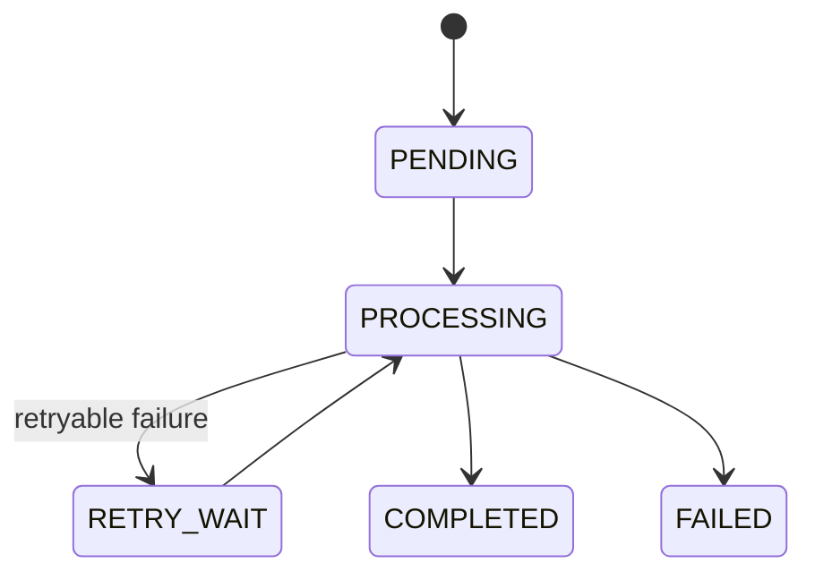

[KO](README.md) / [EN](README_EN.md)

# AI Document Indexing Worker


This is the asynchronous indexing worker for an AI document management system
built on Tmax OpenSQL. It consumes document events from Kafka and downloads,
parses, chunks, and embeds source documents before storing them in pgvector.

The worker is designed around retryability and idempotency to handle **worker
failures, duplicate events, external API failures, and database failures** that
can occur during long-running AI workloads.

> 2026 Open Source Software Developer Competition, TmaxTibero Corporate Challenge<br>
> **“AI Document Management and Vector Synchronization System Based on Tmax OpenSQL”**

## Project Overview

The overall system converts uploaded documents into searchable vector data and
synchronizes it for semantic search and MCP search. This repository is not the
upload API or search API; it is responsible for **document indexing and deletion
post-processing after Kafka**.

The worker's main responsibilities are:

- Consuming `INDEXING_REQUESTED` and `DOCUMENT_DELETED` Kafka events
- Downloading source documents from S3-compatible Object Storage and verifying
  SHA-256 integrity
- Parsing PDF, DOCX, HWP, TXT, and Markdown files
- Configurable token- and paragraph-based chunking
- Generating OpenAI embeddings and validating 1,536-dimensional results
- UPSERTing `document_chunk` rows, completing document versions, and
  conditionally promoting searchable versions
- Tracking status, retries, and worker handoffs through `indexing_job`
- Processing document deletion events and running a reconciliation sweep for
  missed deletions

| Challenge perspective | Role of the overall system | Role of this repository |
|---|---|---|
| Document upload and version management | The Server creates source files and document versions | Reads the created `document` and `document_version` rows |
| Change event synchronization | Outbox and Relay publish events to Kafka | Consumes Kafka events and performs indexing or deletion |
| Automatic embedding | Builds an asynchronous post-upload pipeline | Performs parsing, chunking, OpenAI embedding, and vector storage |
| Semantic and keyword search | Search/MCP provides search interfaces | Prepares pgvector and Nori token data |
| Processing reliability | Each component manages failures within its ownership boundary | Handles manual ACK, idempotent storage, job reacquisition, and retries |

## System Architecture

The highlighted Worker below is the scope of this repository. The detailed
implementations of Web, Server, Outbox, Relay, and Search/MCP belong to other
components.



Using Kafka as the boundary separates upload requests from indexing, so file
parsing and external embedding API calls do not directly occupy upload response
time. In exchange, the system assumes duplicate Kafka delivery and worker
interruptions and is designed so that database results converge to the same
state.

## Core Design

### Indexing Flow



Supported MIME types are:

- PDF: `application/pdf`
- DOCX:
  `application/vnd.openxmlformats-officedocument.wordprocessingml.document`
- HWP: `application/x-hwp`, `application/haansofthwp`
- Text/Markdown: `text/plain`, `text/markdown`

The chunking strategy is selected through a worker-wide configuration setting.

- `FIXED_TOKEN`: Splits the entire extracted text at the token limit.
- `PARAGRAPH`: Preserves paragraph boundaries and splits only long paragraphs.
- `PARAGRAPH_OVERLAP`: Splits long paragraphs with overlapping tokens.

See the [Processing Model](docs/PROCESSING_MODEL_EN.md) for the detailed design
of Kafka batch processing, per-key parallel execution, acknowledgment, and the
poll lifecycle.

### Job State and Idempotency



The worker persists processing status and Kafka record identity in
`indexing_job`, allowing it to track work independently of process memory. See
[Failure Handling](docs/FAILURE_HANDLING_EN.md) for details on repeated-event
detection, job reacquisition conditions, and state-specific recovery behavior.

### Failure Response

| Failure scenario | Response |
|---|---|
| Worker exits before batch ACK | Redeliver uncommitted Kafka records and reprocess recoverable existing jobs |
| Same event is published more than once | Handle idempotently using `source_event_id` and the first Kafka record identity |
| Same Kafka record is redelivered | Detect redelivery using the stored `(topic, partition, offset)` and reacquire the job |
| OpenAI 429, 5xx, network error, and similar failures | Apply limited worker-level retries and backoff after OpenAI client retries |
| Transient Object Storage or parsing failure | Treat as a retryable error |
| Database access failure | Defer batch completion and reprocess through NACK and the database health gate |
| Permanent error or retry limit reached | Terminate in the `FAILED` state |
| Missed document deletion event | Periodically find and idempotently delete residual chunks for deleted documents |

See [Failure Handling & Recovery](docs/FAILURE_HANDLING_EN.md) for detailed
failure detection conditions, state transitions, retry policy,
redelivery/republish decisions, and current guarantees.

## Use of OpenSQL

The worker uses Tmax OpenSQL as the persistent store for indexing results and
job state. It stores chunks and 1,536-dimensional embeddings in
`document_chunk`, and records processing status and Kafka record identity in
`indexing_job`.

| Data | How the worker uses it |
|---|---|
| `document` | Validates the tenant and deletion status, and promotes only versions with a higher `embedding_version_no` as searchable |
| `document_version` | Reads source location, MIME, hash, and version information; updates the chunk count and `indexed_at` on completion |
| `document_chunk` | UPSERTs by `(document_version_id, chunk_no)` and stores Nori tokens, JSONB metadata, and `vector(1536)` |
| `indexing_job` | Stores the event idempotency key, processing state, attempt count, worker, error, and Kafka position |

## Design Documents

| Document | Description |
|---|---|
| [Architecture](docs/ARCHITECTURE_EN.md) | Worker responsibilities and boundaries, system context, key components, and design decisions |
| [Processing Model](docs/PROCESSING_MODEL_EN.md) | Kafka batches, partitions, ordering, parallel processing, ACK/NACK, and the poll lifecycle |
| [Failure Handling](docs/FAILURE_HANDLING_EN.md) | Failure model, idempotency, reprocessing strategy, state transitions, and guarantees |

## Testing

The default tests use H2 and test doubles without external services to verify
listener ACK/NACK behavior, per-key ordering, parsers, deterministic chunking,
retry classification, and publication calls.

```bash
./gradlew test
```

Tests tagged `integration` use a real shared PostgreSQL/pgvector schema to verify
job state transitions, unique constraints, chunk deletion, and pipeline retries.
For safety, the database name must contain `test` or `integration`.

```bash
set -a
source .env
set +a
./gradlew integrationTest
```

Tests that call OpenAI run only when `OPENAI_API_KEY` is set.

## Getting Started

### Requirements

- JDK 21 or Docker
- Kafka broker
- A Tmax OpenSQL or PostgreSQL + pgvector database with the Server/Core
  migrations applied
- S3-compatible Object Storage containing the source documents
- OpenAI API key

This repository does not include Docker Compose or database migrations. Prepare
the external dependencies and shared schema before running the worker on its
own.

### Environment Variables

Copy `.env.example` and fill in the empty values for your environment.

```bash
cp .env.example .env
```

The required runtime settings are:

| Environment variable | Description |
|---|---|
| `DB_URL` | OpenSQL/PostgreSQL JDBC URL |
| `DB_USERNAME`, `DB_PASSWORD` | Database credentials |
| `KAFKA_BOOTSTRAP_SERVERS` | Kafka bootstrap servers |
| `INDEXING_STORAGE_BUCKET` | Object Storage bucket containing source documents |
| `OPENAI_API_KEY` | OpenAI embedding API key |
| `AWS_ACCESS_KEY_ID`, `AWS_SECRET_ACCESS_KEY` | Required when using environment variables in the AWS SDK default credential chain |

The main optional settings are:

| Environment variable | Default | Description |
|---|---|---|
| `INDEXING_WORKER_ID` | UUID generated at startup | Worker identifier recorded in jobs and logs |
| `INDEXING_KAFKA_TOPIC` | `doc.events.v1` | Topic to consume |
| `INDEXING_SUPPORTED_SCHEMA_VERSIONS` | `1` | List of accepted event schema versions |
| `INDEXING_BATCH_SIZE` | `10` | `max.poll.records` |
| `INDEXING_CONSUMER_CONCURRENCY` | `5` | Batch-task and parsing executor size; not Kafka listener concurrency |
| `INDEXING_MAX_ATTEMPTS` | `5` | Maximum number of job attempts |
| `INDEXING_RETRY_BASE_DELAY` | `PT30S` | Base interval for linear backoff |
| `INDEXING_CHUNKING_STRATEGY` | `FIXED_TOKEN` | `FIXED_TOKEN`, `PARAGRAPH`, or `PARAGRAPH_OVERLAP` |
| `INDEXING_MAX_TOKENS_PER_CHUNK` | `512` | Token limit per chunk |
| `INDEXING_OVERLAP_TOKENS` | `64` | Number of overlapping tokens for overlap strategies |
| `INDEXING_MAX_CHUNKS` | `5000` | Chunk limit per document |
| `INDEXING_MAX_TOTAL_TOKENS` | `2000000` | Total token limit per document |
| `INDEXING_MAX_FILE_SIZE_BYTES` | `209715200` | Source file size limit checked before download |
| `INDEXING_PARSE_TIMEOUT` | `PT60S` | Parsing timeout |
| `INDEXING_EMBEDDING_MAX_TOKENS_PER_REQUEST` | `300000` | Threshold for splitting embedding requests |
| `INDEXING_STORAGE_ENDPOINT` | Empty | Endpoint override for S3-compatible services such as MinIO |
| `INDEXING_STORAGE_REGION` | `us-east-1` | Storage region |
| `INDEXING_STORAGE_DOWNLOAD_TIMEOUT` | `PT30S` | Storage API call timeout |
| `FAULT_INJECTION_ENABLED` | `false` | Enables blocking for failure reproduction |
| `FAULT_INJECTION_PHASE` | `EMBEDDING` | Blocking phase |

See [`application.yml`](src/main/resources/application.yml) for the remaining
settings, including the database health gate and deletion sweep interval.

### Running Locally

```bash
set -a
source .env
set +a

./gradlew bootRun
```

To run the JAR:

```bash
./gradlew bootJar
java -jar build/libs/spr1n6-osscontest-worker-0.0.1-SNAPSHOT.jar
```

### Running with Docker

```bash
docker build -t osscontest-indexing-worker .

docker run --rm \
  --name aidocs-worker \
  --env-file .env \
  osscontest-indexing-worker
```

The database, Kafka, and Object Storage addresses must be reachable from the
container. Stop it with:

```bash
docker stop aidocs-worker
```

The Docker image runs as the non-root `worker` user. Its health check verifies
that Java is alive as PID 1 rather than checking an HTTP endpoint.

## Technology Stack

| Area | Technology |
|---|---|
| Language / Runtime | Kotlin 2.3.21, Java 21 |
| Build | Gradle Wrapper 8.14 |
| Application | Spring Boot 4.1.0, Spring Kafka, Spring Data JPA, Spring JDBC, Micrometer |
| Embedding | Spring AI 2.0.0 BOM, OpenAI `text-embedding-3-small`, 1,536 dimensions |
| Database | Tmax OpenSQL/PostgreSQL-compatible SQL, pgvector, JSONB, Hibernate Vector |
| Storage | AWS SDK for Java 2.46.7 BOM, S3-compatible API |
| Parsing | PDFBox 3.0.3, Apache POI 5.3.0, hwplib 1.1.9 |
| Tokenization | jtokkit 1.1.0 (`CL100K_BASE`), Lucene Nori 9.11.1 |
| Container | Eclipse Temurin 21, multi-stage Docker build |

## Project Structure

```text
src/main/kotlin/com/osscontest/worker/indexing
├── consumer/      # Kafka batch listener, event validation, ACK/NACK, DB health gate
├── retrieval/     # Download source documents from S3-compatible storage
├── parsing/       # MIME-specific parsers and timeout guard
├── chunking/      # Chunking strategies, tokenization, and chunk limits
├── embedding/     # OpenAI embedding, result validation, and Nori token generation
├── pipeline/      # Job acquisition, stage coordination, retry, and recovery decisions
├── publication/   # DB entities/repositories, chunk UPSERT, and completion transaction
├── deletion/      # Deletion-event post-processing and reconciliation sweep
└── fault/         # Environment-variable-based failure injection
```

## Contributing

Before making changes, review the package boundaries and shared database
contracts, and make sure at least `./gradlew test` passes. If a change affects
the actual database contract or OpenAI integration, also run
`./gradlew integrationTest` against a dedicated integration database.

## License

This project is distributed under the [MIT License](LICENSE).
