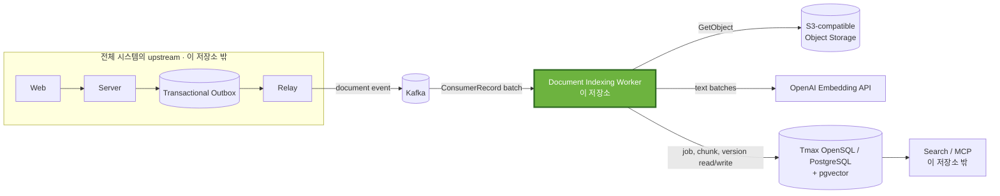
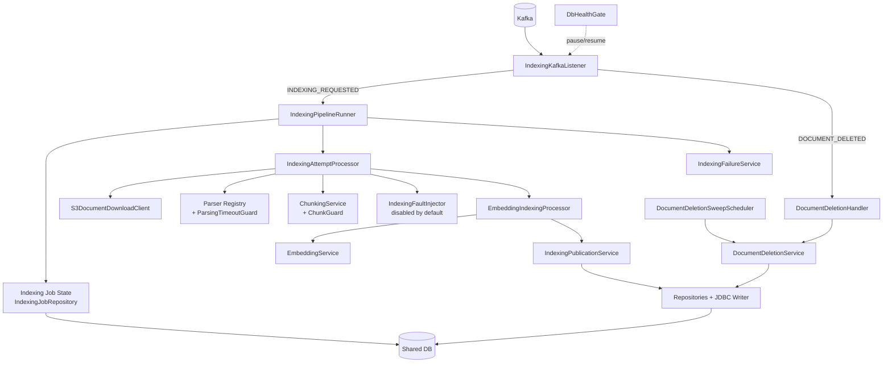
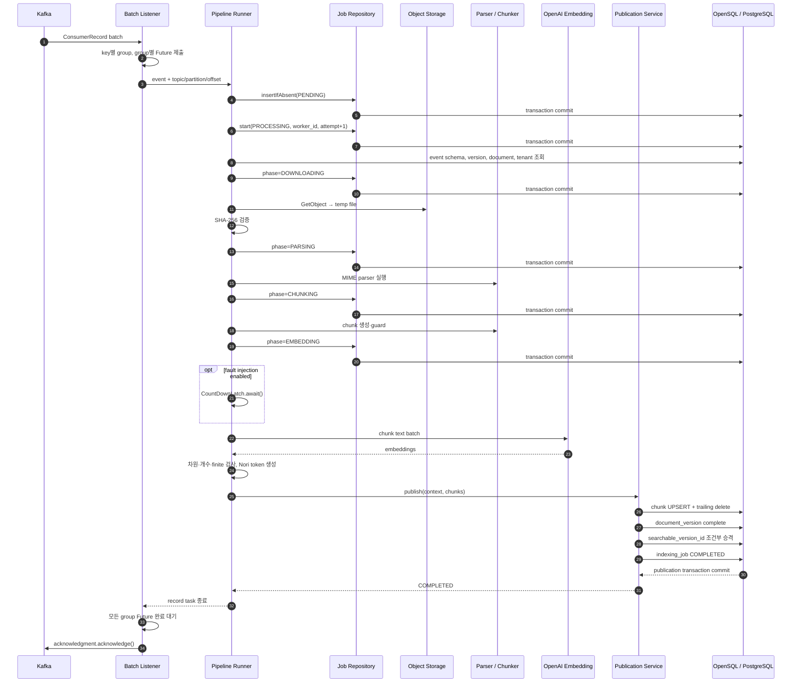
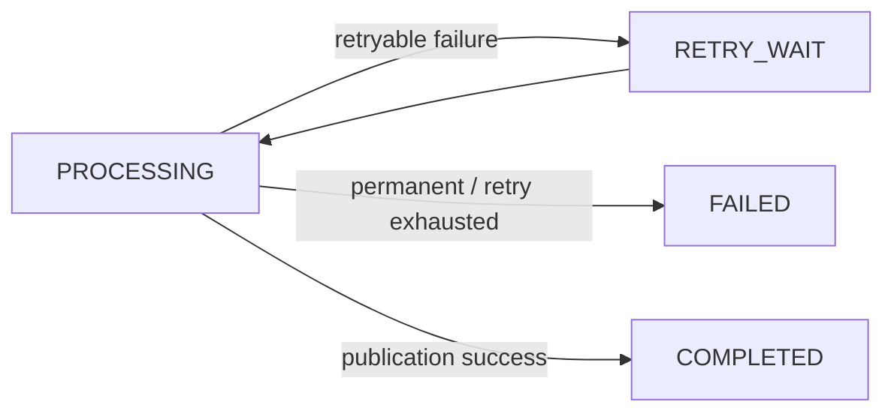
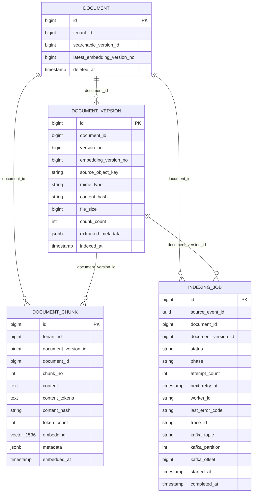
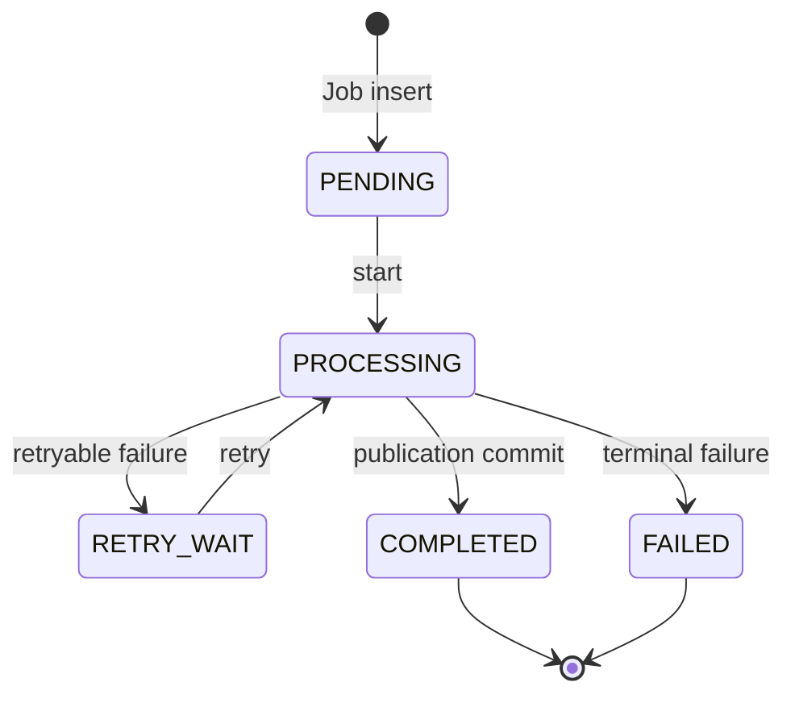

# Worker Architecture

이 문서는 Worker의 전체 구조와 구성 요소 간 책임, 데이터 흐름, 트랜잭션 경계 및 주요 설계 결정을 설명합니다.

## 1. 문서 목적과 범위

이 문서는 README보다 한 단계 깊은 다음 내용을 다룹니다.

- Worker의 책임과 외부 시스템 경계
- 설계 목표와 기술 제약
- 내부 building block과 의존 방향
- 정상 인덱싱과 삭제의 주요 런타임 흐름
- Worker가 사용하는 데이터와 트랜잭션 경계
- 주요 architecture decision, 품질 요구사항과 구조적 한계

Kafka poll·batch·thread·ACK/NACK의 상세 실행 모델은 [Processing Model](PROCESSING_MODEL.md)에서, 장애별 감지·재처리·복구 알고리즘과 보장 범위는 [Failure Handling](FAILURE_HANDLING.md)에서 다룹니다. 이 문서에서는 두 영역을 architecture를 이해하는 데 필요한 수준까지만 설명합니다.
### 1.1 구현 기준

| 구분 | 현재 구현 |
|---|---|
| 프로젝트 구조 | 단일 Gradle 모듈 |
| 런타임 | Java 21 |
| 언어 | Kotlin 2.3.21 |
| 애플리케이션 | Spring Boot 4.1.0 |
| 메시징 | Spring Kafka batch listener |
| 영속화 | Spring Data JPA, JDBC, PostgreSQL driver, Hibernate Vector |
| Object Storage | AWS SDK for Java 2.46.7의 동기 S3 client, path-style access |
| 임베딩 | Spring AI 2.0.0, OpenAI `text-embedding-3-small`, 1,536차원 float vector |
| 문서 처리 | PDFBox, Apache POI, hwplib, jtokkit, Lucene Nori |

## 2. Architecture Goals

| 목표 | 필요한 이유 | 현재 설계의 대응 |
|---|---|---|
| 문서 단위 순서 보존과 병렬 처리 | 같은 문서의 업로드·삭제·여러 버전은 순서가 중요하지만 서로 다른 문서까지 모두 직렬 처리하면 처리량이 떨어집니다. | producer가 `documentId`를 Kafka key로 사용한다는 계약 아래 batch를 key별로 묶고, 같은 key는 순차 처리하며 서로 다른 key group은 고정 thread pool에서 병렬 처리합니다. 검색 버전 승격은 `embedding_version_no`로 추가 fencing합니다. |
| 장애 후 처리 재개 가능성 | batch 안의 여러 문서를 병렬 처리하는 동안 Worker가 종료되면 완료되지 않은 작업을 다른 Worker가 이어서 처리해야 합니다. | batch의 모든 작업이 완료되기 전에는 ACK하지 않습니다. Worker 장애를 Kafka consumer group이 감지하면 partition을 다른 Worker에 재할당하고 미커밋 record를 재전달하며, 새 Worker는 복구 가능한 `indexing_job`을 재획득해 처리를 이어갑니다. |
| 중복 실행의 결과 수렴 | Kafka 전달, batch NACK, ACK 전 crash 때문에 같은 record가 다시 실행될 수 있습니다. | `source_event_id`, Kafka record 위치, 결정적 chunk 번호, chunk UPSERT, 검색 버전 fencing을 함께 사용합니다. 이는 exactly-once가 아니라 at-least-once 실행 결과의 수렴 전략입니다. |
| 상태의 영속적 추적 | 외부 호출을 포함한 다단계 작업의 소유자와 실패 지점을 확인해야 합니다. | Job 상태, phase, attempt, Worker ID, 오류, Kafka topic/partition/offset을 `indexing_job`에 기록합니다. |
| 외부 장애의 분류와 재시도 | 저장소, parser, 임베딩 공급자, DB의 실패 특성이 다릅니다. | 같은 입력으로 반복될 오류는 `FAILED`, 그 밖의 `Exception`은 `RETRY_WAIT` 후보로 분류합니다. DB 상태를 기록할 수 없는 실패는 listener까지 전파해 batch NACK 경로로 보냅니다. |
| 삭제 결과의 수렴 | 삭제 이벤트가 누락되거나 실행 중 인덱싱과 경합하면 chunk가 남을 수 있습니다. | 삭제 이벤트 경로와 주기적 보정 sweep이 같은 멱등 삭제 서비스를 호출합니다. |

## 3. Architecture Constraints

### 3.1 메시징과 처리 수명

- 입력은 기본 topic `doc.events.v1`의 `INDEXING_REQUESTED`, `DOCUMENT_DELETED` 이벤트입니다.
- Worker는 Spring Kafka batch listener와 manual acknowledgment를 사용합니다.
- 같은 문서의 순서는 producer가 `documentId`를 Kafka key로 사용한다는 계약에 의존합니다.
- Kafka offset과 DB 상태는 하나의 transaction으로 묶이지 않으므로, ACK 전 crash나 NACK에 따른 record 재전달 가능성을 전제로 합니다.

consumer group, listener concurrency, batch 크기, heartbeat/session timeout, `max.poll.interval.ms`, executor와 ACK/NACK의 상세 실행 모델은 [Processing Model](PROCESSING_MODEL.md)에서 설명합니다.

### 3.2 데이터와 transaction

- Worker는 Core/Server가 migration한 공유 스키마를 사용합니다. 이 저장소에는 migration이 없고 `spring.jpa.hibernate.ddl-auto=none`입니다.
- Kafka offset과 DB 변경은 하나의 분산 transaction으로 묶이지 않습니다.
- 다운로드, hash 계산, parsing, chunking, embedding 호출은 DB transaction 밖에서 실행됩니다.
- 성공 publication만 chunk, document version, searchable version, Job 완료를 하나의 DB transaction으로 묶습니다.
- 단계별 Job 상태와 phase는 짧은 repository transaction으로 먼저 commit됩니다.
- pgvector column과 embedding 결과의 크기는 현재 1,536차원으로 고정돼 있습니다. 설정 모델과 Java 검증 상수, entity column 정의가 모두 이 값에 결합돼 있습니다.

### 3.3 외부 시스템

- 원문은 S3 API 호환 Object Storage에서 동기 `GetObject`로 임시 파일에 다운로드합니다.
- embedding은 외부 OpenAI API에 의존합니다.
- DB는 Tmax OpenSQL/PostgreSQL 호환 SQL, JSONB, pgvector를 제공해야 합니다.
- Worker에는 HTTP ingress가 없습니다. Actuator dependency는 있지만 Web starter와 HTTP metric endpoint 구성은 없습니다.

## 4. System Context & Scope

아래 그림의 Web, Server, Outbox, Relay, Search/MCP는 전체 프로젝트 맥락입니다. 이 저장소에서 확인되는 경계는 Kafka event 계약, S3 호출, 공유 DB 접근, embedding 호출까지입니다. 외부 컴포넌트의 내부 구현은 이 문서가 보증하지 않습니다.

### 4.1 Worker responsibilities

- Kafka record 역직렬화와 event type 라우팅
- event schema version, document 존재, tenant 일치 검증
- `indexing_job` 생성·조회·획득·상태·phase·실패 기록
- S3 호환 저장소의 원문 다운로드와 SHA-256 일치 확인
- MIME별 PDF, DOCX, HWP, text, Markdown parsing
- 설정된 전략에 따른 chunk 생성과 자원 상한 검사
- OpenAI embedding 요청 분할, 결과 개수·차원·유한값 검증
- Nori 기반 `content_tokens` 생성
- chunk UPSERT, trailing chunk 정리, document version 완료, 검색 버전 조건부 승격
- 문서 삭제 이벤트 처리와 잔여 chunk 보정 sweep
- batch 완료 후 ACK 또는 DB 장애 시 batch NACK
- Job, Worker, Kafka record를 연결하는 로그와 Micrometer 계측

### 4.2 External interfaces

| 외부 시스템 | Worker 입력 | Worker 출력/효과 | 실패 영향 |
|---|---|---|---|
| Kafka | JSON event, record key, topic/partition/offset, 선택적 `traceId` header | manual `acknowledge()` 또는 `nack(0, delay)` 호출 | 미ACK record 재전달, consumer group rebalance, batch 재실행 가능 |
| OpenSQL/PostgreSQL | `document`, `document_version`, 기존 `indexing_job` | `indexing_job`, `document_chunk`, version/search pointer 갱신 | 상태 기록 실패 시 NACK 가능; publication 실패 시 success transaction rollback |
| S3-compatible storage | bucket와 `source_object_key` | 임시 원문 파일 | 다운로드 실패는 기본적으로 재시도 가능 오류 |
| OpenAI | chunk text 목록 | 1,536차원 float embedding 목록 | HTTP 400은 영구 실패로 변환; 그 밖에 전파된 예외는 기본 retry 후보 |

## 5. Solution Strategy

Solution Strategy는 상세 처리 절차나 장애별 복구 알고리즘을 반복하지 않고, Worker 구조를 결정한 핵심 전략만 요약합니다.

| Architecture concern | Strategy | Effect and boundary |
|---|---|---|
| 문서 단위 순서와 병렬 처리 | Kafka key grouping + bounded executor | 같은 key는 순차 처리하고 서로 다른 key group은 병렬 처리합니다. 정확한 batch scheduling과 executor 동작은 [Processing Model](PROCESSING_MODEL.md)에서 설명합니다. |
| 장애 후 재처리 | Kafka redelivery + durable `indexing_job` | ACK 전 장애로 record가 재전달되면 DB에 남은 실행 상태를 기준으로 복구 가능한 Job을 재획득합니다. 장애 감지와 상태별 복구는 [Failure Handling](FAILURE_HANDLING.md)에서 설명합니다. |
| 중복 실행의 결과 수렴 | event/record identity + deterministic chunking + UPSERT + version fencing | at-least-once 환경의 재실행이 같은 DB 결과로 수렴하도록 합니다. |
| DB 일관성과 lock 범위 | external I/O와 state transaction 분리 + 단일 publication transaction | 다운로드·parsing·embedding 동안 긴 DB transaction을 유지하지 않고, 성공 결과는 chunk/version/search pointer/Job 완료를 하나의 transaction으로 확정합니다. |

## 6. Building Block View

### 6.1 논리 구조

### 6.2 주요 building block

| Building block | 책임 | 주요 구성 요소 |
|---|---|---|
| Consumer boundary | Kafka batch 수신, key grouping, event routing, task 완료 대기와 ACK/NACK 경계를 담당합니다. | `IndexingKafkaListener` |
| Job orchestration | event/record identity 판정, Job 획득, attempt 실행과 상태 전이를 조정합니다. | `IndexingPipelineRunner`, `IndexingJobRepository` |
| Document processing | 원문 다운로드·검증, MIME별 parsing, chunk 생성과 자원 상한 검사를 수행합니다. | `S3DocumentDownloadClient`, `DocumentParserRegistry`, `ParsingTimeoutGuard`, `ChunkingService`, `ChunkGuard` |
| Embedding & publication | embedding 요청과 결과 검증, Nori token 생성, 성공 결과의 DB publication을 담당합니다. | `EmbeddingIndexingProcessor`, `EmbeddingService`, `IndexingPublicationService` |
| Failure management | 처리 오류를 분류하고 retry 또는 terminal 상태를 기록합니다. | `IndexingErrorClassifier`, `IndexingFailureService` |
| Deletion convergence | 삭제 이벤트와 보정 sweep을 같은 멱등 삭제 경로로 수렴시킵니다. | `DocumentDeletionHandler`, `DocumentDeletionService`, `DocumentDeletionSweepScheduler` |
| Operational control | DB 장애 시 consumer 제어와 Job·Worker·Kafka record의 관측 정보를 제공합니다. | `DbHealthGate`, structured log marker, MDC, Micrometer |

## 7. Runtime View

### 7.1 정상 `INDEXING_REQUESTED`

핵심 경계는 다음과 같습니다.

1. `insertIfAbsent()`, `start()`, 각 `updatePhase()`는 repository method가 반환될 때 각각 commit됩니다.
2. 따라서 `PROCESSING`과 `EMBEDDING`은 embedding API 호출 전에 DB에서 관찰할 수 있습니다.
3. 장애 주입은 `phase=EMBEDDING` commit 뒤, 실제 embedding 호출 전에만 호출됩니다. 기본 비활성이고 활성화한 Worker의 모든 embedding 작업을 무기한 block합니다.
4. chunk UPSERT부터 Job `COMPLETED`까지는 `IndexingPublicationService.publish()`의 단일 transaction입니다.
5. publication commit 뒤에도 같은 poll batch의 다른 Future가 남아 있으면 ACK하지 않습니다.
6. `acknowledge()`는 Spring Kafka container에 수동 ACK 의사를 전달하는 호출입니다. Kafka broker offset과 DB commit을 원자적으로 묶거나 호출 순간 broker commit 완료를 보장하는 분산 transaction은 아닙니다.

### 7.2 실패와 재처리 개요

Worker는 실패를 영구 오류와 재시도 가능한 오류로 구분하고, 처리 상태를 `indexing_job`에 영속화합니다.

Worker process가 ACK 전에 종료되면 partition 재할당과 record 재전달은 Kafka consumer group이 담당합니다. 재전달된 record를 받은 Worker는 영속화된 event identity, Kafka record identity와 Job 상태를 기준으로 실행 여부를 판단해 결과가 같은 DB 상태로 수렴하도록 합니다.

오류 분류, retry/backoff, Worker handoff, 동일 record 재전달과 동일 event 재발행의 판정, DB 장애와 crash window의 상세 동작은 [Failure Handling](FAILURE_HANDLING.md)에서 설명합니다.

### 7.4 `DOCUMENT_DELETED`

삭제 이벤트는 indexing pipeline과 Job 생성 경로를 사용하지 않습니다.

1. schema version, document 존재, tenant 일치를 검사합니다.
2. 해당 document의 `PENDING`, `PROCESSING`, `RETRY_WAIT` Job을 `DOCUMENT_DELETED` 사유의 `FAILED`로 갱신합니다.
3. 해당 `document_id`의 모든 `document_chunk`를 삭제합니다.
4. 별도 scheduled sweep이 `deleted_at IS NOT NULL`이면서 chunk가 남은 document를 다시 찾아 같은 서비스를 호출합니다.

활성 Job 실패 처리와 chunk 삭제는 하나의 service transaction이 아니라 각각 repository transaction입니다. 중간 실패나 실행 중 publication 경합은 sweep을 통한 결과 수렴에 의존합니다.

## 8. Data & State Model

### 8.1 논리 데이터 관계

아래는 Worker의 entity와 SQL이 사용하는 논리 관계입니다. 정확한 physical constraint와 index DDL의 소유자는 외부 Core/Server schema입니다. 이 저장소의 통합 테스트는 준비된 외부 schema를 대상으로 일부 constraint를 검증하지만 schema를 생성하지 않습니다.

### 8.2 `document`와 `document_version`

Worker는 `document`에서 `id`, `tenant_id`, `searchable_version_id`, `deleted_at`을 entity로 읽습니다. 검색 버전 승격 native SQL은 공유 schema의 `latest_embedding_version_no`, `updated_at`도 사용합니다.

`document_version`에서는 다음 정보를 사용합니다.

- 원문 조회: `source_object_key`
- parser 선택: `mime_type`
- 무결성 검사: `content_hash`
- 다운로드 전 크기 guard: `file_size`
- 검색 version fencing: `embedding_version_no`
- 처리 결과: `chunk_count`, `extracted_metadata`, `indexed_at`

현재 attempt pipeline은 `extractedMetadata=null`로 context를 만들기 때문에 parser가 metadata를 추출해 publication에 전달하는 구현은 없습니다.

### 8.3 `document_chunk`

Worker가 쓰는 chunk 필드는 `tenant_id`, document/version ID, `chunk_no`, 본문, Nori `content_tokens`, content hash, token 수, page 범위, section path, JSONB metadata, 1,536차원 vector, embedding 시각입니다.

- 저장은 `(document_version_id, chunk_no)` conflict target의 UPSERT 방식으로 수행합니다.
- 재처리 결과의 chunk 수가 줄면 새 마지막 번호보다 큰 trailing row를 삭제합니다.
- 저장 후 version별 row 수가 예상 chunk 수와 같은지 확인합니다.
- `tenant_id`는 event 값을 직접 쓰지 않고 `document` row에서 `INSERT ... SELECT`로 가져옵니다.
- vector index 생성, 검색 SQL, HNSW/IVFFlat 운영은 이 저장소에 없습니다.

### 8.4 `indexing_job`

`indexing_job`은 queue가 아니라 Kafka 처리와 DB publication 사이의 durable execution record입니다.

| 역할 | 실제 필드 |
|---|---|
| event·대상 식별 | `source_event_id`, `document_id`, `document_version_id` |
| 실행 상태 | `status`, `phase`, `attempt_count`, `next_retry_at` |
| 소유·진단 | `worker_id`, `last_error_code`, `last_error_message`, `trace_id` |
| Kafka record 식별 | `kafka_topic`, `kafka_partition`, `kafka_offset` |
| 시간 | `started_at`, `completed_at`, `updated_at` |

Job insert SQL은 외부 schema의 `source_event_id` unique constraint와 active document version partial unique constraint를 전제로 `ON CONFLICT DO NOTHING`을 사용합니다. chunk UPSERT 역시 외부 schema의 `(document_version_id, chunk_no)` unique constraint가 필요합니다.

### 8.5 상태와 phase

`indexing_job.status`는 처리 lifecycle의 영속 상태를 나타냅니다. crash 이후 재획득, 삭제와의 경합, 겹쳐 실행 중인 attempt가 만드는 세부 상태 전이는 [Failure Handling](FAILURE_HANDLING.md)에서 설명합니다.

DB에 저장되는 phase는 `DOWNLOADING`, `PARSING`, `CHUNKING`, `EMBEDDING`입니다. `VALIDATING`, `VERIFYING_CONTENT`, `PUBLISHING`은 로그의 stage지만 현재 `indexing_job.phase`에 저장되지 않습니다. phase는 현재 실행 여부가 아니라 마지막으로 기록된 진입 지점이므로 `status`와 함께 해석해야 합니다.

## 9. Cross-cutting Concepts

### 9.1 Idempotency and record identity

멱등성은 하나의 장치가 아니라 다음 층을 조합합니다.

1. `source_event_id` 기준 Job insert conflict 억제
2. 최초 Kafka topic/partition/offset 저장
3. 같은 event ID의 동일 record 재전달과 다른 위치의 재발행 구분
4. 같은 입력에 같은 `chunk_no`와 hash를 만드는 chunking
5. `(document_version_id, chunk_no)` UPSERT와 trailing row 삭제
6. `embedding_version_no`가 더 높은 version만 searchable pointer로 승격
7. terminal Job 재수신 시 실행 생략
8. document delete의 반복 가능한 SQL과 sweep

이 전략은 DB 결과를 수렴시키지만 중복 외부 API 호출까지 제거하지는 않습니다. crash가 embedding 호출 뒤 publication commit 전에 발생하면 같은 text를 다시 embedding할 수 있습니다.

### 9.2 Transaction boundaries

| 경계 | transaction 특성 | commit 후 의미 |
|---|---|---|
| Job insert | repository `@Transactional` | `PENDING`과 최초 record identity가 durable |
| Job start | repository `@Transactional` | `PROCESSING`, 현재 `worker_id`, 증가한 attempt가 durable |
| phase update | repository `@Transactional` | 마지막 진입 phase가 durable |
| 외부 처리 | DB transaction 없음 | long I/O 동안 DB transaction을 유지하지 않음 |
| publication | service `@Transactional` | chunk/version/search pointer/Job 완료가 함께 확정 |
| failure record | `REQUIRES_NEW` + pessimistic lock | 바깥 처리 실패와 독립적으로 retry/terminal 상태 확정 |
| deletion | 두 repository transaction | active Job failure와 chunk delete 사이에 부분 완료 가능 |
| Kafka ACK | DB transaction 밖 | DB와 broker offset 사이 원자성 없음 |

### 9.3 Observability & Traceability

Worker는 DB 상태와 structured log를 함께 사용해 Job, Worker, Kafka record를 연결합니다.

- `indexing_job`에 status, phase, attempt, `worker_id`, error, Kafka topic/partition/offset을 기록합니다.
- Kafka `traceId` header는 event의 `traceId`, `indexing_job.trace_id`, worker thread의 MDC로 전달됩니다.
- `sourceEventId`, Job ID, Worker ID, topic/partition/offset을 포함하는 marker log로 record 수신부터 완료까지 추적합니다.
- Micrometer로 Job duration, retry, terminal failure, parsing timeout, DB health pause 등 process 내부 상태를 계측합니다.

metric exporter, dashboard, alert rule은 이 문서의 범위가 아닙니다. 장애 감지와 복구 시 필요한 관측 정보의 상세는 [Failure Handling](FAILURE_HANDLING.md)에서 설명합니다.

## 10. Architecture Decisions

| 결정 | Context | Decision | Consequence |
|---|---|---|---|
| 비동기 indexing boundary | 문서 처리는 외부 I/O와 CPU 작업을 포함합니다. | Kafka 이후 별도 Worker에서 실행합니다. | 업로드 실행 수명과 분리되지만 Kafka/DB 간 중복 가능성을 다뤄야 합니다. |
| at-least-once + DB 수렴 | Worker crash와 redelivery로 같은 작업이 다시 실행될 수 있습니다. | exactly-once transaction 대신 durable Job, 결정적 chunking, UPSERT와 version fencing을 사용합니다. | DB 결과를 수렴시킬 수 있지만 외부 API 중복 호출과 중첩 실행 가능성은 남습니다. |
| durable `indexing_job` | 장시간 작업의 상태를 process memory에만 두면 crash 후 복구 판단이 어렵습니다. | status, phase, attempt, Worker와 Kafka record identity를 공유 DB에 영속화합니다. | 다른 실행이 이전 처리 상태를 조회할 수 있지만 공유 schema 계약에 의존합니다. |
| key 기반 bounded parallelism | 같은 문서는 순서가 필요하고 다른 문서는 병렬화할 수 있습니다. | 같은 Kafka key는 순차 처리하고 서로 다른 key group만 제한된 executor에서 병렬 처리합니다. | 순서와 처리량을 함께 고려할 수 있지만 정확성은 producer key 계약에 의존합니다. |
| 짧은 state transaction과 단일 publication | 외부 호출 중 DB lock을 잡고 싶지 않지만 성공 결과는 함께 공개해야 합니다. | 상태/phase는 개별 commit, 외부 I/O는 transaction 밖, 성공 publication은 하나의 transaction으로 둡니다. | 진행 상태가 crash 뒤 남고 성공 결과는 원자적이지만 Kafka offset과는 원자적이지 않습니다. |
| 공유 schema consumer | 문서 lifecycle schema는 Server/Core가 소유합니다. | Worker는 `ddl-auto=none`과 native SQL/JPA mapping으로 합의된 schema를 사용합니다. | 책임은 분리되지만 schema 변화와 Worker 배포의 호환성 관리가 외부 계약에 의존합니다. |
| 조건부 searchable version 승격 | 버전별 처리 시간이 달라 완료 순서가 바뀔 수 있습니다. | 더 높은 `embedding_version_no`만 검색 pointer를 갱신합니다. | 구버전 chunk 저장은 보존하면서 검색 대상의 역행을 막습니다. |
| 삭제 event + 보정 sweep | 삭제 이벤트 누락이나 인덱싱과의 경합으로 chunk가 남을 수 있습니다. | event 기반 삭제와 동일한 멱등 삭제 서비스를 주기적 sweep에서도 호출합니다. | 즉시 원자적 삭제를 보장하지는 않지만 잔여 데이터를 반복적으로 정리하는 수렴 경로를 둡니다. |

## 11. Quality Requirements

| Quality attribute | Scenario | Architectural response |
|---|---|---|
| Reliability | Worker 중단이나 record 재전달이 발생합니다. | durable Job과 idempotent publication을 사용해 재실행 결과가 같은 DB 상태로 수렴하도록 합니다. |
| Ordering | 같은 문서의 여러 event가 처리됩니다. | 같은 Kafka key는 순차 처리하고 검색 버전은 `embedding_version_no`로 추가 fencing합니다. |
| Idempotency | 같은 logical event 또는 같은 Kafka record가 다시 입력됩니다. | event/record identity, 결정적 chunk 번호, UPSERT, terminal Job 판정을 조합합니다. |
| Consistency | chunk 저장과 version/Job 완료가 함께 공개되어야 합니다. | 성공 publication을 하나의 DB transaction으로 묶습니다. |
| Recoverability | 장시간 처리 중 process가 종료되거나 일시 오류가 발생합니다. | status, phase, attempt, Worker와 Kafka 위치를 영속화해 후속 실행이 복구 여부를 판단할 수 있게 합니다. |
| Resource safety | 큰 문서나 parser hang이 Worker 자원을 무제한 점유할 수 있습니다. | 파일·chunk·token 상한, parsing timeout, bounded executor를 둡니다. |
| Traceability | 특정 event가 어느 Worker와 Kafka record에서 처리됐는지 추적해야 합니다. | `indexing_job`과 structured log에 Worker ID, trace ID, topic/partition/offset을 연결합니다. |
| Deletion convergence | 삭제 event 누락 또는 처리 경합으로 chunk가 남을 수 있습니다. | 멱등 삭제와 scheduled sweep으로 잔여 데이터를 반복 정리합니다. |

세부 실행 모델의 검증 포인트는 [Processing Model](PROCESSING_MODEL.md), 장애 복구의 상태별 보장과 한계는 [Failure Handling](FAILURE_HANDLING.md)에서 다룹니다.

## 12. Architecture Risks & Limitations

| Risk / limitation | 현재 영향 |
|---|---|
| Kafka와 DB 사이 분산 transaction 부재 | publication commit과 Kafka offset commit은 원자적이지 않습니다. 따라서 at-least-once 실행과 결과 수렴을 전제로 하며 exactly-once로 표현할 수 없습니다. |
| producer key 계약을 Worker가 검증하지 않음 | 같은 문서의 순서 보장은 producer가 일관된 `documentId` key를 사용한다는 외부 계약에 의존합니다. |
| 공유 schema에 강하게 결합 | migration이 저장소에 없어 unique constraint, composite FK, vector extension, native SQL column의 배포 호환성을 Worker만으로 재현할 수 없습니다. |
| OpenSQL HA는 Worker 외부 책임 | Worker는 JDBC 관점에서 DB를 사용하며 cluster HA 구성과 failover orchestration을 구현하지 않습니다. |
| publication과 deletion의 전체 lifecycle이 하나의 transaction이 아님 | 성공 publication 자체는 원자적이지만 삭제 처리 및 실행 중 작업과의 경합까지 하나의 transaction으로 묶이지 않아 보정 경로에 의존합니다. |
| 외부 시스템 의존 | Object Storage와 OpenAI 장애 또는 지연은 Worker 처리 수명에 직접 영향을 줍니다. provider failover는 구현되어 있지 않습니다. |
| metadata pipeline 미완성 | schema와 publication은 `extracted_metadata`를 지원하지만 현재 attempt context는 항상 `null`을 전달합니다. |
| process-only health check | Docker health check는 Java PID 생존만 확인하므로 Kafka/DB/storage/OpenAI 연결 불능을 readiness로 구분하지 못합니다. |
| 관측 export 부재 | Micrometer 계측은 있지만 exporter, dashboard, alert가 없어 deployment에서 별도 연결하지 않으면 process 밖에서 사용할 수 없습니다. |

처리 시간 budget, executor 점유, listener concurrency와 batch replay 범위 같은 실행 모델의 한계는 [Processing Model](PROCESSING_MODEL.md)에서 다룹니다. lease/fencing 부재, retry/poison event, duplicate republish, 상태 경합과 같은 복구 한계는 [Failure Handling](FAILURE_HANDLING.md)에서 다룹니다.

이 저장소에서 확인되지 않아 현재 architecture로 포함하지 않은 기능은 다음과 같습니다.

- Kafka exactly-once transaction 또는 DB/Kafka atomic commit
- OpenSQL HA orchestration과 failover 검증
- HNSW/IVFFlat index migration 및 tuning
- OpenCrypto 기반 암호화
- embedding provider failover
- HTTP 상태/진행 조회 API
- 자동 scaling과 partition capacity 계산

## 13. Related Documents

- [README](../README.md): 프로젝트 소개, 실행 방법, 환경변수
- [Processing Model](PROCESSING_MODEL.md): Kafka batch, partition, ordering, executor, ACK/NACK과 consumer liveness
- [Failure Handling](FAILURE_HANDLING.md): 장애 모델, retry, redelivery, 복구 알고리즘과 보장 범위
- [Code Conventions](CODE_CONVENTIONS.md): 코드 작성과 검토 규칙
