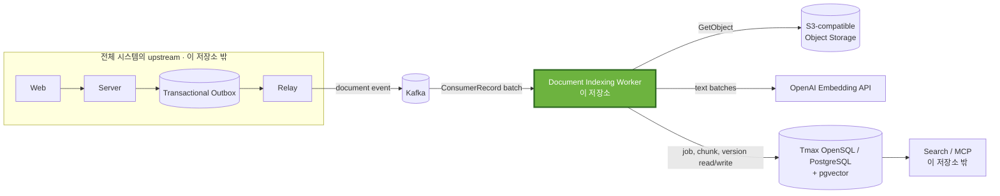
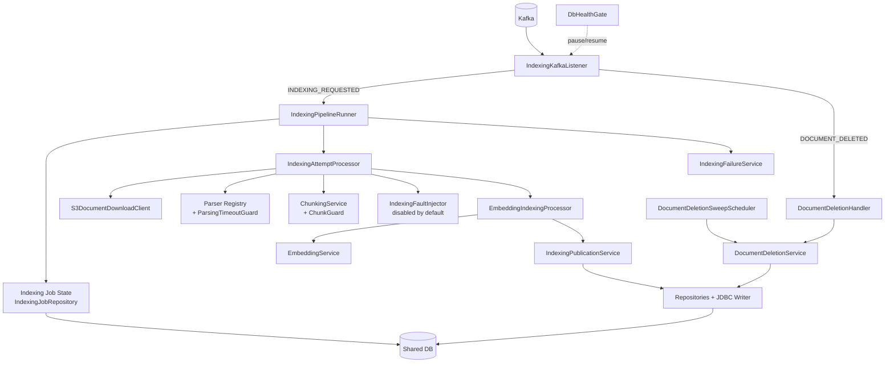
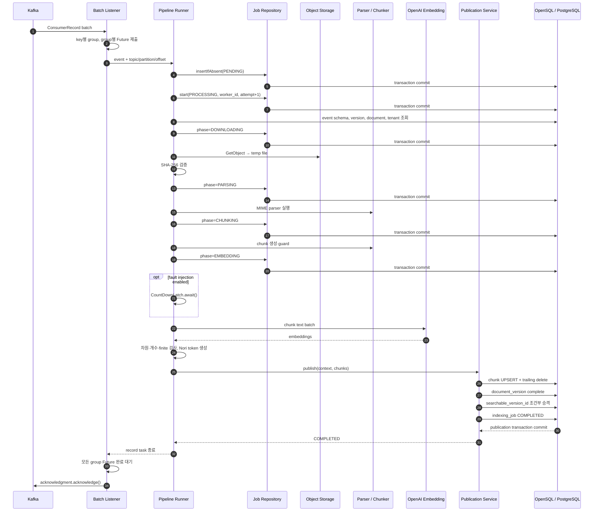
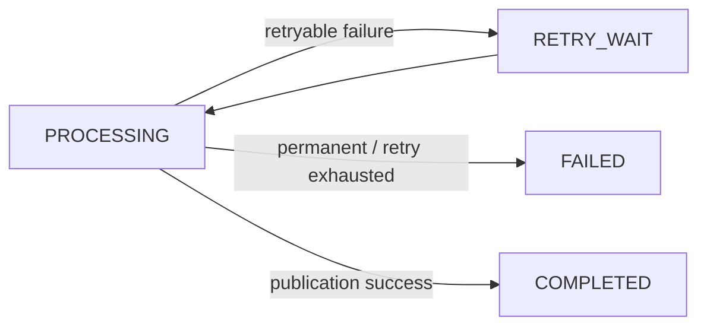
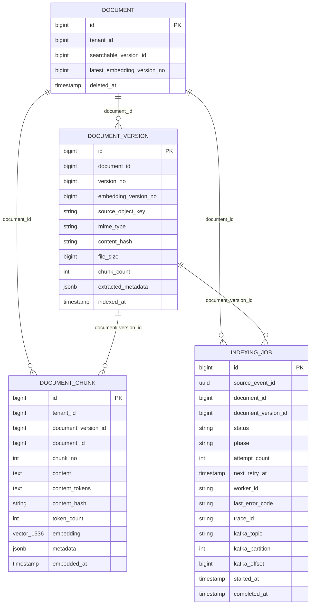
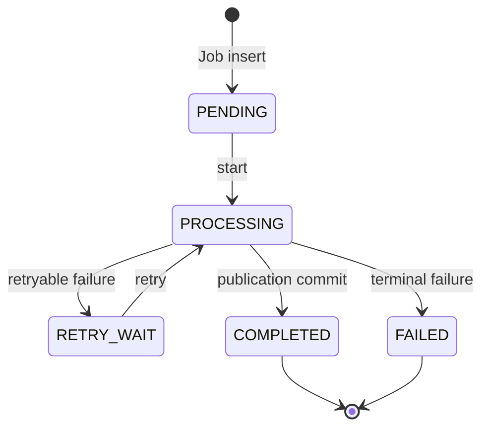
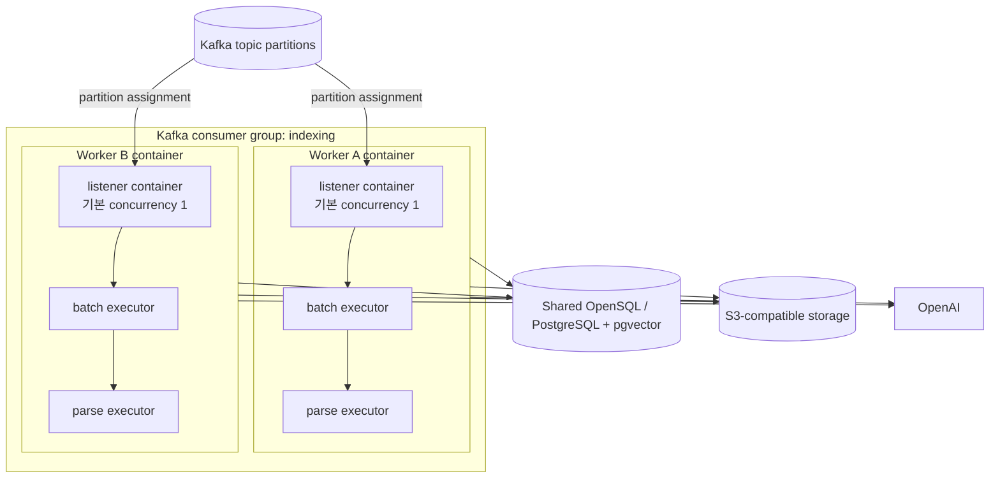

# Worker Architecture

> 구현 기준일: 2026-08-26
>
> 이 문서는 현재 저장소의 소스 코드, 설정, 테스트, Dockerfile을 기준으로 작성한다. 물리 DB 스키마는 이 저장소에 migration이 없으므로 Worker가 사용하는 계약만 설명한다.

## 1. 문서 목적과 범위

이 저장소는 2026 공개SW 개발자대회 TmaxTibero 기업과제 「Tmax OpenSQL 기반 AI 문서 관리 및 벡터 동기화 시스템」의 문서 인덱싱 Worker다. 전체 시스템에서 Worker는 Kafka로 전달된 문서 변경 이벤트를 받아 원문을 검색 가능한 chunk와 vector로 변환하고, 그 결과와 처리 상태를 공유 DB에 반영하는 비동기 실행 계층이다.

이 문서는 README보다 한 단계 깊은 다음 내용을 다룬다.

- Worker의 책임과 외부 시스템 경계
- 설계 목표와 기술 제약
- 내부 building block과 의존 방향
- 정상 인덱싱과 삭제의 주요 런타임 흐름
- Worker가 사용하는 데이터와 트랜잭션 경계
- 배포 모델과 횡단 관심사
- 주요 architecture decision, 품질 요구사항과 구조적 한계

Kafka poll·batch·thread·ACK/NACK의 상세 실행 모델은 [Processing Model](PROCESSING_MODEL.md)에서, 장애별 감지·재처리·복구 알고리즘과 보장 범위는 [Failure Handling](FAILURE_HANDLING.md)에서 다룬다. 이 문서에서는 두 영역을 architecture를 이해하는 데 필요한 수준까지만 설명한다.

### 1.1 구현 기준

| 구분 | 현재 구현 |
|---|---|
| 프로젝트 구조 | 단일 Gradle 모듈 |
| 런타임 | Java 21 |
| 언어 | Kotlin 2.3.21 |
| 애플리케이션 | Spring Boot 4.1.0 |
| 메시징 | Spring Kafka batch listener |
| 영속화 | Spring Data JPA, JDBC, PostgreSQL driver, Hibernate Vector |
| Object Storage | AWS SDK for Java 2.46.7의 동기 S3 client, path-style access |
| 임베딩 | Spring AI 2.0.0, OpenAI `text-embedding-3-small`, 1,536차원 float vector |
| 문서 처리 | PDFBox, Apache POI, hwplib, jtokkit, Lucene Nori |

## 2. Architecture Goals

| 목표 | 필요한 이유 | 현재 설계의 대응 |
|---|---|---|
| 긴 인덱싱 작업 분리 | 다운로드, 파싱, 임베딩은 업로드 요청보다 오래 걸릴 수 있다. | Kafka consumer Worker로 실행 수명을 분리하고 업로드·검색 인터페이스를 Worker 밖에 둔다. |
| 장애 후 처리 재개 가능성 | Worker가 DB 반영 도중 종료되면 같은 작업을 다른 인스턴스가 이어받아야 한다. | batch 전체 완료 전에는 ACK하지 않고, `indexing_job`의 `PROCESSING`도 같은 Kafka record 재전달 시 재획득할 수 있게 한다. 실제 partition 재할당은 Kafka consumer group이 수행한다. |
| 중복 실행의 결과 수렴 | Kafka 전달, batch NACK, ACK 전 crash 때문에 같은 record가 다시 실행될 수 있다. | `source_event_id`, Kafka record 위치, 결정적 chunk 번호, chunk UPSERT, 검색 버전 fencing을 함께 사용한다. 이는 exactly-once가 아니라 at-least-once 실행 결과의 수렴 전략이다. |
| 상태의 영속적 추적 | 외부 호출을 포함한 다단계 작업의 소유자와 실패 지점을 확인해야 한다. | Job 상태, phase, attempt, Worker ID, 오류, Kafka topic/partition/offset을 `indexing_job`에 기록한다. |
| 같은 문서의 순서 보존 | 같은 문서의 업로드와 삭제 또는 여러 버전이 역순으로 반영되면 검색 상태가 뒤집힐 수 있다. | producer가 `documentId`를 Kafka key로 사용한다는 계약 아래, batch를 key별로 묶어 같은 key는 순차 처리한다. 검색 버전 승격은 `embedding_version_no`로 추가 fencing한다. |
| 제한된 병렬 처리 | 서로 다른 문서는 병렬 처리할 수 있지만 외부 API와 로컬 자원은 무제한으로 사용할 수 없다. | batch 안의 key group만 고정 thread pool에서 병렬 처리하고, parsing은 별도 고정 pool과 timeout guard를 사용한다. |
| 외부 장애의 분류와 재시도 | 저장소, parser, 임베딩 공급자, DB의 실패 특성이 다르다. | 같은 입력으로 반복될 오류는 `FAILED`, 그 밖의 `Exception`은 `RETRY_WAIT` 후보로 분류한다. DB 상태를 기록할 수 없는 실패는 listener까지 전파해 batch NACK 경로로 보낸다. |
| 삭제 결과의 수렴 | 삭제 이벤트가 누락되거나 실행 중 인덱싱과 경합하면 chunk가 남을 수 있다. | 삭제 이벤트 경로와 주기적 보정 sweep이 같은 멱등 삭제 서비스를 호출한다. |

## 3. Architecture Constraints

### 3.1 메시징과 처리 수명

- 입력은 기본 topic `doc.events.v1`의 `INDEXING_REQUESTED`, `DOCUMENT_DELETED` 이벤트다.
- Worker는 Spring Kafka batch listener와 manual acknowledgment를 사용한다.
- 같은 문서의 순서는 producer가 `documentId`를 Kafka key로 사용한다는 계약에 의존하며, Worker는 Kafka key와 payload의 `documentId` 일치를 검사하지 않는다.
- Kafka offset과 DB 상태는 하나의 transaction으로 묶이지 않으므로, ACK 전 crash나 NACK에 따른 record 재전달 가능성을 전제로 한다.

consumer group, listener concurrency, batch 크기, heartbeat/session timeout, `max.poll.interval.ms`, executor와 ACK/NACK의 상세 실행 모델은 [Processing Model](PROCESSING_MODEL.md)에서 설명한다.

### 3.2 데이터와 transaction

- Worker는 Core/Server가 migration한 공유 스키마를 사용한다. 이 저장소에는 migration이 없고 `spring.jpa.hibernate.ddl-auto=none`이다.
- Kafka offset과 DB 변경은 하나의 분산 transaction으로 묶이지 않는다.
- 다운로드, hash 계산, parsing, chunking, embedding 호출은 DB transaction 밖에서 실행된다.
- 성공 publication만 chunk, document version, searchable version, Job 완료를 하나의 DB transaction으로 묶는다.
- 단계별 Job 상태와 phase는 짧은 repository transaction으로 먼저 commit된다.
- pgvector column과 embedding 결과의 크기는 현재 1,536차원으로 고정돼 있다. 설정 모델과 Java 검증 상수, entity column 정의가 모두 이 값에 결합돼 있다.

### 3.3 외부 시스템

- 원문은 S3 API 호환 Object Storage에서 동기 `GetObject`로 임시 파일에 다운로드한다.
- embedding은 외부 OpenAI API에 의존한다.
- DB는 Tmax OpenSQL/PostgreSQL 호환 SQL, JSONB, pgvector를 제공해야 한다.
- Worker에는 HTTP ingress가 없다. Actuator dependency는 있지만 Web starter와 HTTP metric endpoint 구성은 없다.

## 4. System Context & Scope

아래 그림의 Web, Server, Outbox, Relay, Search/MCP는 전체 프로젝트 맥락이다. 이 저장소에서 확인되는 경계는 Kafka event 계약, S3 호출, 공유 DB 접근, embedding 호출까지다. 외부 컴포넌트의 내부 구현은 이 문서가 보증하지 않는다.



### 4.1 Worker responsibilities

- Kafka record 역직렬화와 event type 라우팅
- event schema version, document 존재, tenant 일치 검증
- `indexing_job` 생성·조회·획득·상태·phase·실패 기록
- S3 호환 저장소의 원문 다운로드와 SHA-256 일치 확인
- MIME별 PDF, DOCX, HWP, text, Markdown parsing
- 설정된 전략에 따른 chunk 생성과 자원 상한 검사
- OpenAI embedding 요청 분할, 결과 개수·차원·유한값 검증
- Nori 기반 `content_tokens` 생성
- chunk UPSERT, trailing chunk 정리, document version 완료, 검색 버전 조건부 승격
- 문서 삭제 이벤트 처리와 잔여 chunk 보정 sweep
- batch 완료 후 ACK 또는 DB 장애 시 batch NACK
- Job, Worker, Kafka record를 연결하는 로그와 Micrometer 계측

### 4.2 Out of scope

- 사용자 인증, 문서 업로드 API, metadata/version 생성
- Transactional Outbox 작성과 Kafka relay
- Kafka topic 생성, partition 수와 producer key 생성
- 공유 DB schema migration
- 원본 object 삭제와 `document.purged_at` 관리
- 검색 API, vector 유사도 검색, MCP interface
- OpenSQL cluster HA, failover orchestration
- HNSW/IVFFlat index와 OpenCrypto 구성
- Worker container orchestration, autoscaling, alerting, dashboard

### 4.3 External interfaces

| 외부 시스템 | Worker 입력 | Worker 출력/효과 | 실패 영향 |
|---|---|---|---|
| Kafka | JSON event, record key, topic/partition/offset, 선택적 `traceId` header | manual `acknowledge()` 또는 `nack(0, delay)` 호출 | 미ACK record 재전달, consumer group rebalance, batch 재실행 가능 |
| OpenSQL/PostgreSQL | `document`, `document_version`, 기존 `indexing_job` | `indexing_job`, `document_chunk`, version/search pointer 갱신 | 상태 기록 실패 시 NACK 가능; publication 실패 시 success transaction rollback |
| S3-compatible storage | bucket와 `source_object_key` | 임시 원문 파일 | 다운로드 실패는 기본적으로 재시도 가능 오류 |
| OpenAI | chunk text 목록 | 1,536차원 float embedding 목록 | HTTP 400은 영구 실패로 변환; 그 밖에 전파된 예외는 기본 retry 후보 |

## 5. Solution Strategy

| Quality goal / problem | Strategy | Effect and boundary |
|---|---|---|
| 요청 경로와 장시간 처리 분리 | Kafka 기반 비동기 Worker | 업로드와 인덱싱의 실행 수명을 분리한다. Kafka 이전 단계는 이 저장소 밖이다. |
| crash 전후 상태 보존 | durable `indexing_job` | DB commit된 status, phase, attempt, Worker, record identity를 다음 실행이 조회할 수 있다. |
| at-least-once 중복 | event identity + record identity + idempotent write | 동일 record 재전달과 같은 `eventId`의 다른 record 재발행을 구분하고, 재실행 결과를 UPSERT로 수렴시킨다. |
| batch 내 순서와 처리량 | Kafka key grouping + bounded executor | 같은 key는 순차, 다른 key group은 병렬 처리한다. key 계약 위반은 Worker가 교정하지 않는다. |
| DB lock 장기 점유 방지 | external I/O와 state transaction 분리 | 진행 상태는 먼저 commit하고, 다운로드·parsing·embedding 중에는 긴 DB transaction을 유지하지 않는다. |
| 성공 결과 일관성 | 단일 publication transaction | chunk/version/search pointer/Job 완료가 함께 commit되거나 rollback된다. |
| 늦은 구버전 완료 | `embedding_version_no` 기반 조건부 승격 | 구버전 결과도 저장할 수 있지만 현재 검색 pointer는 더 높은 embedding version만 선택한다. |
| 일시 오류 복원력 | 영구 오류 whitelist + inline retry | retry 가능한 실패는 Job을 `RETRY_WAIT`으로 기록하고 같은 실행 thread에서 due 시각까지 기다린다. |
| DB outage 완화 | listener NACK + scheduled DB health gate | 결과를 기록하지 못한 batch는 되감고, DB down 동안 consumer pause를 요청한다. |
| 삭제 이벤트 누락·경합 | event handler + idempotent sweep | 삭제된 문서의 남은 chunk를 반복 탐색해 정리한다. |

## 6. Building Block View

### 6.1 논리 구조



### 6.2 주요 building block

| Building block | 책임 | 주요 입력 | 주요 출력·의존 |
|---|---|---|---|
| Consumer boundary | `IndexingKafkaListener`가 batch 수신, key grouping, event routing, Future join, ACK/NACK를 담당한다. | `List<ConsumerRecord<String, String>>` | `IndexingPipelineRunner`, `DocumentDeletionHandler`, `Acknowledgment` |
| Event contract and validation | `IndexingEvent`, `IndexingEventValidator`, deletion handler가 schema/version/document/tenant 조건을 확인한다. | event payload, DB document/version | 유효한 `DocumentVersionEntity` 또는 영구 오류 |
| Job orchestration | `IndexingPipelineRunner`가 Job identity 판정, 획득, attempt loop, Worker 인계, 완료 로그를 조정한다. | event + `KafkaRecordIdentity` | Job 상태 전이, attempt 실행, retry/terminal 반환 |
| Attempt pipeline | `IndexingAttemptProcessor`가 한 시도의 download → verify → parse → chunk → embed/publish 순서를 고정한다. 이 클래스는 별도 Spring bean이 아니라 Runner가 구성한다. | 획득한 Job, event, document version | chunk 목록과 `IndexingProcessor` 호출 |
| Retrieval | `S3DocumentDownloadClient`가 원문을 임시 파일로 내려받는다. | object key | 임시 `Path`; 실패 시 생성 파일 정리 |
| Parsing | `DocumentParserRegistry`가 MIME별 parser를 선택하고 `ParsingTimeoutGuard`가 별도 pool에서 제한 시간 실행한다. | 원문 stream, MIME | 순서 있는 `ParsedBlock` 목록 |
| Chunking | `ChunkingService`가 전략을 선택하고 `ChunkGuard`가 빈 결과, chunk 수, 전체 token 상한을 검사한다. | parsed blocks, 전략 | 0부터 연속된 `Chunk` 목록 |
| Embedding | `EmbeddingIndexingProcessor`와 `EmbeddingService`가 token 기준 request 분할, OpenAI 호출, 결과 검증, Nori token 생성을 담당한다. | chunk text | `DocumentChunk` 목록 |
| Publication | `IndexingPublicationService`가 성공 결과를 하나의 transaction으로 DB에 공개한다. | context, embedded chunks | chunk/version/search pointer/Job 완료 commit |
| Failure management | `IndexingErrorClassifier`와 `IndexingFailureService`가 영구/일시 오류와 `RETRY_WAIT`/`FAILED`를 결정한다. | 처리 예외, attempt | 잠긴 Job 행의 실패 상태와 `next_retry_at` |
| Deletion convergence | deletion handler, service, sweep가 활성 Job 실패 처리와 document chunk 삭제를 반복 가능하게 수행한다. | delete event 또는 DB sweep 대상 | 활성 Job `FAILED`, chunk 삭제 |
| Operational control | `DbHealthGate`, structured log marker, MDC, Micrometer가 DB 장애 제어와 상관관계를 제공한다. | DB health, runtime event | listener pause/resume, log, in-process metric |

## 7. Runtime View

### 7.1 정상 `INDEXING_REQUESTED`



핵심 경계는 다음과 같다.

1. `insertIfAbsent()`, `start()`, 각 `updatePhase()`는 repository method가 반환될 때 각각 commit된다.
2. 따라서 `PROCESSING`과 `EMBEDDING`은 embedding API 호출 전에 DB에서 관찰할 수 있다.
3. 장애 주입은 `phase=EMBEDDING` commit 뒤, 실제 embedding 호출 전에만 호출된다. 기본 비활성이고 활성화한 Worker의 모든 embedding 작업을 무기한 block한다.
4. chunk UPSERT부터 Job `COMPLETED`까지는 `IndexingPublicationService.publish()`의 단일 transaction이다.
5. publication commit 뒤에도 같은 poll batch의 다른 Future가 남아 있으면 ACK하지 않는다.
6. `acknowledge()`는 Spring Kafka container에 수동 ACK 의사를 전달하는 호출이다. Kafka broker offset과 DB commit을 원자적으로 묶거나 호출 순간 broker commit 완료를 보장하는 분산 transaction은 아니다.

### 7.2 실패와 재처리 개요

Worker는 실패를 영구 오류와 재시도 가능한 오류로 구분하고, 처리 상태를 `indexing_job`에 영속화한다.



Worker process가 ACK 전에 종료되면 partition 재할당과 record 재전달은 Kafka consumer group이 담당한다. 재전달된 record를 받은 Worker는 영속화된 event identity, Kafka record identity와 Job 상태를 기준으로 실행 여부를 판단해 결과가 같은 DB 상태로 수렴하도록 한다.

오류 분류, retry/backoff, Worker handoff, 동일 record 재전달과 동일 event 재발행의 판정, DB 장애와 crash window의 상세 동작은 [Failure Handling](FAILURE_HANDLING.md)에서 설명한다.

### 7.4 `DOCUMENT_DELETED`

삭제 이벤트는 indexing pipeline과 Job 생성 경로를 사용하지 않는다.

1. schema version, document 존재, tenant 일치를 검사한다.
2. 해당 document의 `PENDING`, `PROCESSING`, `RETRY_WAIT` Job을 `DOCUMENT_DELETED` 사유의 `FAILED`로 갱신한다.
3. 해당 `document_id`의 모든 `document_chunk`를 삭제한다.
4. 별도 scheduled sweep이 `deleted_at IS NOT NULL`이면서 chunk가 남은 document를 다시 찾아 같은 서비스를 호출한다.

활성 Job 실패 처리와 chunk 삭제는 하나의 service transaction이 아니라 각각 repository transaction이다. 중간 실패나 실행 중 publication 경합은 sweep을 통한 결과 수렴에 의존한다.

## 8. Data & State Model

### 8.1 논리 데이터 관계

아래는 Worker의 entity와 SQL이 사용하는 논리 관계다. 정확한 physical constraint와 index DDL의 소유자는 외부 Core/Server schema다. 이 저장소의 통합 테스트는 준비된 외부 schema를 대상으로 일부 constraint를 검증하지만 schema를 생성하지 않는다.



### 8.2 `document`와 `document_version`

Worker는 `document`에서 `id`, `tenant_id`, `searchable_version_id`, `deleted_at`을 entity로 읽는다. 검색 버전 승격 native SQL은 공유 schema의 `latest_embedding_version_no`, `updated_at`도 사용한다.

`document_version`에서는 다음 정보를 사용한다.

- 원문 조회: `source_object_key`
- parser 선택: `mime_type`
- 무결성 검사: `content_hash`
- 다운로드 전 크기 guard: `file_size`
- 검색 version fencing: `embedding_version_no`
- 처리 결과: `chunk_count`, `extracted_metadata`, `indexed_at`

현재 attempt pipeline은 `extractedMetadata=null`로 context를 만들기 때문에 parser가 metadata를 추출해 publication에 전달하는 구현은 없다.

### 8.3 `document_chunk`

Worker가 쓰는 chunk 필드는 `tenant_id`, document/version ID, `chunk_no`, 본문, Nori `content_tokens`, content hash, token 수, page 범위, section path, JSONB metadata, 1,536차원 vector, embedding 시각이다.

- 저장은 `(document_version_id, chunk_no)` conflict target의 UPSERT다.
- 재처리 결과의 chunk 수가 줄면 새 마지막 번호보다 큰 trailing row를 삭제한다.
- 저장 후 version별 row 수가 예상 chunk 수와 같은지 확인한다.
- `tenant_id`는 event 값을 직접 쓰지 않고 `document` row에서 `INSERT ... SELECT`로 가져온다.
- vector index 생성, 검색 SQL, HNSW/IVFFlat 운영은 이 저장소에 없다.

### 8.4 `indexing_job`

`indexing_job`은 queue가 아니라 Kafka 처리와 DB publication 사이의 durable execution record다.

| 역할 | 실제 필드 |
|---|---|
| event·대상 식별 | `source_event_id`, `document_id`, `document_version_id` |
| 실행 상태 | `status`, `phase`, `attempt_count`, `next_retry_at` |
| 소유·진단 | `worker_id`, `last_error_code`, `last_error_message`, `trace_id` |
| Kafka record 식별 | `kafka_topic`, `kafka_partition`, `kafka_offset` |
| 시간 | `started_at`, `completed_at`, `updated_at` |

Job insert SQL은 외부 schema의 `source_event_id` unique constraint와 active document version partial unique constraint를 전제로 `ON CONFLICT DO NOTHING`을 사용한다. chunk UPSERT 역시 외부 schema의 `(document_version_id, chunk_no)` unique constraint가 필요하다.

### 8.5 상태와 phase



`indexing_job.status`는 처리 lifecycle의 영속 상태를 나타낸다. crash 이후 재획득, 삭제와의 경합, 겹쳐 실행 중인 attempt가 만드는 세부 상태 전이는 [Failure Handling](FAILURE_HANDLING.md)에서 설명한다.

DB에 저장되는 phase는 `DOWNLOADING`, `PARSING`, `CHUNKING`, `EMBEDDING`이다. `VALIDATING`, `VERIFYING_CONTENT`, `PUBLISHING`은 로그의 stage지만 현재 `indexing_job.phase`에 저장되지 않는다. phase는 현재 실행 여부가 아니라 마지막으로 기록된 진입 지점이므로 `status`와 함께 해석해야 한다.

## 9. Deployment View

### 9.1 다중 Worker 배치



- 같은 consumer group의 여러 Worker process를 실행할 수 있고, Kafka가 partition을 group member에 배분한다.
- 한 process 안에서는 listener container 1개가 poll한 batch를 key group별 로컬 executor에 분산한다.
- partition 수가 Kafka consumer 수준의 최대 병렬성을 제한한다. 로컬 executor 수를 늘리는 것은 partition consumer 수 증가와 같지 않다.
- 모든 Worker는 같은 DB, storage, embedding provider를 공유하며 각 인스턴스에서 DB health check와 deletion sweep이 실행된다.
- `INDEXING_WORKER_ID`를 주면 DB와 로그에 안정적인 ID를 남길 수 있다. 설정하지 않으면 process 시작 때 UUID가 생성된다. `WORKER_STARTED` 로그의 `hostname`은 `HOSTNAME` 환경변수 또는 host name으로 결정된다.

### 9.2 Container image

Dockerfile은 Temurin 21 JDK build stage와 Temurin 21 JRE runtime stage를 사용한다. runtime은 non-root `worker` 사용자로 실행하고 shell `exec`를 통해 Java process를 PID 1로 둔다.

health check는 `/proc/1/cmdline`에서 `app.jar` process 생존만 검사한다. Kafka, DB, storage, OpenAI readiness는 확인하지 않는다. 저장소에 Docker Compose와 orchestrator manifest가 없으므로 다중 Worker 배치와 dependency 기동은 외부 환경의 책임이다.

OpenSQL의 DB HA와 Worker의 consumer 장애 복구는 서로 다른 계층이다. DB failover는 JDBC 연결 관점의 외부 상태 변화이고, Worker crash 이후 partition 재할당은 Kafka consumer group이 담당한다.

## 10. Cross-cutting Concepts

### 10.1 Idempotency and record identity

멱등성은 하나의 장치가 아니라 다음 층을 조합한다.

1. `source_event_id` 기준 Job insert conflict 억제
2. 최초 Kafka topic/partition/offset 저장
3. 같은 event ID의 동일 record 재전달과 다른 위치의 재발행 구분
4. 같은 입력에 같은 `chunk_no`와 hash를 만드는 chunking
5. `(document_version_id, chunk_no)` UPSERT와 trailing row 삭제
6. `embedding_version_no`가 더 높은 version만 searchable pointer로 승격
7. terminal Job 재수신 시 실행 생략
8. document delete의 반복 가능한 SQL과 sweep

이 전략은 DB 결과를 수렴시키지만 중복 외부 API 호출까지 제거하지는 않는다. crash가 embedding 호출 뒤 publication commit 전에 발생하면 같은 text를 다시 embedding할 수 있다.

### 10.2 Transaction boundaries

| 경계 | transaction 특성 | commit 후 의미 |
|---|---|---|
| Job insert | repository `@Transactional` | `PENDING`과 최초 record identity가 durable |
| Job start | repository `@Transactional` | `PROCESSING`, 현재 `worker_id`, 증가한 attempt가 durable |
| phase update | repository `@Transactional` | 마지막 진입 phase가 durable |
| 외부 처리 | DB transaction 없음 | long I/O 동안 DB transaction을 유지하지 않음 |
| publication | service `@Transactional` | chunk/version/search pointer/Job 완료가 함께 확정 |
| failure record | `REQUIRES_NEW` + pessimistic lock | 바깥 처리 실패와 독립적으로 retry/terminal 상태 확정 |
| deletion | 두 repository transaction | active Job failure와 chunk delete 사이에 부분 완료 가능 |
| Kafka ACK | DB transaction 밖 | DB와 broker offset 사이 원자성 없음 |

### 10.3 Error handling

Worker는 오류를 architecture 수준에서 다음 세 범주로 나눈다.

- terminal failure: 같은 입력으로 반복해도 성공하기 어려운 오류는 Job을 `FAILED`로 종결한다.
- retryable failure: 일시적 외부 시스템 오류는 durable Job 상태를 남기고 제한된 재시도로 연결한다.
- infrastructure failure: DB에 처리 결과 자체를 기록할 수 없는 실패는 Kafka acknowledgment를 완료하지 않고 redelivery 경로로 연결한다.

구체적인 오류 분류, retry 계층, DB 장애 시 NACK과 health gate, poison event 처리와 timeout 한계는 [Failure Handling](FAILURE_HANDLING.md)에서 설명한다.

### 10.4 Worker identity and traceability

- `worker_id`는 Job을 마지막으로 획득한 Worker를 나타내며 재획득 때 현재 값으로 갱신된다.
- Kafka `traceId` header는 event의 `traceId`, `indexing_job.trace_id`, worker thread의 MDC로 전달된다.
- `sourceEventId`, Job ID, Worker ID, topic/partition/offset을 포함하는 marker log로 record 수신부터 완료까지 연결할 수 있다.
- batch ACK log는 `partition:offset` 목록만 포함하며 topic과 event ID는 포함하지 않는다. 앞선 수신·완료 로그와 상관관계를 맞춰야 한다.

### 10.5 Observability

아키텍처 관점의 관측 원천은 세 가지다.

- DB: Job status, phase, attempt, owner, error, Kafka position
- log: Worker 시작, event 수신, 재발행/재전달 판정, recovery, 완료, batch ACK, 단계별 duration
- Micrometer: Job duration, inline retry, terminal failure, parsing timeout, DB health pause 등 process 내부 계측

`RebalanceMetricsListener`와 `RebalanceMetricsConfig` 코드는 존재하고 listener 자체 단위 테스트도 있다. 그러나 현재 Spring Boot 4.1 기본 listener factory의 generic wiring과 customizer bean type이 맞지 않아 실제 container에는 custom rebalance listener가 적용되지 않는다. 따라서 현재 실행에서 확인되는 partition assignment 근거는 Spring Kafka의 기본 INFO 로그인 다음 형식이다.

```text
indexing: partitions assigned: [doc.events.v1-0, doc.events.v1-1]
```

즉 현재 `KAFKA_PARTITIONS_ASSIGNED` marker와 `kafka_rebalance_total`을 운영에서 사용 가능하다고 보지 않는다. 또한 metric exporter, dashboard, alert rule은 저장소에 없다.

### 10.6 Security

- Worker는 inbound HTTP endpoint를 노출하지 않는다.
- DB와 OpenAI credential은 환경 property로 받고, S3 credential은 AWS default credential provider chain을 사용한다.
- indexing과 delete 전에 event tenant와 `document.tenant_id` 일치를 검사한다.
- 원문은 OS 임시 경로에 저장하고 정상·예외 경로에서 삭제를 시도한다.
- TLS 강제, secret manager, log redaction, disk encryption, OpenCrypto 적용은 이 저장소에서 확인되지 않는다. 연결 보안은 제공된 JDBC URL, Kafka, S3 endpoint와 배포 환경 설정에 의존한다.

### 10.7 Test-only failure injection

Worker에는 `EMBEDDING` 호출 직전 실행을 block할 수 있는 비활성 기본값의 장애 주입 지점이 있다. 이 기능은 production 복구 로직이 아니라 장애 상황에서 Worker 중단과 재처리 경로를 확인하기 위한 test support다.

구체적인 활성화 조건과 제약은 [Failure Handling](FAILURE_HANDLING.md)에서 설명한다.

## 11. Architecture Decisions

| 결정 | Context | Decision | Consequence |
|---|---|---|---|
| 비동기 indexing boundary | 문서 처리는 외부 I/O와 CPU 작업을 포함한다. | Kafka 이후 별도 Worker에서 실행한다. | 업로드 실행 수명과 분리되지만 Kafka/DB 간 중복 가능성을 다뤄야 한다. |
| at-least-once + DB 수렴 | Worker crash와 redelivery로 같은 작업이 다시 실행될 수 있다. | exactly-once transaction 대신 durable Job, 결정적 chunking, UPSERT와 version fencing을 사용한다. | DB 결과를 수렴시킬 수 있지만 외부 API 중복 호출과 중첩 실행 가능성은 남는다. |
| durable `indexing_job` | 장시간 작업의 상태를 process memory에만 두면 crash 후 복구 판단이 어렵다. | status, phase, attempt, Worker와 Kafka record identity를 공유 DB에 영속화한다. | 다른 실행이 이전 처리 상태를 조회할 수 있지만 공유 schema 계약에 의존한다. |
| key 기반 bounded parallelism | 같은 문서는 순서가 필요하고 다른 문서는 병렬화할 수 있다. | 같은 Kafka key는 순차 처리하고 서로 다른 key group만 제한된 executor에서 병렬 처리한다. | 순서와 처리량을 함께 고려할 수 있지만 정확성은 producer key 계약에 의존한다. |
| 짧은 state transaction과 단일 publication | 외부 호출 중 DB lock을 잡고 싶지 않지만 성공 결과는 함께 공개해야 한다. | 상태/phase는 개별 commit, 외부 I/O는 transaction 밖, 성공 publication은 하나의 transaction으로 둔다. | 진행 상태가 crash 뒤 남고 성공 결과는 원자적이지만 Kafka offset과는 원자적이지 않다. |
| 공유 schema consumer | 문서 lifecycle schema는 Server/Core가 소유한다. | Worker는 `ddl-auto=none`과 native SQL/JPA mapping으로 합의된 schema를 사용한다. | 책임은 분리되지만 schema 변화와 Worker 배포의 호환성 관리가 외부 계약에 의존한다. |
| 조건부 searchable version 승격 | 버전별 처리 시간이 달라 완료 순서가 바뀔 수 있다. | 더 높은 `embedding_version_no`만 검색 pointer를 갱신한다. | 구버전 chunk 저장은 보존하면서 검색 대상의 역행을 막는다. |
| 삭제 event + 보정 sweep | 삭제 이벤트 누락이나 인덱싱과의 경합으로 chunk가 남을 수 있다. | event 기반 삭제와 동일한 멱등 삭제 서비스를 주기적 sweep에서도 호출한다. | 즉시 원자적 삭제를 보장하지는 않지만 잔여 데이터를 반복적으로 정리하는 수렴 경로를 둔다. |

## 12. Quality Requirements

| Quality attribute | Scenario | Architectural response |
|---|---|---|
| Reliability | Worker 중단이나 record 재전달이 발생한다. | durable Job과 idempotent publication을 사용해 재실행 결과가 같은 DB 상태로 수렴하도록 한다. |
| Ordering | 같은 문서의 여러 event가 처리된다. | 같은 Kafka key는 순차 처리하고 검색 버전은 `embedding_version_no`로 추가 fencing한다. |
| Idempotency | 같은 logical event 또는 같은 Kafka record가 다시 입력된다. | event/record identity, 결정적 chunk 번호, UPSERT, terminal Job 판정을 조합한다. |
| Consistency | chunk 저장과 version/Job 완료가 함께 공개되어야 한다. | 성공 publication을 하나의 DB transaction으로 묶는다. |
| Recoverability | 장시간 처리 중 process가 종료되거나 일시 오류가 발생한다. | status, phase, attempt, Worker와 Kafka 위치를 영속화해 후속 실행이 복구 여부를 판단할 수 있게 한다. |
| Resource safety | 큰 문서나 parser hang이 Worker 자원을 무제한 점유할 수 있다. | 파일·chunk·token 상한, parsing timeout, bounded executor를 둔다. |
| Traceability | 특정 event가 어느 Worker와 Kafka record에서 처리됐는지 추적해야 한다. | `indexing_job`과 structured log에 Worker ID, trace ID, topic/partition/offset을 연결한다. |
| Deletion convergence | 삭제 event 누락 또는 처리 경합으로 chunk가 남을 수 있다. | 멱등 삭제와 scheduled sweep으로 잔여 데이터를 반복 정리한다. |

세부 실행 모델의 검증 포인트는 [Processing Model](PROCESSING_MODEL.md), 장애 복구의 상태별 보장과 한계는 [Failure Handling](FAILURE_HANDLING.md)에서 다룬다.

## 13. Architecture Risks & Limitations

| Risk / limitation | 현재 영향 |
|---|---|
| Kafka와 DB 사이 분산 transaction 부재 | publication commit과 Kafka offset commit은 원자적이지 않다. 따라서 at-least-once 실행과 결과 수렴을 전제로 하며 exactly-once로 표현할 수 없다. |
| producer key 계약을 Worker가 검증하지 않음 | 같은 문서의 순서 보장은 producer가 일관된 `documentId` key를 사용한다는 외부 계약에 의존한다. |
| 공유 schema에 강하게 결합 | migration이 저장소에 없어 unique constraint, composite FK, vector extension, native SQL column의 배포 호환성을 Worker만으로 재현할 수 없다. |
| OpenSQL HA는 Worker 외부 책임 | Worker는 JDBC 관점에서 DB를 사용하며 cluster HA 구성과 failover orchestration을 구현하지 않는다. |
| publication과 deletion의 전체 lifecycle이 하나의 transaction이 아님 | 성공 publication 자체는 원자적이지만 삭제 처리 및 실행 중 작업과의 경합까지 하나의 transaction으로 묶이지 않아 보정 경로에 의존한다. |
| 외부 시스템 의존 | Object Storage와 OpenAI 장애 또는 지연은 Worker 처리 수명에 직접 영향을 준다. provider failover는 구현되어 있지 않다. |
| metadata pipeline 미완성 | schema와 publication은 `extracted_metadata`를 지원하지만 현재 attempt context는 항상 `null`을 전달한다. |
| process-only health check | Docker health check는 Java PID 생존만 확인하므로 Kafka/DB/storage/OpenAI 연결 불능을 readiness로 구분하지 못한다. |
| 관측 export 부재 | Micrometer 계측은 있지만 exporter, dashboard, alert가 없어 deployment에서 별도 연결하지 않으면 process 밖에서 사용할 수 없다. |

처리 시간 budget, executor 점유, listener concurrency와 batch replay 범위 같은 실행 모델의 한계는 [Processing Model](PROCESSING_MODEL.md)에서 다룬다. lease/fencing 부재, retry/poison event, duplicate republish, 상태 경합과 같은 복구 한계는 [Failure Handling](FAILURE_HANDLING.md)에서 다룬다.

이 저장소에서 확인되지 않아 현재 architecture로 포함하지 않은 기능은 다음과 같다.

- Kafka exactly-once transaction 또는 DB/Kafka atomic commit
- OpenSQL HA orchestration과 failover 검증
- HNSW/IVFFlat index migration 및 tuning
- OpenCrypto 기반 암호화
- embedding provider failover
- HTTP 상태/진행 조회 API
- 자동 scaling과 partition capacity 계산

## 14. Related Documents

- [README](../README.md): 프로젝트 소개, 실행 방법, 환경변수
- [Processing Model](PROCESSING_MODEL.md): Kafka batch, partition, ordering, executor, ACK/NACK과 consumer liveness
- [Failure Handling](FAILURE_HANDLING.md): 장애 모델, retry, redelivery, 복구 알고리즘과 보장 범위
- [Code Conventions](CODE_CONVENTIONS.md): 코드 작성과 검토 규칙

일부 기존 설계·계획 문서는 작성 시점의 목표나 과거 package 상태를 담고 있을 수 있다. 현재 동작을 판단할 때는 이 문서와 실제 소스 코드·설정을 우선한다.
