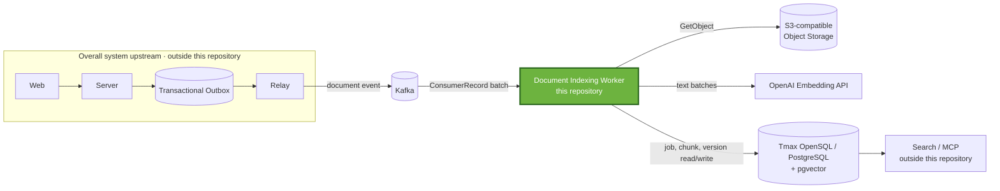
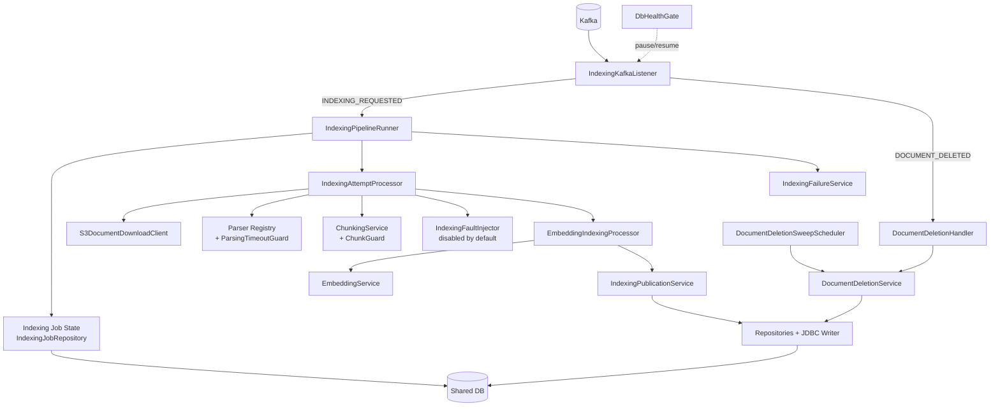
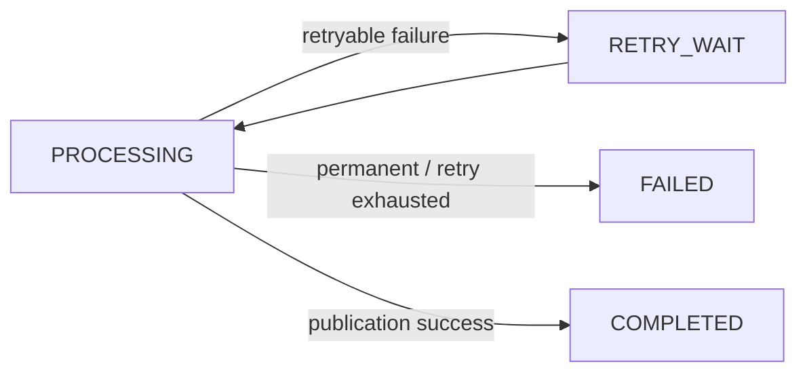
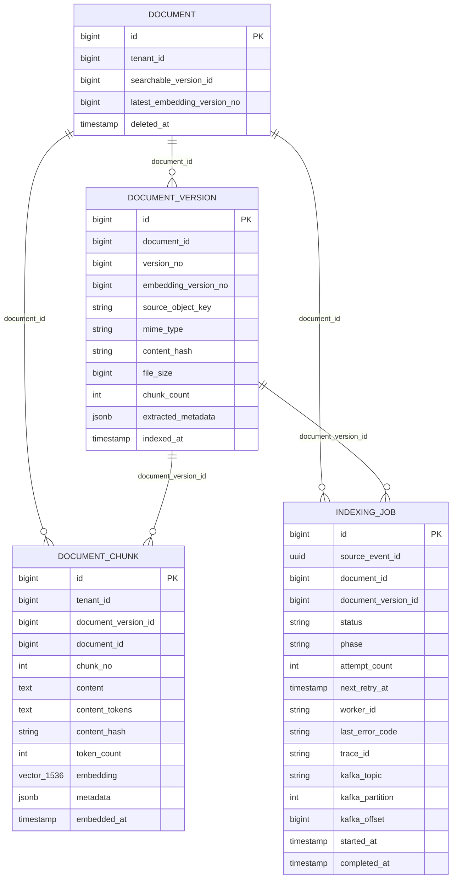
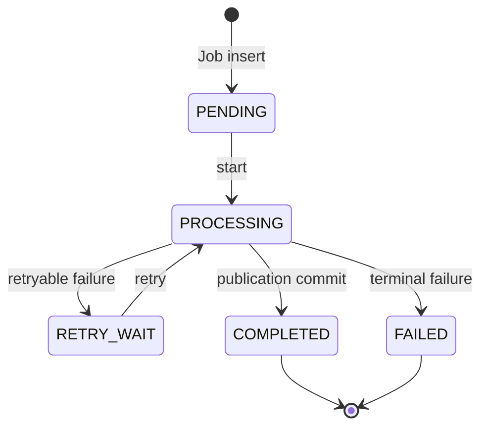

# Worker Architecture

This document describes the Worker's overall structure, component
responsibilities, data flows, transaction boundaries, and major design
decisions.

## 1. Purpose and Scope

This document covers the following topics in greater depth than the README:

- Worker responsibilities and external system boundaries
- Design goals and technical constraints
- Internal building blocks and dependency direction
- Main runtime flows for normal indexing and deletion
- Data used by the Worker and transaction boundaries
- Major architecture decisions, quality requirements, and structural limitations

The detailed Kafka poll, batch, thread, and ACK/NACK execution model is covered
in the [Processing Model](PROCESSING_MODEL_EN.md). Failure-specific detection,
reprocessing, recovery algorithms, and guarantees are covered in [Failure
Handling](FAILURE_HANDLING_EN.md). This document describes those areas only to
the extent necessary to understand the architecture.

### 1.1 Implementation Baseline

| Category | Current implementation |
|---|---|
| Project structure | Single Gradle module |
| Runtime | Java 21 |
| Language | Kotlin 2.3.21 |
| Application | Spring Boot 4.1.0 |
| Messaging | Spring Kafka batch listener |
| Persistence | Spring Data JPA, JDBC, PostgreSQL driver, Hibernate Vector |
| Object Storage | Synchronous S3 client from AWS SDK for Java 2.46.7, with path-style access |
| Embedding | Spring AI 2.0.0, OpenAI `text-embedding-3-small`, 1,536-dimensional float vectors |
| Document processing | PDFBox, Apache POI, hwplib, jtokkit, Lucene Nori |

## 2. Architecture Goals

| Goal | Why it is needed | Current design response |
|---|---|---|
| Preserve per-document order while processing in parallel | Uploads, deletions, and multiple versions of the same document are order-sensitive, but serializing every document would reduce throughput. | Under the contract that producers use `documentId` as the Kafka key, a batch is grouped by key. Records with the same key are processed sequentially, while different key groups run in parallel on a fixed thread pool. Search-version promotion is additionally fenced by `embedding_version_no`. |
| Resume processing after failure | If a Worker exits while processing several documents in a batch in parallel, another Worker must be able to continue unfinished work. | The batch is not acknowledged until all tasks complete. When the Kafka consumer group detects a Worker failure, it assigns partitions to another Worker and redelivers uncommitted records. The new Worker reacquires recoverable `indexing_job` rows and resumes processing. |
| Converge duplicate executions | Kafka delivery, batch NACK, and crashes before ACK can cause the same record to execute again. | The design combines `source_event_id`, Kafka record position, deterministic chunk numbers, chunk UPSERT, and search-version fencing. This is an at-least-once result-convergence strategy, not exactly-once processing. |
| Persistently track state | Multi-stage work involving external calls requires visibility into the owner and the point of failure. | Job status, phase, attempt, Worker ID, error, and Kafka topic/partition/offset are recorded in `indexing_job`. |
| Classify and retry external failures | Storage, parsers, the embedding provider, and the database have different failure characteristics. | Errors that will recur for the same input become `FAILED`; other `Exception` instances are candidates for `RETRY_WAIT`. A failure that prevents database state from being recorded propagates to the listener and enters the batch NACK path. |
| Converge deletion results | Chunks may remain if a deletion event is missed or races with active indexing. | The deletion-event path and periodic reconciliation sweep call the same idempotent deletion service. |

## 3. Architecture Constraints

### 3.1 Messaging and Processing Lifetime

- Inputs are `INDEXING_REQUESTED` and `DOCUMENT_DELETED` events from the default
  topic, `doc.events.v1`.
- The Worker uses a Spring Kafka batch listener with manual acknowledgment.
- Per-document ordering depends on the producer contract that uses `documentId`
  as the Kafka key.
- Kafka offsets and database state are not part of one transaction, so the
  design assumes records may be redelivered after a crash before ACK or after a
  NACK.

See the [Processing Model](PROCESSING_MODEL_EN.md) for the detailed execution
model covering the consumer group, listener concurrency, batch size,
heartbeat/session timeout, `max.poll.interval.ms`, executors, and ACK/NACK.

### 3.2 Data and Transactions

- The Worker uses the shared schema migrated by Core/Server. This repository
  has no migrations, and `spring.jpa.hibernate.ddl-auto=none`.
- Kafka offsets and database changes are not combined in a distributed
  transaction.
- Downloads, hash computation, parsing, chunking, and embedding calls execute
  outside database transactions.
- Only successful publication groups chunks, document version completion,
  searchable version promotion, and job completion in one database transaction.
- Stage-level job status and phase changes are committed first in short
  repository transactions.
- The pgvector column and embedding results are currently fixed at 1,536
  dimensions. The configuration model, Java validation constant, and entity
  column definition are all coupled to this value.

### 3.3 External Systems

- Source documents are downloaded to temporary files through synchronous
  `GetObject` calls to S3 API-compatible Object Storage.
- Embedding depends on the external OpenAI API.
- The database must provide Tmax OpenSQL/PostgreSQL-compatible SQL, JSONB, and
  pgvector.
- The Worker has no HTTP ingress. It includes the Actuator dependency but does
  not include the Web starter or configure an HTTP metrics endpoint.

## 4. System Context & Scope

Web, Server, Outbox, Relay, and Search/MCP in the diagram below provide the
overall project context. The boundaries confirmed in this repository extend to
the Kafka event contract, S3 calls, shared database access, and embedding calls.
This document does not guarantee the internal implementations of external
components.



### 4.1 Worker Responsibilities

- Deserialize Kafka records and route event types
- Validate event schema versions, document existence, and tenant matches
- Create, query, acquire, and update `indexing_job` state and phase, and record
  failures
- Download source documents from S3-compatible storage and verify SHA-256
  hashes
- Parse PDF, DOCX, HWP, text, and Markdown by MIME type
- Create chunks using the configured strategy and enforce resource limits
- Split OpenAI embedding requests and validate result count, dimensions, and
  finite values
- Generate Nori-based `content_tokens`
- UPSERT chunks, remove trailing chunks, complete document versions, and
  conditionally promote searchable versions
- Process document deletion events and sweep for residual chunks
- ACK after batch completion or NACK the batch after a database failure
- Provide logs and Micrometer measurements linking jobs, Workers, and Kafka
  records

### 4.2 External Interfaces

| External system | Worker input | Worker output/effect | Failure impact |
|---|---|---|---|
| Kafka | JSON event, record key, topic/partition/offset, optional `traceId` header | Calls manual `acknowledge()` or `nack(0, delay)` | Unacknowledged record redelivery, consumer-group rebalance, and batch re-execution are possible |
| OpenSQL/PostgreSQL | `document`, `document_version`, existing `indexing_job` | Updates `indexing_job`, `document_chunk`, versions, and the search pointer | A state-recording failure may cause NACK; a publication failure rolls back the success transaction |
| S3-compatible storage | Bucket and `source_object_key` | Temporary source document file | Download failures are retryable by default |
| OpenAI | List of chunk texts | List of 1,536-dimensional float embeddings | HTTP 400 is converted to a permanent failure; other propagated exceptions are retry candidates by default |

## 5. Solution Strategy

The Solution Strategy summarizes only the core strategies that determined the
Worker's structure, without repeating detailed procedures or
failure-specific recovery algorithms.

| Architecture concern | Strategy | Effect and boundary |
|---|---|---|
| Per-document order and parallel processing | Kafka key grouping + bounded executor | Records with the same key run sequentially, while different key groups run in parallel. Exact batch scheduling and executor behavior are described in the [Processing Model](PROCESSING_MODEL_EN.md). |
| Reprocessing after failure | Kafka redelivery + durable `indexing_job` | If a record is redelivered after a failure before ACK, the Worker uses persistent execution state to reacquire a recoverable job. Failure detection and state-specific recovery are described in [Failure Handling](FAILURE_HANDLING_EN.md). |
| Convergence of duplicate execution | Event/record identity + deterministic chunking + UPSERT + version fencing | Repeated execution in an at-least-once environment converges to the same database result. |
| Database consistency and lock scope | Separate external I/O from state transactions + one publication transaction | The Worker does not hold a long database transaction during download, parsing, or embedding. Successful results finalize chunks, versions, the search pointer, and job completion in one transaction. |

## 6. Building Block View

### 6.1 Logical Structure



### 6.2 Main Building Blocks

| Building block | Responsibility | Main components |
|---|---|---|
| Consumer boundary | Receives Kafka batches, groups by key, routes events, waits for task completion, and manages the ACK/NACK boundary. | `IndexingKafkaListener` |
| Job orchestration | Determines event/record identity, acquires jobs, runs attempts, and coordinates state transitions. | `IndexingPipelineRunner`, `IndexingJobRepository` |
| Document processing | Downloads and verifies source documents, parses by MIME type, creates chunks, and enforces resource limits. | `S3DocumentDownloadClient`, `DocumentParserRegistry`, `ParsingTimeoutGuard`, `ChunkingService`, `ChunkGuard` |
| Embedding & publication | Sends and validates embedding requests, generates Nori tokens, and publishes successful results to the database. | `EmbeddingIndexingProcessor`, `EmbeddingService`, `IndexingPublicationService` |
| Failure management | Classifies processing errors and records retry or terminal states. | `IndexingErrorClassifier`, `IndexingFailureService` |
| Deletion convergence | Converges deletion events and reconciliation sweeps through the same idempotent deletion path. | `DocumentDeletionHandler`, `DocumentDeletionService`, `DocumentDeletionSweepScheduler` |
| Operational control | Controls the consumer during database failures and provides observable links between jobs, Workers, and Kafka records. | `DbHealthGate`, structured log marker, MDC, Micrometer |

## 7. Runtime View

### 7.1 Normal `INDEXING_REQUESTED` Flow

```mermaid
sequenceDiagram
    autonumber
    participant K as Kafka
    participant L as Batch Listener
    participant R as Pipeline Runner
    participant J as Job Repository
    participant S as Object Storage
    participant P as Parser / Chunker
    participant E as OpenAI Embedding
    participant U as Publication Service
    participant D as OpenSQL / PostgreSQL

    K->>L: ConsumerRecord batch
    L->>L: Group by key, submit one Future per group
    L->>R: event + topic/partition/offset
    R->>J: insertIfAbsent(PENDING)
    J->>D: transaction commit
    R->>J: start(PROCESSING, worker_id, attempt+1)
    J->>D: transaction commit
    R->>D: Read event schema, version, document, tenant

    R->>J: phase=DOWNLOADING
    J->>D: transaction commit
    R->>S: GetObject → temp file
    R->>R: Verify SHA-256

    R->>J: phase=PARSING
    J->>D: transaction commit
    R->>P: Run MIME parser
    R->>J: phase=CHUNKING
    J->>D: transaction commit
    R->>P: Create chunks and apply guard

    R->>J: phase=EMBEDDING
    J->>D: transaction commit
    opt fault injection enabled
        R->>R: CountDownLatch.await()
    end
    R->>E: chunk text batch
    E-->>R: embeddings
    R->>R: Validate dimensions, count, and finite values; generate Nori tokens

    R->>U: publish(context, chunks)
    U->>D: chunk UPSERT + trailing delete
    U->>D: complete document_version
    U->>D: conditionally promote searchable_version_id
    U->>D: indexing_job COMPLETED
    D-->>U: publication transaction commit
    U-->>R: COMPLETED
    R-->>L: record task complete

    L->>L: Wait for all group Futures
    L->>K: acknowledgment.acknowledge()
```

The key boundaries are:

1. `insertIfAbsent()`, `start()`, and each `updatePhase()` are committed
   separately when their repository methods return.
2. As a result, `PROCESSING` and `EMBEDDING` are visible in the database before
   the embedding API call.
3. Failure injection is invoked only after `phase=EMBEDDING` is committed and
   before the actual embedding call. It is disabled by default; when enabled,
   it blocks every embedding task on that Worker indefinitely.
4. From chunk UPSERT through job `COMPLETED`, all changes occur in one
   `IndexingPublicationService.publish()` transaction.
5. Even after the publication commit, the Worker does not ACK if another Future
   remains in the same poll batch.
6. `acknowledge()` communicates the intent to manually acknowledge to the Spring
   Kafka container. It is not a distributed transaction that atomically binds
   the Kafka broker offset to the database commit or guarantees that the broker
   commit has completed at the moment of the call.

### 7.2 Failure and Reprocessing Overview

The Worker separates permanent failures from retryable failures and persists
processing state in `indexing_job`.



If the Worker process exits before ACK, the Kafka consumer group handles
partition reassignment and record redelivery. The Worker that receives the
redelivered record decides whether to execute it based on the persisted event
identity, Kafka record identity, and job status, making the result converge to
the same database state.

See [Failure Handling](FAILURE_HANDLING_EN.md) for error classification,
retry/backoff, Worker handoff, distinguishing same-record redelivery from
same-event republishing, database failures, and detailed crash-window behavior.

### 7.4 `DOCUMENT_DELETED`

Deletion events do not use the indexing pipeline or job creation path.

1. Validate the schema version, document existence, and tenant match.
2. Update `PENDING`, `PROCESSING`, and `RETRY_WAIT` jobs for the document to
   `FAILED` with the reason `DOCUMENT_DELETED`.
3. Delete every `document_chunk` belonging to the `document_id`.
4. A separate scheduled sweep finds documents where `deleted_at IS NOT NULL`
   and chunks remain, then calls the same service again.

Failing active jobs and deleting chunks are separate repository transactions,
not one service transaction. Recovery from an intermediate failure or a race
with active publication depends on result convergence through the sweep.

## 8. Data & State Model

### 8.1 Logical Data Relationships

The following diagram shows the logical relationships used by the Worker's
entities and SQL. The external Core/Server schema owns the exact physical
constraints and index DDL. This repository's integration tests validate some
constraints against a prepared external schema but do not create the schema.



### 8.2 `document` and `document_version`

The Worker reads `id`, `tenant_id`, `searchable_version_id`, and `deleted_at`
from `document` through an entity. Native SQL for search-version promotion also
uses `latest_embedding_version_no` and `updated_at` from the shared schema.

The Worker uses the following information from `document_version`:

- Source lookup: `source_object_key`
- Parser selection: `mime_type`
- Integrity check: `content_hash`
- Pre-download size guard: `file_size`
- Search-version fencing: `embedding_version_no`
- Processing result: `chunk_count`, `extracted_metadata`, `indexed_at`

The current attempt pipeline constructs its context with
`extractedMetadata=null`, so parser metadata is not currently extracted and
passed to publication.

### 8.3 `document_chunk`

The Worker writes the tenant ID, document/version IDs, `chunk_no`, content, Nori
`content_tokens`, content hash, token count, page range, section path, JSONB
metadata, 1,536-dimensional vector, and embedding timestamp for each chunk.

- Storage uses an UPSERT with `(document_version_id, chunk_no)` as the conflict
  target.
- If reprocessing produces fewer chunks, trailing rows after the new final
  number are deleted.
- After storage, the Worker verifies that the row count for the version matches
  the expected chunk count.
- `tenant_id` is not copied directly from the event; `INSERT ... SELECT` obtains
  it from the `document` row.
- Vector index creation, search SQL, and HNSW/IVFFlat operations are outside this
  repository.

### 8.4 `indexing_job`

`indexing_job` is not a queue. It is a durable execution record between Kafka
processing and database publication.

| Role | Actual fields |
|---|---|
| Event and target identity | `source_event_id`, `document_id`, `document_version_id` |
| Execution state | `status`, `phase`, `attempt_count`, `next_retry_at` |
| Ownership and diagnostics | `worker_id`, `last_error_code`, `last_error_message`, `trace_id` |
| Kafka record identity | `kafka_topic`, `kafka_partition`, `kafka_offset` |
| Time | `started_at`, `completed_at`, `updated_at` |

The job insert SQL uses `ON CONFLICT DO NOTHING`, relying on the external
schema's unique constraint on `source_event_id` and partial unique constraint on
an active document version. Chunk UPSERT likewise requires an external unique
constraint on `(document_version_id, chunk_no)`.

### 8.5 State and Phase



`indexing_job.status` represents the persistent processing lifecycle. Crash
reacquisition, deletion races, and detailed state transitions created by
overlapping attempts are described in [Failure Handling](FAILURE_HANDLING_EN.md).

The phases stored in the database are `DOWNLOADING`, `PARSING`, `CHUNKING`, and
`EMBEDDING`. `VALIDATING`, `VERIFYING_CONTENT`, and `PUBLISHING` are log stages
but are not currently stored in `indexing_job.phase`. A phase represents the
last recorded entry point, not whether work is currently running, so it must be
interpreted together with `status`.

## 9. Cross-cutting Concepts

### 9.1 Idempotency and Record Identity

Idempotency is not provided by one mechanism; it combines the following layers:

1. Suppress conflicting job inserts by `source_event_id`.
2. Store the initial Kafka topic/partition/offset.
3. Distinguish redelivery of the same record from republishing at a different
   position with the same event ID.
4. Use chunking that produces the same `chunk_no` and hash for the same input.
5. UPSERT by `(document_version_id, chunk_no)` and delete trailing rows.
6. Promote only versions with a higher `embedding_version_no` to the searchable
   pointer.
7. Skip execution when a terminal job is received again.
8. Use repeatable SQL and a sweep for document deletion.

This strategy converges database results but does not eliminate duplicate
external API calls. If a crash occurs after an embedding call but before the
publication commit, the same text may be embedded again.

### 9.2 Transaction Boundaries

| Boundary | Transaction characteristic | Meaning after commit |
|---|---|---|
| Job insert | Repository `@Transactional` | `PENDING` and the initial record identity are durable |
| Job start | Repository `@Transactional` | `PROCESSING`, current `worker_id`, and incremented attempt are durable |
| Phase update | Repository `@Transactional` | The last entered phase is durable |
| External processing | No database transaction | No database transaction is held during long I/O |
| Publication | Service `@Transactional` | Chunks, version, search pointer, and job completion are finalized together |
| Failure recording | `REQUIRES_NEW` + pessimistic lock | Retry or terminal state is finalized independently of the outer processing failure |
| Deletion | Two repository transactions | Partial completion is possible between failing active jobs and deleting chunks |
| Kafka ACK | Outside the database transaction | No atomicity between the database and broker offset |

### 9.3 Observability & Traceability

The Worker combines database state and structured logs to link jobs, Workers,
and Kafka records.

- `indexing_job` records status, phase, attempt, `worker_id`, error, and Kafka
  topic/partition/offset.
- The Kafka `traceId` header is propagated to the event's `traceId`,
  `indexing_job.trace_id`, and the Worker thread's MDC.
- Marker logs containing the source event ID, job ID, Worker ID, and
  topic/partition/offset trace a record from receipt to completion.
- Micrometer measures in-process states such as job duration, retries, terminal
  failures, parsing timeouts, and database health pauses.

Metric exporters, dashboards, and alert rules are outside this document's
scope. See [Failure Handling](FAILURE_HANDLING_EN.md) for details about the
observability information required for failure detection and recovery.

## 10. Architecture Decisions

| Decision | Context | Decision | Consequence |
|---|---|---|---|
| Asynchronous indexing boundary | Document processing includes external I/O and CPU work. | Run it in a separate Worker after Kafka. | It is separated from the upload lifetime, but Kafka/database duplication must be handled. |
| At-least-once + database convergence | Worker crashes and redelivery can execute the same task again. | Use a durable job, deterministic chunking, UPSERT, and version fencing instead of an exactly-once transaction. | Database results can converge, but duplicate external API calls and overlapping executions remain possible. |
| Durable `indexing_job` | If long-running state lives only in process memory, recovery decisions after a crash are difficult. | Persist status, phase, attempt, Worker, and Kafka record identity in the shared database. | Another execution can inspect prior processing state, but the design depends on the shared schema contract. |
| Key-based bounded parallelism | The same document requires ordering, while different documents can run in parallel. | Process the same Kafka key sequentially and only parallelize different key groups on a bounded executor. | Ordering and throughput are balanced, but correctness depends on the producer key contract. |
| Short state transactions and one publication transaction | The Worker should not hold database locks during external calls, but successful results must become visible together. | Commit state/phase separately, run external I/O outside transactions, and use one transaction for successful publication. | Progress survives crashes and success results are atomic, but neither is atomic with the Kafka offset. |
| Shared-schema consumer | Server/Core owns the document lifecycle schema. | Use the agreed schema with `ddl-auto=none` and native SQL/JPA mappings. | Responsibilities are separated, but compatibility between schema changes and Worker deployments depends on an external contract. |
| Conditional searchable-version promotion | Different version processing times can reverse completion order. | Update the search pointer only for a higher `embedding_version_no`. | Older-version chunks are preserved while preventing the search target from moving backward. |
| Deletion event + reconciliation sweep | Chunks may remain after a missed deletion event or a race with indexing. | Call the same idempotent deletion service from event-driven deletion and a periodic sweep. | Immediate atomic deletion is not guaranteed, but a convergence path repeatedly removes residual data. |

## 11. Quality Requirements

| Quality attribute | Scenario | Architectural response |
|---|---|---|
| Reliability | A Worker stops or a record is redelivered. | Durable jobs and idempotent publication make re-execution converge to the same database state. |
| Ordering | Multiple events for the same document are processed. | Process the same Kafka key sequentially and additionally fence the search version with `embedding_version_no`. |
| Idempotency | The same logical event or Kafka record arrives again. | Combine event/record identity, deterministic chunk numbers, UPSERT, and terminal-job decisions. |
| Consistency | Chunk storage and version/job completion must be exposed together. | Group successful publication in one database transaction. |
| Recoverability | The process exits during long-running work or a transient error occurs. | Persist status, phase, attempt, Worker, and Kafka position so a later execution can decide whether to recover. |
| Resource safety | Large documents or a hung parser could occupy Worker resources without bound. | Apply file, chunk, and token limits, a parsing timeout, and bounded executors. |
| Traceability | An event must be traceable to its Worker and Kafka record. | Link Worker ID, trace ID, and topic/partition/offset in `indexing_job` and structured logs. |
| Deletion convergence | Chunks may remain after a missed deletion event or a processing race. | Repeatedly remove residual data through idempotent deletion and a scheduled sweep. |

Validation points for the detailed execution model are covered in the
[Processing Model](PROCESSING_MODEL_EN.md). State-specific recovery guarantees
and limitations are covered in [Failure Handling](FAILURE_HANDLING_EN.md).

## 12. Architecture Risks & Limitations

| Risk / limitation | Current impact |
|---|---|
| No distributed transaction between Kafka and the database | The publication commit and Kafka offset commit are not atomic. The system therefore assumes at-least-once execution and result convergence and cannot be described as exactly-once. |
| The Worker does not validate the producer key contract | Per-document ordering depends on the external contract that the producer consistently uses a `documentId` key. |
| Tight coupling to the shared schema | Because this repository has no migrations, unique constraints, composite foreign keys, vector extensions, and deployment compatibility of native SQL columns cannot be reproduced by the Worker alone. |
| OpenSQL HA is external to the Worker | The Worker uses the database through JDBC and does not implement cluster HA configuration or failover orchestration. |
| The full publication-and-deletion lifecycle is not one transaction | Successful publication is atomic, but deletion and races with running tasks are not included in the same transaction and depend on reconciliation. |
| External system dependencies | Object Storage or OpenAI failures and latency directly affect the Worker's processing lifetime. Provider failover is not implemented. |
| Incomplete metadata pipeline | The schema and publication support `extracted_metadata`, but the current attempt context always passes `null`. |
| Process-only health check | The Docker health check verifies only that Java is alive as PID 1, so it cannot distinguish unavailability of Kafka, the database, storage, or OpenAI as a readiness failure. |
| No observability export | Micrometer instrumentation exists, but without an exporter, dashboard, or alerts it is unavailable outside the process unless separately connected during deployment. |

Execution-model limitations such as processing-time budgets, executor occupancy,
listener concurrency, and the batch replay range are covered in the [Processing
Model](PROCESSING_MODEL_EN.md). Recovery limitations such as the absence of
leases/fencing, retries and poison events, duplicate republishes, and state races
are covered in [Failure Handling](FAILURE_HANDLING_EN.md).

The following capabilities are not observable in this repository and are not
included in the current architecture:

- Kafka exactly-once transactions or atomic database/Kafka commits
- OpenSQL HA orchestration and failover verification
- HNSW/IVFFlat index migration and tuning
- OpenCrypto-based encryption
- Embedding provider failover
- HTTP status/progress query API
- Automatic scaling and partition-capacity calculation

## 13. Related Documents

- [README](../README_EN.md): Project overview, execution instructions, and
  environment variables
- [Processing Model](PROCESSING_MODEL_EN.md): Kafka batches, partitions,
  ordering, executors, ACK/NACK, and consumer liveness
- [Failure Handling](FAILURE_HANDLING_EN.md): Failure model, retries,
  redelivery, recovery algorithms, and guarantees
- [Code Conventions](CODE_CONVENTIONS_EN.md): Code authoring and review rules
