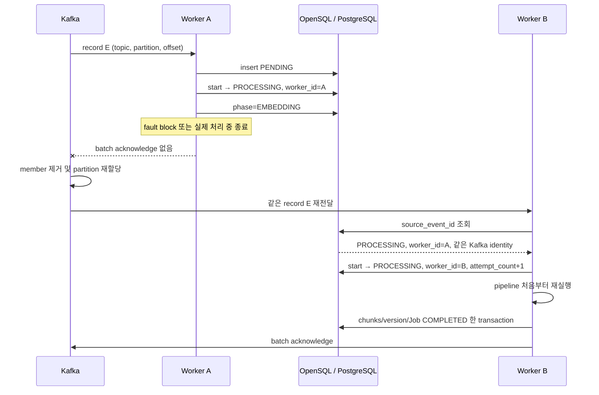
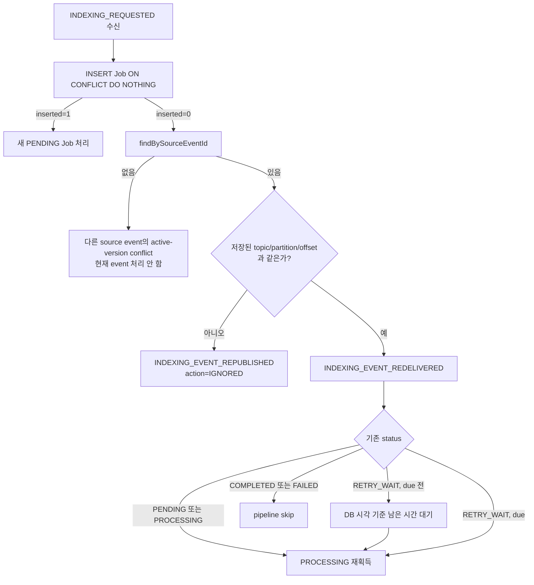
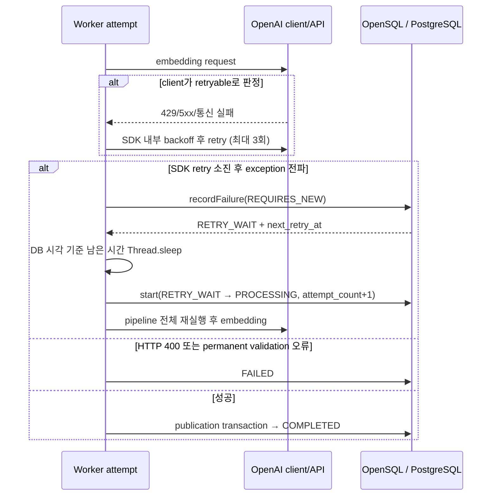
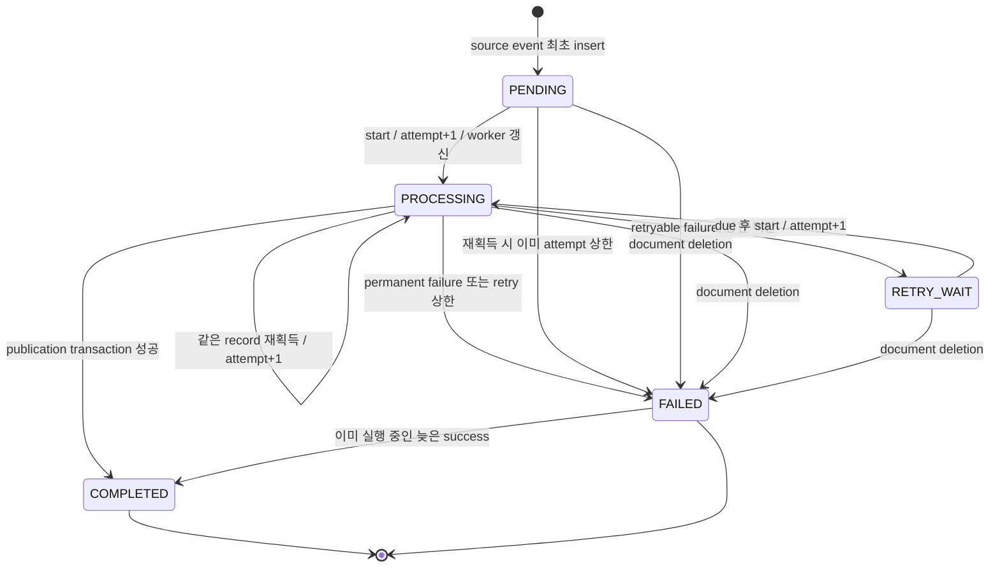

# Failure Handling & Recovery

이 문서는 2026 공개SW 개발자대회 TmaxTibero 기업과제 「Tmax OpenSQL 기반 AI 문서 관리 및 벡터 동기화 시스템」의 문서 인덱싱 Worker가 실패를 감지하고 복구하는 방식을 설명한다. 기준은 현재 저장소의 production code, `application.yml`, Gradle 의존성, 테스트 코드다. 이 저장소에는 Flyway/Liquibase migration과 Docker Compose가 없으므로 DB 제약과 다중 Worker 배포에 관한 설명은 Worker가 사용하는 계약과 검증 가능한 범위로 제한한다.

## 1. 문서 목적과 범위

Worker는 Kafka의 `INDEXING_REQUESTED` 이벤트를 받아 원문 다운로드, 무결성 검증, 파싱, 청킹, 임베딩, DB publication을 수행한다. 이 과정은 외부 저장소와 임베딩 API를 호출하는 장시간 작업이며, DB transaction과 Kafka offset commit은 하나의 분산 transaction으로 묶여 있지 않다.

이 문서는 다음을 다룬다.

- Worker 종료와 consumer group 재할당 이후의 재처리
- logical duplicate publish와 동일 Kafka record redelivery의 구분
- `indexing_job` 상태별 재획득과 재시도 정책
- OpenAI client와 Worker 두 계층의 retry
- DB 실패 시 NACK 이후의 복구와 consumer pause
- publication 중단, ACK gap, 동시 attempt 등 crash window
- 삭제 경합과 poison event를 포함한 복합 장애
- failure injection과 현재 테스트 근거
- 현재 복구 설계가 보장하는 범위와 한계

전체 시스템 구조와 DB transaction 설계는 [Worker Architecture](ARCHITECTURE.md), Kafka poll·batch·thread·ACK/NACK의 상세 실행 모델과 processing time budget은 [Processing Model](PROCESSING_MODEL.md)의 범위다. 여기서는 장애 감지와 다음 실행의 복구 판단에 직접 필요한 구조만 반복한다.

### 1.1 검증 수준 표기

| 표기 | 의미 |
|---|---|
| 단위 테스트 | 외부 Kafka/DB 없이 클래스 동작을 검증한다. |
| DB 통합 테스트 코드 | `integration` tag가 붙은 테스트가 있으며 외부 PostgreSQL 계열 전용 DB가 필요하다. 기본 `test` task에서는 제외된다. |
| 외부 API 통합 테스트 코드 | 실제 OpenAI credential이 필요한 조건부 테스트가 있다. |
| Failure Injection 지원 | 장애를 수동으로 재현할 production code 내 비활성 기본값의 test support가 있다. |
| 검증 근거 없음 | 현재 저장소에 해당 동작을 자동 또는 수동으로 수행했다는 결과가 없다. |

테스트 코드가 있다는 사실과 특정 환경에서 그 테스트를 실행해 통과했다는 사실은 구분한다.

## 2. Failure Model

| Failure | 영향 | 감지 | 현재 복구 | 저장소의 검증 근거 |
|---|---|---|---|---|
| 처리 중 Worker process 종료 | Job이 `PENDING`, `PROCESSING`, `RETRY_WAIT`에 남고 batch offset이 commit되지 않을 수 있다. | Kafka consumer group이 member 상실 또는 poll 지연을 감지 | consumer group 재할당 후 동일 record redelivery, recoverable Job 재획득 | 재획득 단위/DB 통합 테스트 코드, embedding 직전 Failure Injection 지원. 다중 Worker SIGKILL E2E 없음 |
| 동일 Kafka record redelivery | 같은 external 작업과 DB write가 다시 실행될 수 있다. | 저장된 `(topic, partition, offset)`과 현재 record identity 비교 | `PENDING`/`PROCESSING` 재획득, due 전 `RETRY_WAIT` 대기 후 재획득, terminal Job skip | 단위 테스트와 `PROCESSING` repository 통합 테스트 코드 |
| 동일 logical event 재발행 | 같은 `source_event_id`가 새 offset으로 들어올 수 있다. | `source_event_id` 조회 후 Kafka record identity 불일치 | `INDEXING_EVENT_REPUBLISHED`를 남기고 새 record를 처리하지 않음 | 단위 테스트. unique constraint 생성 migration은 이 저장소에 없음 |
| 일시적인 download/parse/embedding 실패 | 현재 batch가 장시간 ACK되지 않고 partition lag이 증가할 수 있다. | exception whitelist에 없는 오류를 retryable로 분류 | `RETRY_WAIT` 영속화, 선형 backoff 후 같은 listener invocation에서 재시도 | Pipeline 및 failure service 단위/DB 통합 테스트 코드 |
| OpenAI 429/5xx/일부 통신 실패 | 임베딩 호출 실패 또는 지연 | OpenAI Java client의 HTTP/exception 분류 후, 소진 시 Worker로 exception 전파 | provider client 내부 retry 후 Worker Job retry | 의존 라이브러리 구현 확인. 429 전용 테스트 없음 |
| 영구 입력/처리 오류 | 같은 입력을 반복해도 성공하지 않으며 batch를 오래 막을 수 있다. | `IndexingErrorClassifier`의 명시적 exception whitelist | 한 번의 Worker attempt 후 `FAILED`, 이후 record ACK | 분류 단위 테스트 및 일부 pipeline 통합 테스트 코드 |
| DB 접근 실패 | Job 상태를 기록하지 못한 채 record를 소각하거나 성공 결과를 확정하지 못할 수 있다. | listener까지 전파된 `DataAccessException`, 주기적 `SELECT 1` | batch index 0부터 NACK, DB health gate가 container pause/resume | Listener와 health gate 단위 테스트. 실제 DB 중단+Kafka E2E 없음 |
| publication transaction 중 실패 | 일부 chunk, version, Job 상태가 서로 다른 결과로 보일 수 있다. | transaction 내부 exception 및 저장 건수 검증 | 한 transaction rollback, 재처리 시 chunk UPSERT와 trailing delete | publication 호출 순서 단위 테스트. 실제 rollback 통합 테스트 없음 |
| DB 완료 후 Kafka offset commit 전 종료 | DB는 `COMPLETED`인데 같은 record가 다시 전달될 수 있다. | redelivery 시 source event 및 record identity와 terminal status 조회 | `COMPLETED` Job은 pipeline을 재실행하지 않고 batch ACK 경로로 진행 | terminal skip 단위 테스트. crash window E2E 없음 |
| 역직렬화 실패/지원하지 않는 이벤트 | poison record가 partition 진행을 막을 수 있다. | JSON 역직렬화 및 event validation exception | 오류 로그 후 해당 record를 소비하고 batch ACK | Listener 단위 테스트. DLQ 없음 |

## 3. 공통 복구 원칙

### 3.1 복구가 전제하는 Kafka delivery semantics

Worker는 batch listener로 Kafka record를 수신하고 key별 task의 완료를 기다린 뒤 acknowledgment를 수행한다. DB failure가 listener까지 전파되면 batch NACK 경로로 연결될 수 있으며, ACK 전에 process가 종료되거나 offset commit이 완료되지 않으면 같은 record가 다시 전달될 수 있다.

이 문서에서 중요한 전제는 **Kafka delivery 완료와 DB 처리 완료가 하나의 원자적 사건이 아니라는 점**이다. consumer group, partition, batch scheduling, executor, `AckMode.MANUAL`, ACK/NACK와 offset boundary의 상세 동작은 [Processing Model](PROCESSING_MODEL.md)에서 설명한다.

### 3.2 Batch ACK가 만드는 상태 혼합

한 batch의 여러 document group은 서로 다른 시점에 DB 상태를 commit한다. 예를 들어 Job A가 publication까지 끝나 `COMPLETED`가 되고 Job B가 `PROCESSING` 또는 `RETRY_WAIT`인 동안 Worker가 종료될 수 있다. 이때 DB에는 `COMPLETED`와 미완료 상태가 함께 존재하며 batch ACK는 호출되지 않는다.

같은 batch 범위가 다시 전달되면 다음과 같이 수렴한다.

- `COMPLETED` 또는 `FAILED`: `start()`가 획득하지 못하므로 pipeline을 다시 실행하지 않는다.
- `PENDING` 또는 `PROCESSING`: 새 Worker가 `PROCESSING`으로 재획득한다.
- `RETRY_WAIT`: due 전이면 DB 시각 기준 남은 시간을 기다린 뒤 재획득한다.

따라서 성공한 Job도 Kafka record 자체는 다시 보일 수 있지만, terminal status 분기가 DB 작업의 반복을 줄인다. batch acknowledgment의 blast radius는 남는다.

### 3.3 복구 판단에 사용하는 `indexing_job`

`indexing_job`은 Kafka offset을 대신하는 저장소가 아니라, redelivery 시 실행 여부를 판단하기 위한 영속 상태다. 복구에 직접 사용하는 핵심 필드는 다음과 같다.

| 복구 판단 | 필드 | 용도 |
|---|---|---|
| 동일 logical event 여부 | `source_event_id` | 같은 producer event인지 판별 |
| 동일 Kafka record 여부 | `kafka_topic`, `kafka_partition`, `kafka_offset` | redelivery와 새 position의 republish 구분 |
| 재처리 가능 여부 | `status` | recoverable/terminal 상태 판별 |
| retry 시점과 예산 | `attempt_count`, `next_retry_at` | 남은 retry와 due 시각 판단 |
| Worker 인계 관측 | `worker_id` | 마지막 획득 Worker와 현재 Worker 비교 |

Kafka identity는 Job을 처음 insert할 때 저장되며 이후 redelivery나 republish로 갱신하지 않는다. `worker_id`는 `start()`가 성공할 때 현재 Worker로 갱신하지만 fencing token이나 lease가 아니다.

전체 `indexing_job` 데이터 모델과 다른 entity의 관계는 [Worker Architecture](ARCHITECTURE.md)에서 설명한다.

### 3.4 두 종류의 identity

- `source_event_id`: producer 관점의 logical event identity다.
- `(kafka_topic, kafka_partition, kafka_offset)`: Kafka log 안의 물리 record identity다.

현재 production code는 두 identity를 실제로 비교한다. 같은 `source_event_id`가 존재할 때 Kafka identity도 같으면 redelivery, 다르면 duplicate publish로 분기한다. 단순히 컬럼만 저장하는 설계가 아니다.

### 3.5 DB transaction과 Kafka offset 사이의 복구 전제

전체 pipeline, DB 상태와 Kafka offset을 함께 감싸는 하나의 transaction은 없다. Job 생성·획득·phase·failure 기록은 처리 중간에 영속화될 수 있고, 성공 publication은 별도 DB transaction으로 확정되며 Kafka acknowledgment는 그 밖에서 수행된다.

따라서 이 문서는 다음 crash window를 명시적으로 다룬다.

- Job 상태는 commit됐지만 외부 처리가 끝나기 전 종료
- 외부 처리는 수행됐지만 publication commit 전 종료
- publication은 commit됐지만 Kafka offset commit 전 종료
- 여러 key group 중 일부만 DB commit된 상태에서 batch 종료

각 DB transaction의 정확한 경계는 [Worker Architecture](ARCHITECTURE.md)에서 설명한다.

## 4. Worker 처리 중 종료

### 4.1 Failure scenario

가장 중요한 경로는 다음과 같다.

```text
Kafka record 수신
→ Job PENDING 생성
→ PROCESSING commit
→ phase=EMBEDDING commit
→ embedding 또는 publication 중 Worker 종료
→ batch acknowledge 미호출
```

문제는 외부 API 호출이 중복될 수 있고, DB에는 미완료 Job이 남으며, 같은 batch에서 먼저 끝난 Job까지 Kafka에서 다시 보일 수 있다는 점이다.

### 4.2 Kafka의 장애 감지와 재할당

Worker가 직접 다른 Worker의 생존을 감지하거나 partition을 재할당하지 않는다. process 종료나 consumer가 poll lifecycle을 유지하지 못하는 상황은 Kafka consumer group이 감지하고, group membership 변화에 따라 partition을 다른 consumer에 재할당할 수 있다.

`SIGKILL`처럼 process가 사라지는 경우와 process는 살아 있지만 긴 처리로 poll interval을 초과하는 경우는 Kafka 관점에서 서로 다른 liveness 경로다. heartbeat/session timeout, `max.poll.interval.ms`, 실제 consumer group과 listener concurrency의 상세 설정은 [Processing Model](PROCESSING_MODEL.md)에서 설명한다.

이 저장소는 `group.instance.id`, container restart policy 또는 다중 Worker deployment를 정의하지 않는다. 따라서 partition handoff가 실제로 일어나려면 같은 consumer group의 다른 실행 중 Worker 또는 외부 orchestrator가 필요하다.

### 4.3 Recovery strategy



partition reassignment는 Kafka consumer group의 기능이다. 같은 record인지 판정하고 미완료 Job을 재획득하는 것은 Worker production code의 책임이다.

### 4.4 Crash windows

| Crash 지점 | DB에 남을 수 있는 상태 | redelivery 시 경로 | 중복 가능성/보호 장치 |
|---|---|---|---|
| record 수신 후 Job insert 전 | Job 없음 | 새 `PENDING` insert 후 정상 처리 | 이전 external side effect 없음 |
| `PENDING` insert 후 `start()` 전 | `PENDING`, Kafka identity 저장 | 같은 identity redelivery → `PENDING` 재획득 | `source_event_id` conflict가 새 Job 생성을 막음 |
| `PROCESSING` commit 후 download/parse/chunk 중 | `PROCESSING`, 마지막 `phase`, attempt 증가 | `PROCESSING` 재획득 후 전체 attempt 재실행 | 다운로드/파싱은 반복될 수 있음 |
| embedding 중 | `PROCESSING`, `phase=EMBEDDING` | 전체 attempt 재실행 | 이미 성공한 embedding request도 다시 호출될 수 있어 비용/지연 중복 가능 |
| publication transaction commit 전 | 외부에서 보이는 publication write는 rollback되어야 하며 Job은 이전 `PROCESSING` | 전체 attempt 재실행 | 단일 transaction과 chunk UPSERT가 수렴을 보조 |
| publication commit 후 완료 로그/ACK 전 | chunks/version/Job `COMPLETED` | 같은 identity 감지 후 terminal Job skip | embedding과 DB publication은 재실행하지 않음 |
| `acknowledge()` 호출 후 broker commit 완료 전 | DB `COMPLETED`, commit 결과는 code에서 동기 확인하지 않음 | commit되지 않았다면 redelivery 가능, terminal Job skip | DB/Kafka gap을 terminal status로 흡수 |

`PROCESSING` 재획득은 `status IN ('PENDING', 'PROCESSING')`인 Job을 다시 `PROCESSING`으로 갱신한다. 이때 `worker_id`를 현재 Worker로 바꾸고 `attempt_count`를 증가시킨다. 반복 crash도 attempt budget을 소비하며, 상한에 도달한 `PENDING`/`PROCESSING` Job은 `MAX_ATTEMPTS_EXCEEDED`로 `FAILED`가 된다.

### 4.5 Guarantee와 limitation

현재 설계가 제공하는 범위는 다음과 같다.

- 처리 중 ACK되지 않은 record는 consumer group 재할당 후 다시 전달될 수 있다.
- 동일 record가 다시 오면 영속 Job의 미완료 상태를 기준으로 재획득할 수 있다.
- DB 성공 후 ACK 전 crash는 `COMPLETED` terminal skip으로 DB publication 반복을 피한다.

다음은 보장하지 않는다.

- exactly-once 실행 또는 external API 호출 1회 보장
- DB transaction과 Kafka offset commit의 원자성
- Worker A가 완전히 멈추기 전에 Worker B가 시작되는 구간의 단일 실행권
- crash가 반복되어도 무한히 재시도하는 동작
- Kafka broker 장애, retention 만료, 잘못된 offset 운영 변경까지 포함한 무유실 보장

## 5. 중복 이벤트 발행과 Kafka 재전달

### 5.1 왜 `eventId`만으로 충분하지 않은가

동일 `source_event_id`는 두 상황에서 나타날 수 있다.

1. producer/relay가 같은 logical event를 새 Kafka record로 다시 publish한다.
2. 기존 Kafka record의 offset이 commit되지 않아 Kafka가 다시 전달한다.

첫 번째를 무조건 다시 처리하면 duplicate work가 발생한다. 반대로 같은 event ID를 무조건 버리면 Worker crash 뒤 미완료 Job도 복구할 수 없다. 이 Worker는 Job에 최초 Kafka position을 저장하고 현재 record와 비교한다.

### 5.2 실제 decision logic



판정 코드는 `IndexingPipelineRunner.acquireJobId()`에 있다.

- 같은 `source_event_id`, 다른 topic/partition/offset: `INDEXING_EVENT_REPUBLISHED`, 처리하지 않음
- 같은 `source_event_id`, 같은 topic/partition/offset: `INDEXING_EVENT_REDELIVERED`
- redelivery이며 status가 `PENDING`, `PROCESSING`, `RETRY_WAIT`: `INDEXING_JOB_RECOVERY`
- previous `worker_id`가 현재와 다르면 `recoveryType=WORKER_HANDOFF`

### 5.3 Status interaction

| 기존 status | 같은 record redelivery | 다른 position의 같은 event republish |
|---|---|---|
| `PENDING` | 재획득 | 무시 |
| `PROCESSING` | 재획득 | 무시 |
| `RETRY_WAIT` | due까지 기다린 후 재획득 | 무시 |
| `COMPLETED` | pipeline skip 후 listener 성공 경로 | 무시 |
| `FAILED` | pipeline skip 후 listener 성공 경로 | 무시 |

`FAILED` Job에 동일 event ID를 다시 publish해도 retry trigger로 사용되지 않는다. 다시 처리하려면 source event identity가 다른 새로운 요청이 필요하다.

### 5.4 DB constraint에 대한 전제

`insertIfAbsent()`는 외부 schema의 다음 제약을 전제로 `ON CONFLICT DO NOTHING`을 사용한다.

- `source_event_id` unique constraint
- 같은 `document_version_id`에 대한 active Job unique constraint

그러나 이 저장소에는 해당 constraint를 생성하는 migration이 없다. `ddl-auto=none`이고 schema는 Core/Server 측 책임이라는 repository 주석만 있다. 따라서 배포 전에 외부 schema가 이 계약을 만족해야 한다. DB 통합 테스트 코드는 전용 외부 DB에서 이 계약을 확인하지만 기본 test task에는 포함되지 않는다.

### 5.5 Guarantee와 limitation

- production code에는 duplicate publish와 Kafka redelivery를 구분하는 실제 분기가 있다.
- 판정은 `(topic, partition, offset)` 세 필드를 모두 사용한다.
- 같은 record의 미완료 Job은 재처리되고 terminal Job은 다시 실행되지 않는다.

다만 Kafka identity 비교는 최초 Job row가 정확히 보존된다는 전제에 의존한다. 같은 document version을 다른 event가 이미 active 상태로 처리 중이면 새 event의 insert는 conflict로 끝나고 `findBySourceEventId()`도 null이어서 그 새 event는 ACK 경로로 간다. 먼저 존재한 active Job이 나중에 실패하면 무시된 event를 자동으로 되살리는 별도 scheduler는 없다.

## 6. Embedding API 및 일시 장애 retry

### 6.1 Retryable과 non-retryable 분류

`EmbeddingService`가 별도로 영구 실패로 변환하는 것은 OpenAI Java SDK의 `BadRequestException`, 즉 HTTP 400이다. 이는 `EmbeddingRequestRejectedException`이 되어 한 Worker attempt 후 `FAILED`로 종결된다.

`IndexingErrorClassifier`의 permanent whitelist는 다음 exception이다.

- event validation 오류
- content hash mismatch
- empty extraction
- chunk 수/전체 token 제한 초과
- 지원하지 않는 MIME type
- file size 초과
- 손상 파일
- embedding HTTP 400 변환 오류
- embedding 결과 개수/차원/유한값 검증 오류

그 외 exception은 기본적으로 retryable이다. 따라서 parse timeout, S3/OpenAI 통신 오류, OpenAI 429/5xx가 provider client에서 최종 전파된 경우, 그리고 별도로 분류하지 않은 application 오류도 Worker retry 대상이다. 이는 일시 오류를 넓게 흡수하지만 실제로는 영구적인 미분류 오류도 상한까지 반복할 수 있다는 trade-off다.

### 6.2 두 retry 계층

현재 resolved dependency는 Spring AI 2.0.0과 OpenAI Java core 4.39.1이다. 별도 override가 없으므로 Spring AI의 OpenAI common properties 기본값을 사용한다.

| 계층 | 대상 | 횟수/대기 | 상태 영속성 |
|---|---|---|---|
| OpenAI Java client 내부 | repeatable request의 408, 409, 429, 5xx, `X-Should-Retry: true`, I/O 및 SDK retryable exception | `spring.ai.openai.max-retries=3`: 최초 호출 외 최대 3회 retry. `Retry-After-Ms`/`Retry-After` 우선, 없으면 0.5초 기반 지수 backoff(최대 8초)와 jitter | `indexing_job`에는 내부 retry 횟수가 기록되지 않음 |
| Worker Job | provider client에서 최종 전파된 오류를 포함한 classifier의 retryable exception | `INDEXING_MAX_ATTEMPTS` 기본 5. 실패 후 `base-delay × attempt_count` 선형 backoff, 기본 30초 | `attempt_count`, `RETRY_WAIT`, `next_retry_at`, error fields 저장 |

Spring AI는 OpenAI client에 기본 request timeout 60초와 최대 retry 3을 전달한다. Worker `application.yml`에는 `spring.ai.openai.timeout`과 `spring.ai.openai.max-retries` override가 없다.

Worker attempt 한 번에 embedding input을 여러 API batch로 나누어 순차 호출할 수 있다. 따라서 `attempt_count=1`이 OpenAI HTTP 호출 1회를 의미하지 않는다. 앞선 embedding batch가 성공한 뒤 뒤쪽 batch가 실패하면 DB publication은 아직 시작되지 않았지만, Worker retry에서 앞선 batch도 다시 호출된다.

### 6.3 Retry runtime



Worker retry는 별도 Kafka retry topic, Job poller, scheduler를 사용하지 않는다. 같은 `IndexingPipelineRunner.run()` invocation과 같은 batch executor thread에서 `Thread.sleep()`으로 기다린다. Job이 `COMPLETED` 또는 `FAILED`에 도달할 때까지 listener의 batch ACK도 대기한다.

### 6.4 Retry 중 Worker 종료

`recordFailure()`는 `REQUIRES_NEW` transaction으로 `RETRY_WAIT`과 `next_retry_at`을 먼저 commit한 뒤 sleep한다. 이 대기 중 Worker가 종료되면 record는 ACK되지 않은 상태다. redelivery를 받은 Worker는 다음과 같이 처리한다.

1. 같은 Kafka identity와 `RETRY_WAIT`을 확인한다.
2. `next_retry_at`이 아직 미래면 `LOCALTIMESTAMP` 기준 남은 시간만 기다린다.
3. due가 되면 `start()`로 `PROCESSING` 재획득하고 기존 `attempt_count`에서 계속 증가시킨다.

반대로 `start()`가 attempt를 증가시킨 직후, failure 상태를 기록하기 전에 종료되면 Job은 `PROCESSING`에 남는다. 다음 redelivery의 재획득도 attempt를 하나 더 소비하며, 이전 오류의 backoff는 저장되지 않는다.

### 6.5 Retry exhaustion

- permanent exception: 현재 attempt에서 바로 `FAILED`
- retryable exception이며 `attempt_count < maxAttempts`: `RETRY_WAIT`
- retryable exception이며 상한 도달: `FAILED`
- crash redelivery에서 이미 `attempt_count >= maxAttempts`인 `PENDING`/`PROCESSING`: `MAX_ATTEMPTS_EXCEEDED`로 `FAILED`

`FAILED`가 되면 listener는 이를 정상적으로 종결된 Job으로 보고 결국 batch를 ACK한다. DLQ나 `FAILED` Job 자동 재기동 scheduler는 없다.

### 6.6 검증 범위

- generic retry 성공/소진 및 permanent failure를 다루는 pipeline 통합 테스트 코드가 있다.
- 선형 `next_retry_at`, exhaustion, non-`PROCESSING` failure write 무시를 다루는 DB 통합 테스트 코드가 있다.
- HTTP 400 변환 단위 테스트가 있다.
- 429, 5xx, `Retry-After`, network timeout을 실제 OpenAI/Kafka와 함께 검증하는 테스트는 없다.

Worker retry와 provider retry가 누적되면 listener completion과 consumer poll budget에 영향을 준다. `max.poll.interval.ms` 대비 최악 처리 시간 계산과 executor slot 점유 영향은 [Processing Model](PROCESSING_MODEL.md)에서 설명한다.

## 7. Database 장애

### 7.1 왜 별도 경로가 필요한가

일반 pipeline 오류는 DB에 `RETRY_WAIT` 또는 `FAILED`를 기록한 뒤 ACK 여부를 결정할 수 있다. DB 자체가 실패하면 그 상태 기록도 할 수 없으므로 같은 방식만으로는 처리 사실을 남길 수 없다.

### 7.2 실제 exception 경로

모든 DB 오류가 즉시 NACK으로 직행하는 것은 아니다.

| 발생 위치/회복 상태 | 실제 경로 |
|---|---|
| Job insert, source event 조회, `start()` 등 runner의 attempt catch 밖에서 `DataAccessException` 발생 | listener worker thread까지 전파 → batch NACK |
| document 조회/publication 등 attempt 내부 DB 실패 후 DB가 failure 기록 시점에는 회복 | classifier 기본 정책상 retryable → `RETRY_WAIT` 기록 후 inline retry |
| attempt 내부 DB 실패 후 `currentDbTimestamp()` 또는 `recordFailure()`도 실패 | 새 `DataAccessException`이 listener까지 전파 → batch NACK |
| deletion handler의 DB 실패 | listener까지 전파 → batch NACK |

Listener까지 `DataAccessException`이 전파되면 Worker는 해당 batch를 ACK하지 않고 NACK 경로로 연결한다. 이때 이미 DB에서 성공한 다른 Job도 같은 batch 범위에서 다시 전달될 수 있으므로 terminal status와 UPSERT가 재실행 결과를 흡수한다.

NACK index, delay, Future barrier와 예상하지 못한 비-DB exception이 listener/container에 미치는 영향은 [Processing Model](PROCESSING_MODEL.md)에서 설명한다. 이 문서에서는 이후 redelivery가 발생했을 때의 상태 수렴만 복구 보장으로 다룬다.

### 7.3 DB health gate

`DbHealthGate`는 기본 5초마다 `SELECT 1`을 실행한다.

- DB unhealthy, container running, pause 미요청: listener container `pause()` 요청
- DB healthy, pause 요청 상태: `resume()`

Spring Kafka의 paused container는 새 record 전달을 중단하면서 consumer poll/heartbeat를 유지해 불필요한 rebalance를 피하는 방향으로 동작한다. 이미 실행 중인 batch를 중단하거나 rollback시키는 기능은 아니다. NACK과 health gate는 별도 메커니즘이며, scheduler가 DB 장애를 먼저 또는 나중에 감지할 수 있다.

### 7.4 Guarantee와 limitation

- listener까지 도달한 `DataAccessException`은 ACK하지 않고 batch NACK한다.
- DB outage 동안 health gate가 추가 record delivery를 pause하고 복구 후 resume할 수 있다.
- batch NACK 때문에 성공 record도 재전달될 수 있으나 Job status가 반복 처리를 줄인다.

다음은 현재 확인되지 않는다.

- 실제 OpenSQL/PostgreSQL failover 환경에서의 driver reconnect와 RTO
- NACK 후 broker seek/redelivery를 포함하는 integration test
- DB product 자체의 HA 또는 자동 primary 전환
- 모든 SQL failure를 동일한 원인으로 정확히 분류하는 정책

## 8. Partial Write와 재처리

### 8.1 Publication 전에는 chunk를 저장하지 않는다

download, parsing, chunking, embedding 결과는 publication 전까지 파일 또는 메모리에 있다. embedding을 여러 request로 나누더라도 각 request 성공 직후 chunk row를 insert하지 않는다. 따라서 embedding 중 crash는 DB의 부분 chunk set보다 external 호출 중복 문제를 만든다.

### 8.2 Publication failure의 원자성 경계

성공 publication은 chunk 결과, version 완료 정보, searchable version 조건부 승격과 Job `COMPLETED`를 하나의 DB transaction으로 확정한다. 따라서 commit 전에 SQL 또는 검증이 실패하면 해당 publication 범위는 함께 rollback되는 구조다.

재처리 시 chunk는 `(document_version_id, chunk_no)` 기준 UPSERT되고 trailing chunk를 제거해 같은 document version의 결과를 현재 attempt의 chunk set으로 수렴시킨다.

publication transaction의 정확한 write 순서와 데이터 모델은 [Worker Architecture](ARCHITECTURE.md)에서 설명한다.

### 8.3 Schema dependency

UPSERT는 DB에 `(document_version_id, chunk_no)` unique constraint가 실제로 있어야 한다. 이 저장소의 SQL은 그 제약을 참조하지만 migration을 소유하지 않는다. 따라서 다음을 구분해야 한다.

- Worker code에 UPSERT와 transaction은 구현되어 있다.
- constraint 생성과 vector schema의 배포는 외부 저장소의 선행 조건이다.
- publication service 단위 테스트는 repository 호출을 mock하므로 실제 rollback과 UPSERT를 검증하지 않는다.

### 8.4 DB 성공 후 offset commit 전 failure window

publication transaction이 성공하면 Job은 `COMPLETED`다. 이후 Worker가 `INDEXING_JOB_COMPLETED` 로그 또는 batch ACK 전에 죽어도 동일 Kafka record가 재전달될 수 있다. 새 Worker는 같은 event/source identity를 조회하지만 `start()`가 terminal status를 획득하지 못하므로 validation/download/embedding/publication을 수행하지 않는다. listener가 다른 record까지 처리한 후 다시 ACK한다.

이 경로는 DB/Kafka atomic transaction을 만들지 않는다. 대신 redelivery를 허용하고 DB terminal status로 중복 publication을 피하는 at-least-once 대응이다.

### 8.5 동시 attempt limitation

`start()`는 `PROCESSING`도 획득할 수 있고 lease/fencing token을 확인하지 않는다. rebalance 중 이전 Worker가 아직 실행되는 등의 상황에서는 두 attempt가 겹칠 수 있다.

- chunk는 UPSERT로 수렴한다.
- failure 기록은 현재 status가 `PROCESSING`일 때만 적용되어 늦은 실패가 `COMPLETED`를 덮지 못한다.
- completion update에는 이전 status/worker guard가 없다. 늦은 성공은 `FAILED`를 다시 `COMPLETED`로 바꿀 수 있다.
- external embedding 호출은 중복될 수 있다.

특히 document deletion이 active Job을 `FAILED(DOCUMENT_DELETED)`로 바꿔도 이미 실행 중인 attempt를 취소하지 않는다. 늦은 publication이 `COMPLETED`를 쓸 수 있으며, searchable version promotion의 deleted guard와 주기적 deletion sweep이 chunk 노출/잔존을 다시 수렴시키는 보조 장치다. 단일 실행권 보장은 아니다.

## 9. Job State Machine



| 상태 | 장애 복구 관점의 의미 |
|---|---|
| `PENDING` | Job identity는 영속화됐지만 Worker attempt를 아직 획득하지 않았다. 같은 record로 재획득 가능하다. |
| `PROCESSING` | 마지막 `worker_id`가 획득했고 attempt budget을 하나 소비했다. crash redelivery에서 다시 획득할 수 있다. |
| `RETRY_WAIT` | retryable failure와 다음 retry 시각이 commit됐다. 같은 listener가 기다리거나 redelivery Worker가 남은 시간을 기다린다. |
| `COMPLETED` | publication transaction이 완료됐다. 동일 source event/record의 pipeline 재실행 대상이 아니다. |
| `FAILED` | permanent failure, retry 상한, crash 재획득 상한, 또는 deletion으로 종결됐다. 동일 source event/record의 자동 재실행 대상이 아니다. |

`COMPLETED`와 `FAILED`는 `start()` 관점에서는 terminal이다. 하지만 completion SQL 자체는 status guard가 없으므로 이미 실행 중인 성공 attempt가 `FAILED`를 `COMPLETED`로 바꾸는 전이는 실제로 가능하다.

## 10. 장애 간 상호작용

### 10.1 Batch 일부 성공 + 다른 Job block + Worker crash

DB에는 `COMPLETED`와 `PROCESSING`이 공존한다. ACK는 batch 전체 Future가 끝나지 않아 발생하지 않는다. redelivery에서 completed Job은 skip되고 processing Job만 재획득된다. 이것이 batch ACK와 Job 단위 durable state를 함께 쓰는 핵심 이유다.

### 10.2 Retry wait + Worker crash

`RETRY_WAIT`이 먼저 commit되고 record는 uncommitted다. 새 Worker가 같은 record를 받으면 남은 backoff를 DB 시각으로 계산해 기다린다. retry 횟수는 보존되지만 crash가 `start()` 이후 발생했다면 추가 attempt가 소비된다.

### 10.3 DB outage + batch 내 이미 성공한 Job

한 group의 escaped `DataAccessException` 때문에 index 0 NACK이 호출된다. 다른 group이 이미 성공했더라도 다시 전달될 수 있다. terminal skip은 재처리 비용을 줄이지만 Kafka lag과 duplicate delivery 자체를 제거하지 않는다.

### 10.4 Provider 장기 장애 + poll interval

SDK 내부 retry, Worker attempt, 선형 sleep이 중첩되는 동안 listener callback이 반환되지 않는다. heartbeat와 별개로 15분 poll interval을 초과하면 rebalance가 발생할 수 있고, 새 Worker가 동일 `PROCESSING`/`RETRY_WAIT` Job을 다시 획득해 동시에 또는 연속으로 provider를 호출할 수 있다.

### 10.5 성공 commit + ACK gap

DB success와 Kafka offset commit 사이의 window는 존재한다. 이 경우 Kafka는 record를 다시 전달할 수 있지만, Worker는 `COMPLETED` status와 동일 record identity를 보고 skip한다. 이 안전성은 source event unique 제약과 Job row의 영속성에 의존한다.

## 11. Failure Injection과 Verification

### 11.1 Blocking point

`IndexingAttemptProcessor`의 순서는 다음과 같다.

```text
Job start → PROCESSING repository transaction commit
→ download / parse / chunk
→ updatePhase("EMBEDDING") repository transaction commit
→ IndexingFaultInjector.blockIfNeeded()
→ embedding API 호출
```

`IndexingPipelineRunner.run()`과 `IndexingAttemptProcessor.process()` 전체에는 `@Transactional`이 없다. `start()`와 `updatePhase()`는 각각 repository transaction이므로 fault block은 `PROCESSING`과 `EMBEDDING`이 DB에 commit된 뒤, embedding API 호출 전에 위치한다.

### 11.2 Configuration

| Worker | 환경 변수 | 값 |
|---|---|---|
| Worker A | `INDEXING_WORKER_ID` | 예: `WORKER_A` |
| Worker A | `FAULT_INJECTION_ENABLED` | `true` |
| Worker A | `FAULT_INJECTION_PHASE` | `EMBEDDING` |
| Worker B | `INDEXING_WORKER_ID` | 예: `WORKER_B` |
| Worker B | `FAULT_INJECTION_ENABLED` | `false` |

`FAULT_INJECTION_ENABLED=false`이면 phase 값과 무관하게 block하지 않는다. 현재 설정에는 document/version target 변수가 없다. 활성화된 Worker는 phase가 정확히 일치하는 모든 Job에서 `CountDownLatch.await()`로 block한다. release API도 없다.

이 component는 test profile로 제한되지 않고 production component scan에 포함된다. 기본값은 false지만 운영 환경에서 실수로 활성화하면 모든 matching Job이 block될 수 있으므로 배포 환경변수 관리가 필요하다.

### 11.3 관측 가능한 실제 로그

| 단계 | marker와 핵심 필드 |
|---|---|
| Worker 시작 | `WORKER_STARTED workerId={} hostname={}` |
| record 수신 | `INDEXING_EVENT_RECEIVED sourceEventId={} documentId={} documentVersionId={} workerId={} eventType={} topic={} partition={} offset={}` |
| fault block | `FAULT_INJECTION_BLOCKED documentVersionId={} phase={} workerId={} sourceEventId={} partition={} offset={}` |
| 같은 record redelivery | `INDEXING_EVENT_REDELIVERED sourceEventId={} topic={} partition={} offset={} previousStatus={} previousWorkerId={} currentWorkerId={}` |
| 미완료 Job recovery | `INDEXING_JOB_RECOVERY recoveryType={} jobId={} sourceEventId={} previousStatus={} previousWorkerId={} currentWorkerId={} partition={} offset={}` |
| 새 Worker attempt | `INDEXING_JOB_STARTED jobId={} sourceEventId={} status={} workerId={} partition={} offset={}` |
| 완료 | `INDEXING_JOB_COMPLETED jobId={} sourceEventId={} workerId={} partition={} offset={} durationMs={}` |
| batch ACK 호출 후 | `KAFKA_BATCH_ACK batchSize={} records={} durationMs={}` |

`FAULT_INJECTION_BLOCKED`에는 topic이 없지만, 같은 `sourceEventId`의 `INDEXING_EVENT_RECEIVED`/`INDEXING_EVENT_REDELIVERED`에서 topic까지 확인할 수 있다. Worker A와 B의 `sourceEventId`, partition, offset이 같고 `INDEXING_JOB_RECOVERY recoveryType=WORKER_HANDOFF`가 나타나면 production code가 같은 Kafka record의 Worker handoff로 판정했음을 보여준다.

Spring Kafka 기본 partition assignment 로그는 현재 INFO에서 다음 형태로 stdout/stderr에 출력된다.

```text
indexing: partitions assigned: [doc.events.v1-0, doc.events.v1-1]
```

`RebalanceMetricsListener`와 `KAFKA_PARTITIONS_ASSIGNED` marker 구현 및 단위 테스트는 존재한다. 그러나 현재 `ContainerCustomizer<String, String, ...>` bean은 Spring Boot 4.1 기본 listener factory의 generic wiring과 맞지 않아 실제 container에 연결되지 않는다. 따라서 실행 환경의 assignment 확인은 custom marker가 아니라 Spring Kafka 기본 로그를 기준으로 해야 한다.

### 11.4 현재 테스트 coverage

| 대상 | 자동/통합 근거 | 남은 미검증 범위 |
|---|---|---|
| batch 완료 후 1회 ACK | Listener 단위 테스트 | 실제 broker commit timing |
| DB failure batch NACK | Listener 단위 테스트 | real DB outage, broker seek/redelivery |
| DB health pause/resume | 단위 테스트 | 실제 long outage와 consumer membership |
| duplicate publish vs redelivery | Runner 단위 테스트 | 실제 relay duplicate publish E2E |
| `PROCESSING` 재획득과 worker 변경 | Runner 단위 및 repository 통합 테스트 코드 | SIGKILL/rebalance E2E |
| `RETRY_WAIT` due 전 대기/재획득 | Runner 단위 테스트 | retry sleep 중 SIGKILL E2E |
| terminal Job skip | Runner 단위 테스트 | DB commit 후 ACK 전 crash E2E |
| generic retry 성공/상한/영구 실패 | Pipeline 통합 테스트 코드 | Kafka batch 및 실제 외부 API 결합 |
| 429/5xx/client backoff | resolved OpenAI client 구현 | 전용 자동 테스트 없음 |
| HTTP 400 영구 분류 | EmbeddingService 단위 테스트 | 실제 API 400 integration |
| publication transaction/UPSERT | 호출 순서 단위 테스트와 SQL 구현 | 실제 rollback, partial write, concurrent publication integration |
| embedding 직전 block | Fault injector 단위 테스트 및 수동 주입 기능 | 자동 다중 container 장애 스크립트 없음 |
| custom rebalance listener | listener 단위 테스트 | 실제 container 미연결 |

현재 `build.gradle.kts`의 기본 `test` task는 `integration` tag를 제외한다. `integrationTest` task는 외부 DB, Kafka endpoint, object storage, OpenAI credential을 요구하지만 Testcontainers나 Embedded Kafka를 자동 기동하지 않는다.

## 12. Failure Guarantees

| Scenario | Expected recovery | 현재 보장 범위 | Remaining risk |
|---|---|---|---|
| `PROCESSING` 중 Worker 종료 | same record redelivery 후 Job 재획득 | ACK 전 record와 영속 Job이 남고 consumer group이 정상 동작한다는 조건에서 재처리 가능 | rebalance 지연, duplicate external call, attempt 상한 |
| `RETRY_WAIT` sleep 중 종료 | 남은 due 시간 후 재획득 | next retry 시각과 횟수 보존 | long sleep/poll interval, crash 직전/직후 추가 attempt 소비 |
| 동일 event 새 offset 재발행 | republish로 판정해 ignore | source event와 최초 Kafka identity가 보존된 경우 | `FAILED` Job 재발행도 ignore, external schema unique 제약 의존 |
| DB publication 완료 전 종료 | transaction rollback 후 전체 attempt 재처리 | transaction manager와 DB가 rollback 결과를 일관되게 제공하는 범위 | rollback E2E 미검증, concurrent attempt |
| DB publication 완료 후 ACK 전 종료 | `COMPLETED` Job skip 후 ACK | same source event row가 조회되는 경우 DB 중복 publication 방지 | Kafka commit과 DB의 원자성은 없음 |
| DB access 실패 | escaped `DataAccessException` batch NACK, health gate pause | listener까지 exception이 도달한 경로 | 일부 DB 오류는 Worker retry로 먼저 분류, real failover 미검증 |
| OpenAI 429/5xx/통신 실패 | SDK retry 후 Worker inline retry | retryable exception이 최종 전파되고 poll budget 내인 경우 | API 호출 중복, 15분 초과 rebalance, 전용 429 test 없음 |
| retry 한도 초과/영구 오류 | `FAILED` 저장 후 ACK | failure row를 DB에 기록할 수 있는 경우 | DLQ/자동 재기동/알림 규칙 없음 |
| malformed/unsupported event | 로그 후 ACK | poison record가 partition을 계속 막지 않음 | payload 보관용 DLQ 없음 |

## 13. Known Failure Limitations & Risks

1. **동시 실행권 fencing이 없다.** `PROCESSING`을 다른 Worker가 곧바로 재획득할 수 있고 이전 Worker를 취소하지 않는다. `worker_id`는 관측 값이다.

2. **retry classifier는 unknown exception을 retryable로 본다.** 일시 오류 누락을 줄이는 대신 영구적인 코드/설정 오류를 최대 attempt까지 반복할 수 있다.

3. **terminal failure의 자동 복구 경로가 없다.** `FAILED`는 같은 event redelivery나 republish로 다시 실행되지 않으며 DLQ, Job poller, 자동 replay가 없다.

4. **duplicate republish가 항상 복구 trigger는 아니다.** 같은 `source_event_id`의 새 Kafka position은 무시되며, active-version conflict로 새 event가 소각된 뒤 기존 Job이 실패해도 이를 되살리는 scheduler가 없다.

5. **publication rollback과 crash recovery E2E가 없다.** transaction/UPSERT 구조와 분리된 단위·통합 테스트는 있지만 실제 process kill과 DB commit timing을 결합한 자동 테스트가 없다.

6. **Failure Injection이 profile로 격리되지 않았다.** 기본값은 false지만 환경변수 하나로 모든 embedding Job을 block할 수 있다.

7. **poison event 보존소가 없다.** deserialization/validation 실패는 로그 후 ACK되므로 원본 replay에는 Kafka 보존 데이터나 별도 운영 절차가 필요하다.

8. **파싱 취소는 interrupt 협조에 의존한다.** timeout 시 `Future.cancel(true)`를 호출하지만 parser가 interrupt를 무시하면 parse executor thread가 계속 점유될 수 있다.

9. **저장소가 process restart나 다중 Worker 배치를 정의하지 않는다.** consumer group recovery는 다른 Worker 또는 외부 orchestrator가 실제로 존재할 때 의미가 있다.

Kafka/DB atomicity, 외부 schema와 OpenSQL HA 같은 구조적 한계는 [Worker Architecture](ARCHITECTURE.md)에서, `max.poll.interval.ms` budget, batch acknowledgment 영향 범위, executor 점유, 실제 consumer group 설정과 같은 실행 모델의 한계는 [Processing Model](PROCESSING_MODEL.md)에서 다룬다.

## 14. 관련 문서

- [README](../README.md)
- [Worker Architecture](ARCHITECTURE.md): Worker의 책임과 경계, 데이터 모델, transaction boundary와 architecture decision
- [Processing Model](PROCESSING_MODEL.md): Kafka consumer, batch, partition, executor, ACK/NACK와 consumer liveness

과거 계획/설계 문서와 현재 production code가 충돌하면 이 문서 역시 production code를 기준으로 갱신해야 한다.
