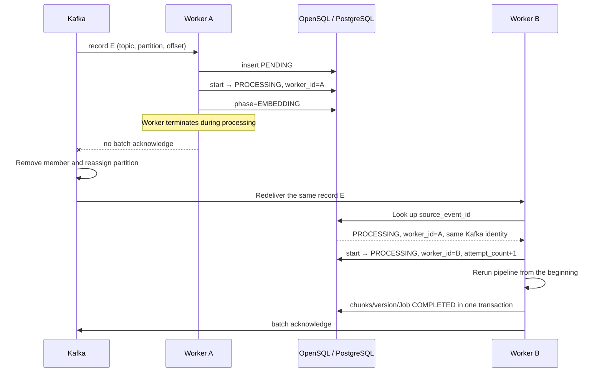
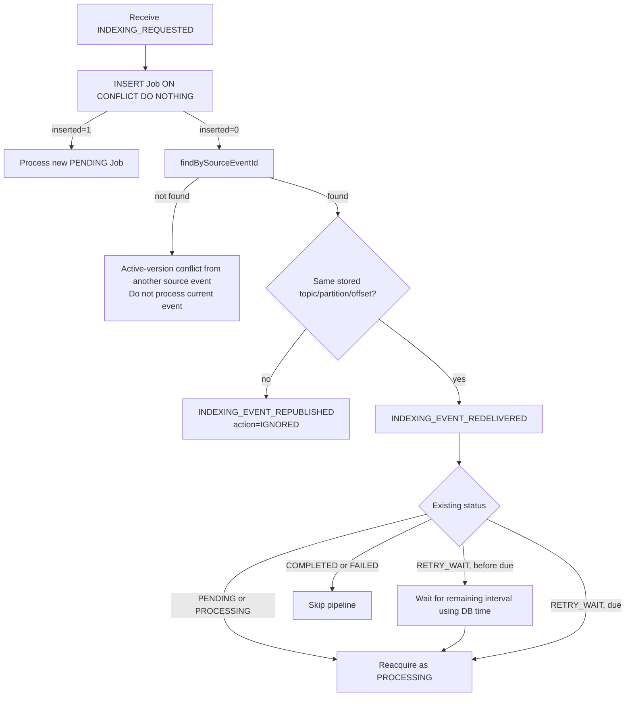
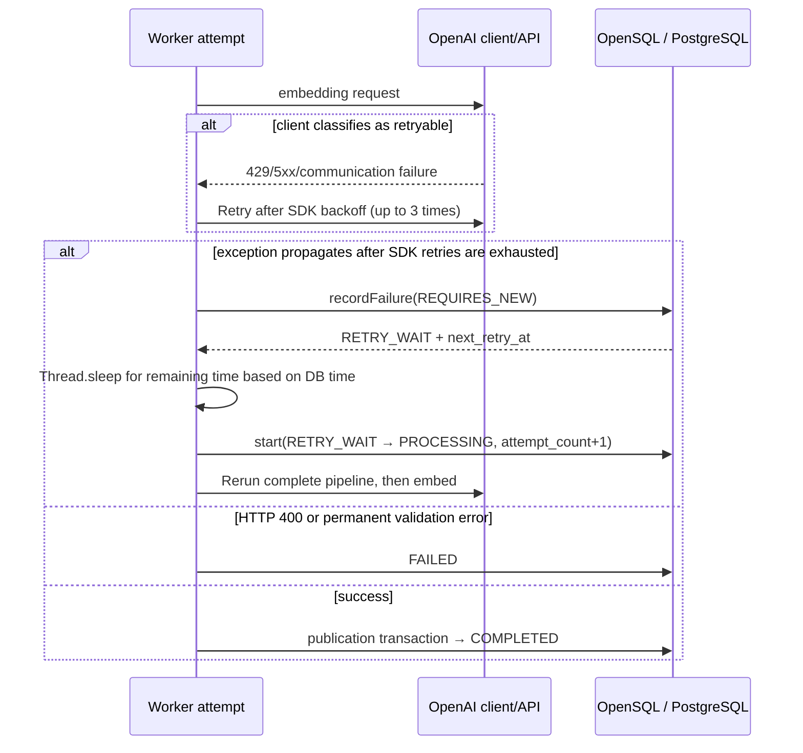

# Failure Handling & Recovery

This document describes failures that can occur while the Worker is processing,
how they are detected, how state is recorded, and the reprocessing and recovery
strategies.

## 1. Purpose and Scope

This document covers:

- Reprocessing after Worker termination and consumer-group reassignment
- Distinguishing logical duplicate publication from redelivery of the same Kafka
  record
- Job reacquisition and retry policies for each `indexing_job` state
- Two retry layers: the OpenAI client and the Worker
- Recovery after a NACK and consumer pausing during database failures
- Crash windows such as interrupted publication, the ACK gap, and concurrent
  attempts
- Compound failures, including deletion races and poison events
- The guarantees and limitations of the current recovery design

Overall system structure and database transaction design are covered in [Worker
Architecture](ARCHITECTURE_EN.md). The detailed Kafka poll, batch, thread, and
ACK/NACK execution model, as well as the processing-time budget, are covered in
the [Processing Model](PROCESSING_MODEL_EN.md). This document repeats only the
structures directly needed for failure detection and recovery decisions in the
next execution.

## 2. Failure Model

| Failure | Impact | Detection | Current recovery |
|---|---|---|---|
| Worker process terminates during processing | A job may remain in `PENDING`, `PROCESSING`, or `RETRY_WAIT`, and the batch offset may remain uncommitted. | The Kafka consumer group detects member loss or poll delay. | Reassign partitions, redeliver the same record, and reacquire a recoverable job. |
| Same Kafka record is redelivered | The same external work and database writes may execute again. | Compare the stored `(topic, partition, offset)` with the current record identity. | Reacquire `PENDING`/`PROCESSING`; wait until due and reacquire `RETRY_WAIT`; skip terminal jobs. |
| Same logical event is republished | The same `source_event_id` may arrive at a new offset. | Look up `source_event_id` and detect a different Kafka record identity. | Log `INDEXING_EVENT_REPUBLISHED` and do not process the new record. |
| Transient download, parsing, or embedding failure | The current batch may remain unacknowledged for a long time, increasing partition lag. | Classify errors not in the explicit exception whitelist as retryable. | Persist `RETRY_WAIT`, apply linear backoff, and retry in the same listener invocation. |
| OpenAI 429, 5xx, or selected communication failures | The embedding call fails or is delayed. | The OpenAI Java client classifies the HTTP response or exception and propagates it to the Worker when retries are exhausted. | Retry inside the provider client, followed by a Worker job retry. |
| Permanent input or processing error | Repeating the same input cannot succeed and may block the batch for a long time. | Explicit exception whitelist in `IndexingErrorClassifier`. | Move to `FAILED` after one Worker attempt, then acknowledge the record. |
| Database access failure | The Worker may be unable to record job state or finalize a successful result without dropping the record. | A `DataAccessException` propagated to the listener and periodic `SELECT 1`. | NACK from batch index 0; the database health gate pauses and resumes the container. |
| Failure during publication transaction | Chunks, version state, and job state could otherwise appear inconsistent. | An exception inside the transaction and stored-count validation. | Roll back one transaction; on reprocessing, UPSERT chunks and delete trailing rows. |
| Worker exits after database completion but before Kafka offset commit | The database is `COMPLETED`, but the same record may be delivered again. | On redelivery, query source event and record identity together with terminal status. | Skip the pipeline for a `COMPLETED` job and continue to the batch ACK path. |
| Deserialization failure or unsupported event | A poison record could block partition progress. | JSON deserialization and event validation exception. | Log the error, consume the record, and ACK the batch. |

## 3. Common Recovery Principles

### 3.1 Assumed Kafka Delivery Semantics

The Worker receives Kafka records through a batch listener and acknowledges only
after tasks grouped by key have completed. If a database failure propagates to
the listener, it can enter the batch NACK path. If the process exits before ACK
or the offset commit does not complete, the same records can be delivered again.

The important premise is that **Kafka delivery completion and database
processing completion are not one atomic event**. See the [Processing
Model](PROCESSING_MODEL_EN.md) for the detailed behavior of the consumer group,
partitions, batch scheduling, executors, `AckMode.MANUAL`, ACK/NACK, and offset
boundaries.

### 3.2 Mixed State Created by Batch ACK

Multiple document groups in one batch commit their database state at different
times. For example, Job A may finish publication and reach `COMPLETED` while Job
B remains in `PROCESSING` or `RETRY_WAIT`; the Worker can then terminate before
the batch ACK is called. The database contains both completed and unfinished
states.

When the same batch range is delivered again, it converges as follows:

- `COMPLETED` or `FAILED`: `start()` cannot acquire it, so the pipeline is not
  executed again.
- `PENDING` or `PROCESSING`: the new Worker reacquires it as `PROCESSING`.
- `RETRY_WAIT`: before it is due, wait for the remaining interval based on
  database time, then reacquire it.

Thus, a successful job's Kafka record may still appear again, but the terminal
status branch reduces repeated database work. The blast radius of batch
acknowledgment remains.

### 3.3 `indexing_job` Used for Recovery Decisions

`indexing_job` is not a replacement for the Kafka offset. It is a durable state
record used to decide whether to execute work on redelivery. The main fields
used directly in recovery are:

| Recovery decision | Field | Purpose |
|---|---|---|
| Same logical event | `source_event_id` | Determine whether it is the same producer event |
| Same Kafka record | `kafka_topic`, `kafka_partition`, `kafka_offset` | Distinguish redelivery from republishing at a new position |
| Eligibility for reprocessing | `status` | Distinguish recoverable from terminal state |
| Retry time and budget | `attempt_count`, `next_retry_at` | Determine remaining retries and due time |
| Worker-handoff observation | `worker_id` | Compare the last Worker that acquired the job with the current Worker |

Kafka identity is stored when the job is first inserted and is not updated on
later redelivery or republishing. `worker_id` is updated to the current Worker
when `start()` succeeds, but it is not a fencing token or lease.

The complete `indexing_job` data model and its relationships to other entities
are described in [Worker Architecture](ARCHITECTURE_EN.md).

### 3.4 Two Kinds of Identity

- `source_event_id`: the logical event identity from the producer's perspective.
- `(kafka_topic, kafka_partition, kafka_offset)`: the physical record identity
  within the Kafka log.

The current production code compares both identities. When the same
`source_event_id` exists, matching Kafka identity indicates redelivery; a
different identity indicates duplicate publication. These columns are not
merely stored without being used.

### 3.5 Recovery Premise Between Database Transactions and Kafka Offsets

No single transaction wraps the full pipeline, database state, and Kafka offset.
Job creation, acquisition, phase updates, and failure records may be persisted
during processing. Successful publication is finalized in a separate database
transaction, and Kafka acknowledgment occurs outside it.

This document therefore addresses these crash windows explicitly:

- Job state is committed, but external processing has not finished.
- External processing has finished, but publication has not committed.
- Publication has committed, but the Kafka offset has not committed.
- Only some key groups have committed database work when the batch terminates.

Exact database transaction boundaries are described in [Worker
Architecture](ARCHITECTURE_EN.md).

## 4. Termination During Worker Processing

### 4.1 Failure Scenario

The most important path is:

```text
Receive Kafka record
→ Create Job as PENDING
→ Commit PROCESSING
→ Commit phase=EMBEDDING
→ Worker terminates during embedding or publication
→ Batch acknowledge is not called
```

The concerns are that an external API call may be duplicated, an unfinished job
remains in the database, and even jobs that finished earlier in the same batch
may appear again in Kafka.

### 4.2 Kafka Failure Detection and Reassignment

The Worker does not detect the liveness of other Workers or reassign partitions.
Kafka's consumer group detects process termination or a consumer that fails to
maintain its poll lifecycle and may reassign partitions to another consumer as
group membership changes.

From Kafka's perspective, a disappearing process such as one killed with
`SIGKILL` and a process that remains alive but exceeds the poll interval follow
different liveness paths. See the [Processing Model](PROCESSING_MODEL_EN.md) for
heartbeat/session timeout, `max.poll.interval.ms`, and the actual consumer group
and listener concurrency settings.

### 4.3 Recovery Strategy



Partition reassignment is a Kafka consumer-group capability. Determining whether
this is the same record and reacquiring an unfinished job are responsibilities
of the Worker's production code.

### 4.4 Crash Windows

| Crash point | State that may remain in the database | Path on redelivery | Duplication/protection |
|---|---|---|---|
| After receiving the record, before job insert | No job | Insert a new `PENDING` job and process normally | No prior external side effect |
| After `PENDING` insert, before `start()` | `PENDING` with Kafka identity stored | Same-identity redelivery → reacquire `PENDING` | Conflict on `source_event_id` prevents a new job |
| After `PROCESSING` commit, during download/parse/chunk | `PROCESSING`, last `phase`, incremented attempt | Reacquire `PROCESSING` and rerun the entire attempt | Download and parsing may repeat |
| During embedding | `PROCESSING`, `phase=EMBEDDING` | Rerun the entire attempt | Already successful embedding requests may be called again, duplicating cost and latency |
| Before publication transaction commit | Externally visible publication writes should roll back; the job remains in the prior `PROCESSING` state | Rerun the entire attempt | One transaction and chunk UPSERT support convergence |
| After publication commit, before completion log/ACK | Chunks/version/job are `COMPLETED` | Detect the same identity and skip the terminal job | Embedding and database publication do not run again |
| After `acknowledge()` but before broker commit completes | Database is `COMPLETED`; the code does not synchronously inspect the commit result | If uncommitted, redelivery is possible and the terminal job is skipped | Terminal status absorbs the database/Kafka gap |

Reacquiring `PROCESSING` updates jobs with `status IN ('PENDING', 'PROCESSING')`
to `PROCESSING`, changes `worker_id` to the current Worker, and increments
`attempt_count`. Repeated crashes consume the attempt budget. A `PENDING` or
`PROCESSING` job that reaches the limit becomes `FAILED` with
`MAX_ATTEMPTS_EXCEEDED`.

### 4.5 Guarantees and Limitations

The current design provides the following:

- Records not acknowledged during processing can be delivered again after
  consumer-group reassignment.
- If the same record arrives again, an incomplete persistent job can be
  reacquired.
- After a database success and a crash before ACK, the `COMPLETED` terminal skip
  avoids repeating database publication.

It does not guarantee:

- Exactly-once execution or a single external API call
- Atomicity between a database transaction and a Kafka offset commit
- Exclusive execution while Worker B starts before Worker A has completely
  stopped
- Unlimited retries despite repeated crashes
- Losslessness across Kafka broker failure, retention expiration, or incorrect
  operational offset changes

## 5. Duplicate Event Publication and Kafka Redelivery

### 5.1 Why `eventId` Alone Is Insufficient

The same `source_event_id` can appear in two situations:

1. The producer or relay republishes the same logical event as a new Kafka
   record.
2. Kafka redelivers an existing record because its offset was not committed.

Always reprocessing the first case creates duplicate work. Always dropping the
same event ID, on the other hand, prevents recovery of an incomplete job after a
Worker crash. This Worker stores the initial Kafka position in the job and
compares it with the current record.

### 5.2 Actual Decision Logic



The decision code resides in `IndexingPipelineRunner.acquireJobId()`.

- Same `source_event_id`, different topic/partition/offset:
  `INDEXING_EVENT_REPUBLISHED`; do not process.
- Same `source_event_id`, same topic/partition/offset:
  `INDEXING_EVENT_REDELIVERED`.
- Redelivery with `PENDING`, `PROCESSING`, or `RETRY_WAIT` status:
  `INDEXING_JOB_RECOVERY`.
- If the previous `worker_id` differs from the current one:
  `recoveryType=WORKER_HANDOFF`.

### 5.3 State Interaction

| Existing status | Same-record redelivery | Same-event republish at another position |
|---|---|---|
| `PENDING` | Reacquire | Ignore |
| `PROCESSING` | Reacquire | Ignore |
| `RETRY_WAIT` | Wait until due, then reacquire | Ignore |
| `COMPLETED` | Skip pipeline, then follow listener success path | Ignore |
| `FAILED` | Skip pipeline, then follow listener success path | Ignore |

Republishing the same event ID for a `FAILED` job does not act as a retry
trigger. Reprocessing requires a new request with a different source event
identity.

### 5.4 Database Constraint Assumptions

`insertIfAbsent()` uses `ON CONFLICT DO NOTHING`, relying on these constraints in
the external schema:

- Unique constraint on `source_event_id`
- Unique constraint on an active job for the same `document_version_id`

The recovery strategy depends on the external schema satisfying this contract.

### 5.5 Guarantees and Limitations

- Production code contains an actual branch distinguishing duplicate
  publication from Kafka redelivery.
- The decision uses all three fields: `(topic, partition, offset)`.
- An unfinished job for the same record is reprocessed, while a terminal job is
  not executed again.

However, Kafka identity comparison assumes the initial job row is preserved
accurately. If another event already has an active job for the same document
version, inserting a new event ends in conflict and `findBySourceEventId()` also
returns null, so the new event follows the ACK path. If the pre-existing active
job later fails, there is no separate scheduler that automatically revives the
ignored event.

## 6. Embedding API and Transient-Failure Retries

### 6.1 Retryable and Non-retryable Classification

`EmbeddingService` separately converts only `BadRequestException` from the
OpenAI Java SDK—HTTP 400—into a permanent failure. It becomes an
`EmbeddingRequestRejectedException` and terminates as `FAILED` after one Worker
attempt.

The permanent exception whitelist in `IndexingErrorClassifier` includes:

- Event validation errors
- Content hash mismatch
- Empty extraction
- Chunk-count or total-token limit exceeded
- Unsupported MIME type
- File-size limit exceeded
- Corrupt file
- Converted embedding HTTP 400 error
- Embedding result count, dimension, or finite-value validation error

All other exceptions are retryable by default. As a result, parse timeouts,
S3/OpenAI communication errors, OpenAI 429/5xx responses ultimately propagated
by the provider client, and otherwise unclassified application errors are
eligible for Worker retries. This broadly absorbs transient errors, with the
trade-off that a permanent but unclassified error may repeat until the limit.

### 6.2 Two Retry Layers

The currently resolved dependencies are Spring AI 2.0.0 and OpenAI Java core
4.39.1. Without overrides, the Worker uses the defaults from Spring AI's OpenAI
common properties.

| Layer | Target | Count/wait | State persistence |
|---|---|---|---|
| Inside OpenAI Java client | A repeatable request receiving 408, 409, 429, 5xx, `X-Should-Retry: true`, I/O failures, or SDK retryable exceptions | `spring.ai.openai.max-retries=3`: up to three retries in addition to the initial call. Prefer `Retry-After-Ms`/`Retry-After`; otherwise use exponential backoff starting at 0.5 seconds, capped at 8 seconds, with jitter. | Internal retry counts are not recorded in `indexing_job`. |
| Worker job | Retryable exceptions from the classifier, including those finally propagated by the provider client | `INDEXING_MAX_ATTEMPTS` defaults to 5. After failure, linear backoff is `base-delay × attempt_count`, with a 30-second default base. | Stores `attempt_count`, `RETRY_WAIT`, `next_retry_at`, and error fields. |

Spring AI passes the default 60-second request timeout and maximum retry count of
3 to the OpenAI client. The Worker does not override `spring.ai.openai.timeout`
or `spring.ai.openai.max-retries` in `application.yml`.

One Worker attempt may split embedding input across several sequential API
batches. Therefore, `attempt_count=1` does not mean one OpenAI HTTP call. If an
earlier embedding batch succeeds and a later batch fails, database publication
has not started, but the Worker retry calls the earlier batch again.

### 6.3 Retry Runtime



Worker retries do not use a separate Kafka retry topic, job poller, or scheduler.
They wait with `Thread.sleep()` in the same `IndexingPipelineRunner.run()`
invocation and on the same batch-executor thread. The listener's batch ACK also
waits until the job reaches `COMPLETED` or `FAILED`.

### 6.4 Worker Termination During Retry

`recordFailure()` first commits `RETRY_WAIT` and `next_retry_at` in a
`REQUIRES_NEW` transaction, then sleeps. If the Worker terminates during this
wait, the record remains unacknowledged. The Worker receiving the redelivery:

1. Confirms the same Kafka identity and `RETRY_WAIT`.
2. If `next_retry_at` is still in the future, waits only for the remaining time
   based on `LOCALTIMESTAMP`.
3. Once due, uses `start()` to reacquire `PROCESSING` and continues incrementing
   the existing `attempt_count`.

Conversely, if the Worker exits immediately after `start()` increments the
attempt but before the failure state is recorded, the job remains in
`PROCESSING`. Reacquisition on the next redelivery consumes another attempt, and
the backoff for the previous error is not stored.

### 6.5 Retry Exhaustion

- Permanent exception: immediately `FAILED` in the current attempt
- Retryable exception with `attempt_count < maxAttempts`: `RETRY_WAIT`
- Retryable exception at the limit: `FAILED`
- Crash redelivery where a `PENDING`/`PROCESSING` job already has
  `attempt_count >= maxAttempts`: `FAILED` with `MAX_ATTEMPTS_EXCEEDED`

Once a job becomes `FAILED`, the listener treats it as normally terminated and
eventually ACKs the batch. There is no DLQ or scheduler that automatically
restarts `FAILED` jobs.

The combination of Worker and provider retries affects listener completion and
the consumer poll budget. See the [Processing Model](PROCESSING_MODEL_EN.md) for
the worst-case processing-time calculation against `max.poll.interval.ms` and
the impact on executor-slot occupancy.

## 7. Database Failures

### 7.1 Why a Separate Path Is Required

For ordinary pipeline errors, the Worker can record `RETRY_WAIT` or `FAILED` in
the database before deciding whether to ACK. If the database itself fails, that
state cannot be recorded, so the same approach alone cannot leave evidence that
the record was processed.

### 7.2 Actual Exception Paths

Not every database error goes directly to NACK.

| Location/recovery state | Actual path |
|---|---|
| A `DataAccessException` during job insert, source-event lookup, `start()`, or another operation outside the runner's attempt catch | Propagates to the listener worker thread → batch NACK |
| Database failure inside an attempt, such as document lookup/publication, where the database has recovered by the time failure is recorded | Retryable under the classifier's default policy → record `RETRY_WAIT`, then retry inline |
| Database failure inside an attempt, followed by failure of `currentDbTimestamp()` or `recordFailure()` | A new `DataAccessException` propagates to the listener → batch NACK |
| Database failure in the deletion handler | Propagates to the listener → batch NACK |

When a `DataAccessException` reaches the listener, the Worker does not ACK the
batch and enters the NACK path. Other jobs that already succeeded in the
database within that batch range may also be delivered again, so terminal
status and UPSERT absorb the repeated execution.

See the [Processing Model](PROCESSING_MODEL_EN.md) for the NACK index, delay,
Future barrier, and the impact of unexpected non-database exceptions on the
listener/container. This document treats convergence after subsequent
redelivery as the recovery guarantee.

### 7.3 Database Health Gate

`DbHealthGate` executes `SELECT 1` every five seconds by default.

- Database unhealthy, container running, no pause requested: request
  `pause()` on the listener container.
- Database healthy while a pause is requested: `resume()`.

A paused Spring Kafka container continues consumer polling/heartbeats while
stopping delivery of new records, which avoids unnecessary rebalances. It does
not interrupt or roll back an already executing batch. NACK and the health gate
are separate mechanisms, and the scheduler may detect the database failure
before or after the listener.

### 7.4 Guarantees and Limitations

- A `DataAccessException` that reaches the listener causes a batch NACK instead
  of ACK.
- During a database outage, the health gate can pause additional record delivery
  and resume it after recovery.
- A batch NACK can redeliver successful records, but job status reduces repeated
  processing.

## 8. Partial Writes and Reprocessing

### 8.1 Chunks Are Not Stored Before Publication

Until publication, download, parsing, chunking, and embedding results remain in
a file or memory. Even when embeddings are split among several requests, chunk
rows are not inserted after each successful request. Therefore, a crash during
embedding causes duplicate external calls rather than a partial chunk set in the
database.

### 8.2 Atomic Boundary of Publication Failure

Successful publication finalizes chunk results, version-completion information,
conditional searchable-version promotion, and job `COMPLETED` in one database
transaction. If SQL or validation fails before commit, that publication scope
rolls back together.

On reprocessing, chunks are UPSERTed by `(document_version_id, chunk_no)` and
trailing chunks are removed so that the document version converges to the chunk
set from the current attempt.

The exact publication write order and data model are described in [Worker
Architecture](ARCHITECTURE_EN.md).

### 8.3 Schema Dependency

UPSERT depends on the database unique constraint on
`(document_version_id, chunk_no)`. Reprocessing convergence depends on this
schema contract and the publication transaction.

### 8.4 Failure Window After Database Success and Before Offset Commit

When the publication transaction succeeds, the job is `COMPLETED`. If the
Worker then dies before the `INDEXING_JOB_COMPLETED` log or batch ACK, the same
Kafka record may be delivered again. The new Worker looks up the same event and
record identity, but `start()` cannot acquire a terminal status, so it does not
run validation, download, embedding, or publication. The listener ACKs again
after processing other records.

This path does not create an atomic database/Kafka transaction. Instead, it
allows redelivery and uses the database's terminal status to avoid duplicate
publication under at-least-once delivery.

### 8.5 Concurrent-Attempt Limitation

`start()` can acquire a `PROCESSING` job and does not validate a lease or fencing
token. During a rebalance, the previous Worker may still be executing, allowing
two attempts to overlap.

- Chunks converge through UPSERT.
- Failure recording applies only while the current status is `PROCESSING`, so a
  late failure cannot overwrite `COMPLETED`.
- The completion update has no previous-status or Worker guard. A late success
  can change `FAILED` back to `COMPLETED`.
- External embedding calls may be duplicated.

In particular, changing an active job to `FAILED(DOCUMENT_DELETED)` after a
document deletion does not cancel an already running attempt. A late publication
can write `COMPLETED`; the deleted guard on searchable-version promotion and the
periodic deletion sweep are supporting mechanisms that reconverge chunk
visibility and residual data. They do not guarantee exclusive execution.

## 9. Job State Machine

| State | Meaning for failure recovery |
|---|---|
| `PENDING` | Job identity is persistent, but a Worker attempt has not yet acquired it. It can be reacquired from the same record. |
| `PROCESSING` | The last `worker_id` acquired it and consumed one attempt. It can be reacquired after crash redelivery. |
| `RETRY_WAIT` | A retryable failure and next retry time are committed. The same listener waits, or a Worker receiving redelivery waits for the remaining interval. |
| `COMPLETED` | The publication transaction completed. The pipeline does not rerun for the same source event/record. |
| `FAILED` | Processing ended because of a permanent failure, retry limit, crash-reacquisition limit, or deletion. The same source event/record is not automatically rerun. |

`COMPLETED` and `FAILED` are terminal from the perspective of `start()`. However,
because the completion SQL itself has no status guard, a successful attempt that
is already running can in fact change `FAILED` back to `COMPLETED`.

## 10. Interactions Between Failures

### 10.1 Partial Batch Success + Another Blocked Job + Worker Crash

The database contains both `COMPLETED` and `PROCESSING`. ACK does not occur
because not every Future in the batch has completed. On redelivery, the completed
job is skipped and only the processing job is reacquired. This is the main reason
for combining batch ACK with durable per-job state.

### 10.2 Retry Wait + Worker Crash

`RETRY_WAIT` commits first, and the record remains uncommitted. When a new Worker
receives the same record, it calculates the remaining backoff from database time
and waits. The retry count is preserved, but an additional attempt is consumed
if the crash occurred after `start()`.

### 10.3 Database Outage + Job Already Successful Within the Batch

An escaped `DataAccessException` in one group causes a NACK from index 0. Another
group may be delivered again even if it already succeeded. Terminal skipping
reduces reprocessing cost but does not eliminate Kafka lag or duplicate delivery.

### 10.4 Prolonged Provider Outage + Poll Interval

While SDK retries, Worker attempts, and linear sleeps accumulate, the listener
callback does not return. Even if heartbeats continue, exceeding the 15-minute
poll interval can trigger a rebalance. A new Worker may reacquire the same
`PROCESSING`/`RETRY_WAIT` job and call the provider concurrently or sequentially.

### 10.5 Successful Commit + ACK Gap

There is a window between database success and Kafka offset commit. Kafka may
redeliver the record, but the Worker sees `COMPLETED` together with the same
record identity and skips it. This safety depends on the source-event unique
constraint and persistence of the job row.

## 11. Failure Guarantees & Boundaries

- Kafka processing is **at least once**; exactly-once execution is not
  guaranteed.
- If a failure occurs before ACK or offset commit, even completed records may be
  delivered again. Terminal job states and idempotent writes converge the result.
- A failure that prevents state from being stored in the database cannot be
  recovered by job state transitions alone and therefore depends on Kafka NACK
  and redelivery.
- Persistent external-service failures and permanent errors are not retried
  indefinitely. They end as `FAILED` according to the retry limit or permanent
  failure classification.

## 12. Related Documents

- [README](../README_EN.md)
- [Worker Architecture](ARCHITECTURE_EN.md): Worker responsibilities and
  boundaries, data model, transaction boundaries, and architecture decisions
- [Processing Model](PROCESSING_MODEL_EN.md): Kafka consumer, batches,
  partitions, executors, ACK/NACK, and consumer liveness

If older planning/design documents conflict with current production code, this
document must likewise be updated to follow the production code.
