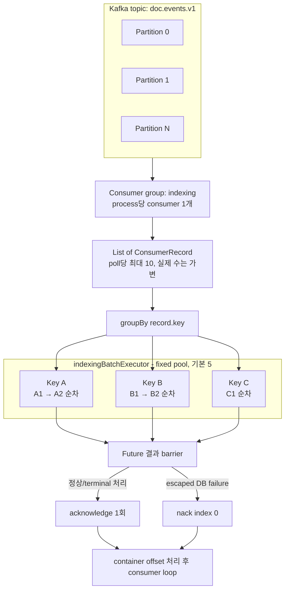
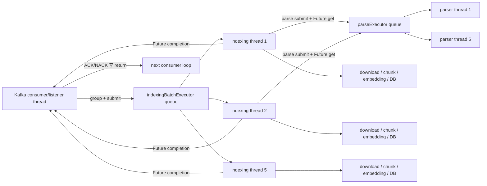
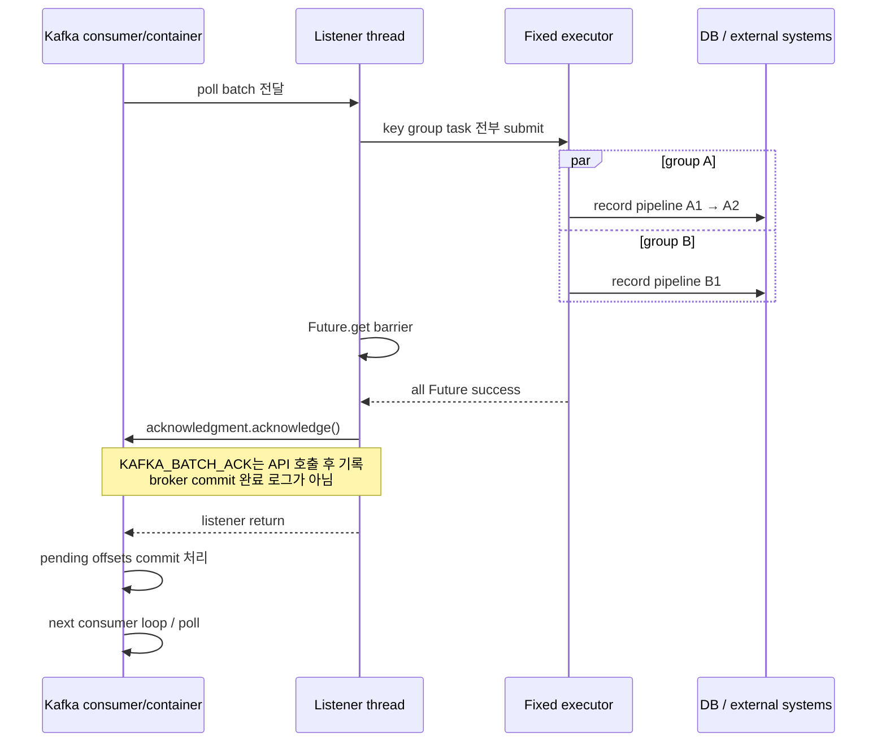

# Kafka Processing Model

이 문서는 2026 공개SW 개발자대회 TmaxTibero 기업과제 「Tmax OpenSQL 기반 AI 문서 관리 및 벡터 동기화 시스템」의 문서 인덱싱 Worker가 Kafka record를 실행하는 모델을 설명한다. 기준은 현재 저장소의 production code, `application.yml`, Gradle dependency resolution, 테스트와 Dockerfile이다.

설명하는 범위는 Kafka poll 이후 record가 batch listener에 전달되어 key별 task로 실행되고, 결과가 ACK 또는 NACK으로 연결된 뒤 consumer loop로 돌아가는 과정이다. 전체 시스템 구조와 DB transaction 설계는 [Worker Architecture](ARCHITECTURE.md), crash·중복·재전달·retry의 상세 복구 정책은 [Failure Handling & Recovery](FAILURE_HANDLING.md)를 참고한다.

## 1. 문서 목적과 범위

이 Worker의 처리 경계는 다음 세 층으로 나뉜다.

1. **Kafka 경계**: partition assignment, poll batch, consumer group offset
2. **실행 경계**: listener thread, record-key group, executor task, record pipeline
3. **DB 경계**: Job 상태 transaction과 성공 publication transaction

세 경계는 일치하지 않는다. 한 Kafka batch가 하나의 DB transaction인 것도 아니고, executor thread가 분리됐다고 listener thread가 즉시 다음 poll로 돌아가는 것도 아니다. listener는 제출한 task의 `Future`를 기다리기 때문이다.

이 문서는 정상 실행 모델과 실패가 listener completion에 미치는 영향까지만 다루며 다음 질문에 답한다.

- batch가 어떤 단위로 만들어지고 내부 task로 나뉘는가
- 동일 key record의 순서와 서로 다른 key record의 병렬성은 어디까지인가
- listener thread와 인덱싱/파싱 thread의 역할은 무엇인가
- 어떤 결과가 application-level 완료로 취급되는가
- ACK/NACK 호출과 offset commit의 관계는 무엇인가
- processing time이 consumer liveness에 어떤 영향을 주는가
- process, consumer, partition, executor thread를 늘릴 때 병렬성이 어떻게 달라지는가

Job 상태별 재획득, duplicate publish와 redelivery 판정, retryable/permanent 오류 분류 등 **다음 실행에서 어떻게 복구하는가**는 이 문서의 범위가 아니며 [Failure Handling & Recovery](FAILURE_HANDLING.md)에서 설명한다.

## 2. Processing Requirements

| 요구사항 | 필요한 이유 | 현재 구현 |
|---|---|---|
| 장시간 인덱싱을 request/response 경로 밖에서 실행 | download, parse, embedding, DB write는 처리 시간이 길고 외부 시스템에 의존한다. | Kafka event를 batch consumer로 수신해 별도 Worker process에서 실행한다. |
| 같은 문서 이벤트의 순차 실행 | 업로드/삭제나 연속 버전의 완료 순서가 뒤바뀌면 검색 상태가 달라질 수 있다. | 같은 `ConsumerRecord.key()`를 한 group으로 묶고 group 내부를 `forEach`로 순차 실행한다. producer key 계약은 이 저장소 밖에 있다. |
| 서로 다른 문서의 병렬 실행 | 한 문서의 긴 처리로 다른 문서까지 완전히 직렬화되는 것을 줄여야 한다. | 서로 다른 record key group을 fixed executor에 독립 task로 제출한다. |
| 처리 결과를 확인한 뒤 offset 처리 | executor task가 실행 중인데 listener가 먼저 완료되면 미완료 작업의 offset이 앞서갈 수 있다. | listener thread가 `Future.get()`으로 barrier를 형성한 뒤 한 번 ACK한다. |
| DB를 기록할 수 없는 실패의 재처리 연결 | Job 상태도 남기지 못한 record를 ACK하면 처리 근거가 사라진다. | listener까지 전파된 `DataAccessException`이 있으면 index 0부터 batch NACK한다. |
| 처리량 제한 | 외부 embedding quota와 local resource를 무제한 동시 사용하지 않아야 한다. | batch executor와 parse executor를 각각 고정 크기 pool로 둔다. |
| poll lifecycle 유지 | listener callback이 너무 오래 반환하지 않으면 consumer group에서 제외될 수 있다. | `max.poll.interval.ms=900000`을 설정했지만 end-to-end 처리시간 상한은 입증되지 않았다. |

## 3. Processing Model at a Glance



Batch 수신은 병렬 처리 자체가 아니다. 병렬성은 listener가 batch를 `record.key()`별로 나눈 뒤 각 group을 executor task로 제출하면서 생긴다. Kafka consumer thread는 그동안 `Future`를 기다리므로 다음 poll을 계속 수행하지 않는다.

## 4. Kafka Consumer Model

### 4.1 Listener entry point

현재 `@KafkaListener`는 하나다.

```text
IndexingKafkaListener.onMessage(
    records: List<ConsumerRecord<String, String>>,
    ack: Acknowledgment,
)
```

Listener annotation은 다음과 같다.

```text
@KafkaListener(topics = ["${indexing.consumer.topic}"], id = "indexing")
```

- topic pattern, explicit `groupId`, explicit `containerFactory`, annotation-level `concurrency`는 없다.
- `Consumer` 객체를 직접 받지 않는다.
- payload 객체의 list가 아니라 raw JSON value를 가진 `List<ConsumerRecord<String, String>>`를 받는다.
- deserialization은 executor thread의 `processRecord()`에서 Jackson으로 수행한다.

### 4.2 Topic과 실제 consumer group

| 항목 | 현재 저장소 기본값 | 결정 방식 |
|---|---|---|
| Topic | `doc.events.v1` | `INDEXING_KAFKA_TOPIC`으로 override 가능 |
| YAML consumer group | `indexing-worker` | `spring.kafka.consumer.group-id` |
| 실제 listener group | `indexing` | listener `id="indexing"`, Spring Kafka 4.1의 `idIsGroup=true` 기본 동작 |

Annotation에 `groupId`가 없더라도 listener id가 group ID로 사용된다. 따라서 현재 실제 group은 YAML의 `indexing-worker`가 아니라 `indexing`이다. YAML group property만 바꾸는 것으로는 이 listener의 group을 바꿀 수 없다.

### 4.3 확인된 consumer/container 설정

현재 runtime dependency는 Spring Kafka 4.1.0과 Kafka clients 4.2.1이다.

| Setting | Repository default | 역할/비고 |
|---|---:|---|
| listener type | `batch` | 한 listener invocation에 record list 전달 |
| ack mode | `MANUAL` | application이 `Acknowledgment`를 호출 |
| enable auto commit | `false` | Kafka consumer auto commit 비활성 |
| auto offset reset | `earliest` | 초기 committed offset이 없을 때 적용 |
| max poll records | 10 | `INDEXING_BATCH_SIZE` override. 한 poll의 **상한**이며 고정 batch size가 아님 |
| max poll interval | 900,000 ms | 두 poll 사이 최대 허용 시간 15분 |
| session timeout | 45,000 ms | heartbeat를 받지 못하는 member의 session 판단 기준 |
| heartbeat interval | 3,000 ms | classic consumer heartbeat 주기 |
| listener concurrency | 미설정, current Spring Kafka container default 1 | process 하나에 child Kafka consumer 하나 |
| sync commits | 미설정, current Spring Kafka container default `true` | container가 commit을 실행할 때 sync commit 경로 사용 |
| async ACKs | 미설정, current Spring Kafka container default `false` | out-of-order asynchronous acknowledgment 기능을 사용하지 않음 |
| fetch settings | 프로젝트에서 미설정 | 처리 모델이 특정 fetch size/wait에 의존하지 않음 |
| isolation level | 프로젝트에서 미설정 | 별도 read isolation 정책을 선언하지 않음 |
| client ID | 프로젝트에서 미설정 | framework/client 생성 값 사용 |

표는 저장소 기본 configuration 기준이다. Spring의 외부 property source로 배포 시 override할 수 있지만, 이 저장소에는 실제 운영 override 값이 없다.

### 4.4 Partition assignment

같은 group의 consumer들 사이에 topic partition이 배정된다. 이 저장소에는 topic 생성 코드나 partition 수 설정이 없으므로 실제 partition 수는 확인할 수 없다.

한 consumer에 여러 partition이 배정될 수 있고, 한 번의 poll 결과에는 그 여러 partition의 record가 함께 들어올 수 있다. listener는 partition별로 task를 나누지 않고 오직 record key로 grouping한다.

Partition assignment/revocation의 기본 Spring Kafka INFO 로그는 실행 container에서 확인할 수 있다. 별도 `RebalanceMetricsListener` 구현은 있지만 현재 `ContainerCustomizer` generic wiring 문제로 실제 container에 연결되지 않아 custom `KAFKA_PARTITIONS_ASSIGNED` marker를 처리 모델의 관측 근거로 사용하지 않는다.

## 5. Partitioning과 Ordering

### 5.1 실제 grouping key

Production code는 다음 표현식을 사용한다.

```text
records.groupBy { it.key() }
```

즉 grouping 기준은 event payload의 `documentId`가 아니라 Kafka record의 string key다. Listener는 key와 payload `documentId`가 같은지 검증하지 않는다.

Code comment와 테스트는 `record.key() == documentId 문자열`이라는 producer contract를 전제로 한다. 그러나 이 저장소에는 producer, `KafkaTemplate`, custom partitioner, topic provisioning이 없다. 따라서 다음은 구분해야 한다.

- **확인된 Worker 동작**: 동일한 record key는 같은 executor group에서 순차 처리된다.
- **외부 전제**: producer가 동일 document의 모든 event에 일관된 document ID key를 넣어 같은 partition으로 보내야 한다.

### 5.2 Same-document ordering의 조건

동일 document의 순서를 유지하려면 아래 조건이 모두 필요하다.

1. producer가 같은 document에 byte/string 표현까지 같은 key를 사용한다.
2. 해당 key들이 같은 Kafka partition에 배치된다.
3. Kafka가 partition 안에서 전달한 record 순서가 listener list/group value 순서로 유지된다.
4. Worker가 같은 key group을 `forEach`로 순차 실행한다.
5. 정상 처리 중 해당 partition의 소유 consumer가 하나다.

한 batch 안에서는 Kotlin `groupBy`가 같은 key의 value를 입력 list 순서로 모으고, `sameKeyRecords.forEach(::processRecord)`가 그 순서를 유지한다. 테스트도 같은 key의 두 record가 `PipelineRunner`에 원래 순서로 전달되는 것을 검증한다.

Batch 사이에서도 정상 상태에서는 listener가 현재 batch task를 끝내고 반환한 뒤 다음 consumer loop로 가기 때문에 같은 consumer가 순차적으로 받는다. 다만 이것은 producer partition contract와 정상 partition ownership을 전제로 한 범위다.

### 5.3 Ordering boundary

다음은 보장되지 않는다.

- 서로 다른 key record의 DB 완료 순서
- 서로 다른 partition 사이의 global order
- 같은 document를 서로 다른 key 또는 partition으로 보낸 경우의 순서
- producer가 record key를 null로 보내거나 payload `documentId`와 다르게 보낸 경우의 문서별 순서

Null key들은 모두 하나의 null-key group으로 묶여 서로 다른 문서여도 직렬 실행될 수 있다. 같은 partition의 서로 다른 key record도 executor에서는 병렬 실행되므로 DB side effect가 Kafka offset 순서와 다르게 완료될 수 있다. Batch ACK barrier가 incomplete record를 건너뛰는 commit은 막지만 side-effect 완료 순서를 같게 만들지는 않는다.

## 6. Batch Consumption

### 6.1 Poll에서 listener까지

Kafka client가 poll한 record collection을 Spring Kafka batch container가 `List<ConsumerRecord<String, String>>`로 listener에 전달한다. `max.poll.records=10`은 최대 개수다. 다음 이유로 실제 list 크기는 10보다 작을 수 있다.

- 현재 사용 가능한 record 수
- assigned partition별 lag
- fetch 결과와 poll 시점
- 이전 처리와 offset 위치

Worker code는 list가 항상 10개라고 가정하지 않는다.

### 6.2 Batch contents

하나의 batch에는 다음이 함께 있을 수 있다.

- 같은 partition의 여러 key
- 같은 key의 여러 record
- consumer에 배정된 여러 partition의 record
- `INDEXING_REQUESTED`와 `DOCUMENT_DELETED`

Listener는 event type이나 partition별로 batch를 분리하지 않는다. key grouping 후 각 record를 executor thread에서 deserialize하고 event type에 따라 indexing runner 또는 deletion handler로 보낸다.

### 6.3 Batch를 사용하는 효과와 비용

Batch는 한 poll에서 여러 document key를 확보해 in-process executor에 병렬 공급할 수 있게 한다. default `max.poll.records=10`과 executor size 5는 최대 record 수가 pool size의 두 배인 구성이다.

대신 Kafka offset 처리는 batch completion barrier 뒤로 묶인다. 한 key group이 오래 걸리면 먼저 끝난 다른 group도 ACK를 기다린다. Batch는 DB atomicity를 제공하지 않는다.

## 7. In-Batch Scheduling

### 7.1 Scheduling algorithm

Listener의 실행 순서는 다음과 같다.

1. `records.groupBy { it.key() }`
2. 각 group list마다 `executor.submit { sameKeyRecords.forEach(::processRecord) }`
3. 반환된 `Future` list를 제출 순서대로 순회
4. 각 `future.get()`으로 완료 또는 exception 확인
5. 결과를 바탕으로 ACK, NACK 또는 exception propagation

Coroutine, `CompletableFuture.allOf`, reactive stream은 사용하지 않는다. Plain `ExecutorService`와 blocking `Future.get()`을 사용한다.

### 7.2 예시: A1, B1, A2, C1, B2

입력 batch가 다음 순서라고 가정한다.

```text
A1, B1, A2, C1, B2
```

Grouping 결과는 다음과 같다.

```text
A → A1 → A2
B → B1 → B2
C → C1
```

Default pool size 5에서는 A, B, C group task가 각각 다른 최대 3개의 executor thread에서 실행될 수 있다. A group 안에서는 A1이 반환된 뒤 A2가 실행되고, B도 같은 방식이다. C1이 먼저 끝나도 listener는 A와 B의 Future까지 확인하기 전 ACK할 수 없다.

| A2 결과 | A group | B/C group | Batch 결과 |
|---|---|---|---|
| 정상 완료 | group 완료 | 독립 실행/완료 | 모든 Future 완료 후 ACK |
| permanent failure가 Job `FAILED`로 정상 종결 | runner가 return하므로 group은 실행 관점에서 완료 | 독립 실행/완료 | ACK 가능 |
| 역직렬화/지원하지 않는 event | `processRecord()`가 로그 후 exception을 소비 | 독립 실행/완료 | ACK 가능 |
| listener까지 나온 `DataAccessException` | A group `forEach` 중단, Future failure | Listener는 B/C Future까지 기다림 | batch index 0 NACK |
| 예상하지 못한 비-DB exception | A group 중단, Future failure | 이미 실행 중일 수 있으나 끝까지 기다린다는 보장 없음 | explicit ACK/NACK 없이 container로 exception 전파 |

각 group의 DB transaction은 독립적이므로 A2가 실패해도 이미 commit된 A1/B/C 결과를 batch 차원에서 rollback하지 않는다.

### 7.3 Completion detection order

Future는 group task를 제출한 순서대로 `get()`한다. 따라서 뒤쪽 Future가 이미 실패했어도 앞쪽의 긴 Future가 끝날 때까지 listener가 그 실패를 관측하지 못할 수 있다.

DB failure는 발견한 뒤에도 나머지 Future를 모두 확인하도록 구현되어 있다. 예상하지 못한 비-DB failure는 발견 즉시 `ExecutionException`을 던지므로 제출 순서상 뒤에 있는 task가 계속 실행 중인 채 listener callback이 끝날 수 있다.

## 8. Thread와 Executor Model



### 8.1 Kafka consumer/listener thread

Consumer thread가 하는 일은 다음과 같다.

- batch 수신과 key grouping
- group task 제출
- `Future.get()` barrier
- DB failure 집계
- `Acknowledgment.acknowledge()` 또는 `nack()` 호출

실제 document download/parse/chunk/embed/publication은 이 thread에서 직접 실행하지 않는다. 그러나 Future를 blocking wait하므로 consumer thread가 그동안 next poll을 수행할 수 있는 것은 아니다.

### 8.2 Indexing batch executor

`indexingBatchExecutor`는 Java 21의 `Executors.newFixedThreadPool(concurrency)`다.

| 속성 | 현재 값/동작 |
|---|---|
| pool type | fixed `ThreadPoolExecutor` |
| core/max size | `INDEXING_CONSUMER_CONCURRENCY`, 기본 5 |
| work queue | JDK `newFixedThreadPool`의 unbounded `LinkedBlockingQueue` |
| rejection policy | JDK default `AbortPolicy`; 정상 실행 중 queue capacity로 reject되지는 않음 |
| thread factory/name | project custom 설정 없음, JDK default thread factory |
| task decorator | 없음 |
| virtual thread | 사용하지 않음 |
| bean destroy | `shutdown()` |

환경변수 이름에 `CONSUMER_CONCURRENCY`가 포함되지만 Kafka listener consumer 수를 바꾸지 않는다. 이 값은 in-process indexing task와 parse pool 크기를 함께 바꾼다.

### 8.3 Parse executor

각 indexing thread는 parsing 단계에서 별도 fixed pool에 parser task를 제출하고 최대 `INDEXING_PARSE_TIMEOUT` 기본 60초 동안 `Future.get()`으로 기다린다. 따라서 parsing 중에는 indexing thread 하나와 parser thread 하나가 함께 점유된다.

Timeout이면 `future.cancel(true)`와 `shutdownNow()` 가능한 구조지만 parser가 interrupt에 협조하지 않으면 parser thread가 실제로 계속 점유될 수 있다.

### 8.4 Retry thread occupancy

Retry는 Kafka redelivery나 별도 scheduler가 아니라 같은 `IndexingPipelineRunner.run()` loop 안에서 수행된다. Retryable failure가 `RETRY_WAIT`으로 기록되면 `ThreadSleepRetryWaiter`가 DB 시각 기준 남은 시간 동안 `Thread.sleep()`한다.

이 sleep은 indexing executor thread를 pool에 반환하지 않는다. 따라서 retry/backoff 중인 document group 하나가 기본 5개 slot 중 하나를 계속 차지한다. 해당 group의 뒤 record도 같이 대기한다.

### 8.5 Queue와 natural backpressure

Unbounded queue 자체에는 application-level capacity limit이 없다. 다만 정상 success/DB-NACK 경로에서는 listener가 현재 batch 완료까지 반환하지 않으므로 한 consumer가 다음 batch를 계속 poll해 queue를 무한히 채우는 구조는 아니다.

Default batch에서는 group task 수가 최대 10이고, 5개가 실행 중이면 나머지가 queue에서 기다린다. `INDEXING_BATCH_SIZE`를 크게 올리면 한 batch가 만드는 queued task도 그만큼 늘 수 있다.

예상하지 못한 비-DB failure는 뒤 Future를 모두 기다리지 않고 listener로 전파되므로 이미 제출된 task가 남을 수 있다. Container error handling이 listener를 다시 호출하면 이전 invocation task와 새 task가 겹쳐 queue가 한 batch 범위를 넘을 가능성이 있다. 이 경로의 실제 broker/container 동작은 통합 테스트되지 않았다.

## 9. Record Processing Lifecycle과 Execution Boundary

### 9.1 Executor task 안의 record lifecycle

각 record는 indexing executor thread에서 다음 순서로 실행된다.

```text
ConsumerRecord
→ traceId header 추출과 MDC 설정
→ JSON deserialization
→ INDEXING_EVENT_RECEIVED 로그
→ INDEXING_REQUESTED: IndexingPipelineRunner
   또는 DOCUMENT_DELETED: DocumentDeletionHandler
→ event handling completed
→ MDC 제거
```

`INDEXING_REQUESTED`의 pipeline은 Job 획득 이후 validation, download, hash verification, parse, chunk, embedding, publication을 같은 outer indexing thread에서 순차 호출한다. Parsing 계산만 parse executor로 넘겼다가 결과를 기다리고, embedding client 호출도 synchronous하게 수행한다.

각 단계의 내부 DB transaction 구성과 publication 원자성은 [Worker Architecture](ARCHITECTURE.md)에서 설명한다.

### 9.2 Application-level record completion

Listener 관점의 완료는 “해당 record에 대한 현재 실행 정책이 정상 반환했다”는 의미이며 항상 `indexing_job=COMPLETED`를 뜻하지는 않는다.

- indexing 또는 deletion handler가 정상 반환한 경우
- terminal 정책에 따라 pipeline이 실행을 생략하거나 종료하고 정상 반환한 경우
- malformed JSON 또는 listener-level invalid event를 로그 후 소비한 경우

Job 상태별 skip·재획득, duplicate publish/redelivery 판정과 terminal failure 정책은 [Failure Handling & Recovery](FAILURE_HANDLING.md)에서 설명한다.

### 9.3 Kafka, task, acknowledgment boundary 비교

| Boundary | 범위 | 다른 boundary와의 관계 |
|---|---|---|
| Kafka poll batch | listener에 전달된 최대 10 record | 하나의 DB transaction이 아님 |
| key group task | 같은 record key의 record list | 한 executor thread에서 순차 실행 |
| record pipeline | 한 record의 event handler 실행 | 전체 batch를 감싸는 transaction 없음 |
| Kafka acknowledgment | DB 처리 결과를 기다린 뒤 listener thread에서 호출 | broker offset과 DB의 atomic transaction이 아님 |

Listener thread에서 executor thread로 실행이 넘어가며 서로 다른 key group은 독립적으로 진행된다. DB transaction의 상세 경계는 [Worker Architecture](ARCHITECTURE.md), 실패 후 재실행과 상태 수렴은 [Failure Handling & Recovery](FAILURE_HANDLING.md)에서 다룬다.

## 10. Batch Completion과 Offset Management

### 10.1 Success condition

Batch ACK 조건은 다음과 같다.

1. 모든 key group Future를 제출한다.
2. 제출 순서대로 `Future.get()`이 정상 반환한다.
3. escaped `DataAccessException`이 하나도 집계되지 않는다.
4. `ack.acknowledge()`를 한 번 호출한다.

Record별 ACK나 partial batch ACK API는 사용하지 않는다.

### 10.2 ACK sequence



`AckMode.MANUAL`에서는 acknowledgment가 container에 처리 완료 offset을 전달한다. Current Spring Kafka container의 `syncCommits` 기본값이 true이므로 container가 실제 commit을 수행할 때 synchronous commit 경로를 사용한다. 그러나 application은 broker commit 결과 callback을 별도로 기록하지 않으며 `KAFKA_BATCH_ACK` 로그도 `acknowledge()` 호출 직후, listener return 전에 출력된다. 따라서 이 로그를 broker commit 완료 증거로 사용하면 안 된다.

### 10.3 Offset boundary

정상 ACK 시 현재 poll batch에서 처리된 partition별 마지막 record 다음 offset이 commit 대상이 된다. Batch가 여러 partition의 record를 포함하면 각 partition의 offset이 함께 처리된다.

DB에서는 record별 transaction이 이미 독립 commit될 수 있지만 Kafka offset은 batch barrier 뒤에서 처리된다. 이 차이 때문에 일부 DB 성공과 uncommitted Kafka record가 동시에 존재할 수 있다.

### 10.4 DB failure와 NACK

Executor Future의 direct cause가 `DataAccessException`이면 listener는 첫 DB failure를 저장하고 나머지 Future도 모두 기다린다. 하나라도 있으면 다음을 호출한다.

```text
ack.nack(0, INDEXING_DB_HEALTH_PAUSE_NACK_DELAY)
```

Default delay는 5초다. Batch listener의 index 0 NACK이므로 index보다 앞서 commit할 record는 없고, 현재 batch의 record 전체가 partition별 seek/redelivery 대상이 될 수 있다. NACK delay 동안 consumer 전체가 pause되는 효과가 있으며 단일 실패 record만 별도 retry하는 모델이 아니다.

NACK 호출 후 listener는 즉시 return한다. 이미 성공한 group의 DB transaction은 rollback되지 않는다. 이후 redelivery의 idempotency와 상태별 복구는 [Failure Handling & Recovery](FAILURE_HANDLING.md)에서 다룬다.

### 10.5 Unexpected exception

Non-DB `ExecutionException`과 listener wait의 `InterruptedException`은 explicit ACK/NACK 없이 container로 전파된다. 이 저장소에는 별도 `CommonErrorHandler` configuration이 없으므로 live container의 재호출 횟수와 delay를 application 정책으로 정의하지 않는다.

또한 pipeline 내부에서 처리 정책에 의해 정상 반환된 오류는 listener의 explicit ACK/NACK 판단에서 이미 결론 난 task로 보인다. Listener까지 exception이 전파되는 구체적인 오류 분류와 상태 기록 실패의 복구 정책은 [Failure Handling & Recovery](FAILURE_HANDLING.md)에서 설명한다.

## 11. Processing Time과 Consumer Liveness

### 11.1 Executor 분리가 poll thread를 자유롭게 하지는 않는다

실제 indexing은 executor thread에서 수행되지만 listener thread는 모든 Future가 끝날 때까지 blocking한다. 따라서 이전 poll에서 record를 받은 시점부터 listener가 return하고 다음 poll로 갈 때까지의 전체 batch 시간이 `max.poll.interval.ms` budget에 포함된다.

### 11.2 Heartbeat와 poll interval

| Mechanism | 현재 값 | 이 Worker에서의 의미 |
|---|---:|---|
| `heartbeat.interval.ms` | 3초 | process가 살아 있는 동안 consumer membership heartbeat를 보낸다. |
| `session.timeout.ms` | 45초 | process 종료/통신 단절로 heartbeat가 사라진 경우의 broker 판단 축이다. |
| `max.poll.interval.ms` | 15분 | process가 살아 있어도 listener callback 때문에 poll로 돌아오지 못하는 경우의 판단 축이다. |

Worker thread에서 실행한다고 heartbeat와 poll 문제가 모두 해결되는 것은 아니다. Heartbeat는 유지될 수 있지만 consumer thread의 다음 poll은 batch completion barrier 뒤에 있기 때문에 15분을 넘을 수 있다.

### 11.3 Batch time model

한 poll batch의 record 수를 `N`, 서로 다른 record key 수를 `K`, executor thread 수를 `M`이라 하자. 현재 default는 `N ≤ 10`, `M = 5`다.

같은 key group `g`의 시간은 다음과 같다.

```text
T_group(g) = Σ T_record(r),  r ∈ group(g)
```

각 record는 retry를 포함한다.

```text
T_record
  = Σ T_attempt(i)
  + Σ T_backoff(i)
```

Group task들은 fixed pool에서 실행되므로 batch 시간은 단순히 항상 `max(T_group)`이 아니다.

```text
T_batch
  = makespan_M(T_group(1), ..., T_group(K))
  + listener/commit scheduling overhead
```

- `K ≤ M`: 충분한 thread가 있다면 대체로 가장 느린 group이 지배한다.
- `K > M`: queue에서 다음 group이 기다리므로 여러 execution wave가 생긴다.
- 한 key에 record가 몰리면 해당 group 안에서 합산되어 executor thread 수를 늘려도 그 group은 병렬화되지 않는다.

Consumer membership을 안정적으로 유지하려면 실제 운용에서 poll 사이 시간이 `900초`보다 작아야 한다. 이 저장소에는 이를 end-to-end로 검증하는 test가 없다.

### 11.4 Default retry backoff로 계산 가능한 하한

Worker attempt 기본 상한은 5이고 backoff는 `30초 × attempt_count` 선형이다. 다섯 번째 attempt에서 끝난다면 sleep은 attempt 1~4 실패 뒤 발생한다.

```text
한 record의 최대 Worker-level backoff
= 30 + 60 + 90 + 120
= 300초
```

이 값에는 download, parse, embedding, DB 시간이 포함되지 않는다.

| Default batch shape | In-process scheduling | backoff만으로 생길 수 있는 batch 시간 |
|---|---|---:|
| 10 record, key 10개 | pool 5에서 최대 5 group 동시, 이후 queued group | 모든 record가 retry 소진 시 최소 약 2 wave × 300초 = 600초 |
| 10 record, key 1개 | group 하나에서 10 record 직렬 | 모든 record가 retry 소진 시 10 × 300초 = 3,000초 |
| key 일부 편중 | 긴 group과 queued group의 조합 | key별 record 수와 pool scheduling에 따라 달라지며 가장 긴 group이 크게 지배 |

같은-key 10건 경로는 backoff sleep만으로 15분 poll interval을 넘는다. 서로 다른 key 10건도 backoff 후 남는 이론상 여유는 약 300초뿐이며 실제 attempt 실행시간이 추가된다.

### 11.5 Attempt time의 확인 가능한 요소

| 단계 | 확인된 시간 관련 설정 | Processing thread 영향 |
|---|---|---|
| S3 download | API call timeout 기본 30초 | indexing thread block |
| parsing | parse timeout 기본 60초 | indexing thread와 parser thread 모두 점유 |
| embedding | Spring AI/OpenAI client default request timeout 60초, client retry 최대 3 | embedding request batch를 순차 호출하며 indexing thread block |
| Worker retry | 최대 5 attempt, 총 backoff 최대 300초/record | sleep 동안 indexing thread 점유 |
| DB publication | query/transaction timeout 별도 설정 없음, chunk 최대 기본 5,000행을 행별 UPSERT | indexing thread block |

Embedding은 document를 여러 API request로 나눌 수 있고 각 request에서 provider retry가 발생할 수 있다. DB에도 end-to-end record timeout이 없다. 따라서 `T_attempt`의 신뢰 가능한 전체 상한을 현재 code/config만으로 계산할 수 없다.

### 11.6 현재 safety margin 판단

현재 설정만으로 “15분 안에 항상 다음 poll로 돌아온다”고 판단할 수 없다. 오히려 같은 key 집중, inline retry, provider retry, 여러 embedding request, 행별 DB UPSERT가 겹치면 초과 가능한 경로가 명확하다.

`Kafka batch received`와 `KAFKA_BATCH_ACK durationMs`, stage duration log, `indexing_job_duration_seconds` timer는 실측 근거를 제공하지만 저장소에는 poll budget 경계 test, dashboard, SLO가 없다.

## 12. Scaling Model

### 12.1 네 가지 병렬성 축

```mermaid
flowchart TB
    P[Topic partitions: P<br/>저장소에서 개수 미정]
    W[Worker processes: W]
    C[Kafka consumers in group: C<br/>repository default C = W × 1]
    A[Active consumers ≤ min(P, C)]
    B[각 active consumer의 현재 poll batch]
    E[process별 indexing executor<br/>M = 기본 5]
    R[동시에 실행되는 key group 수<br/>≤ min(M, current batch의 K)]

    W --> C
    P --> A
    C --> A
    A --> B
    B --> E
    E --> R
```

| 축 | 무엇을 늘리는가 | 현재 기본 |
|---|---|---:|
| Worker process | JVM/container instance | 배포 설정은 저장소에 없음 |
| Kafka consumer | group 내 partition 소유자 | process당 1 |
| Partition | Kafka-level 최대 active consumer 수 | topic provisioning이 저장소 밖이라 미확인 |
| Indexing executor thread | 한 consumer의 현재 batch 안 key-group 동시 실행 | process당 5 |
| Parse executor thread | 동시 parser 계산 | process당 5 |

### 12.2 Process와 consumer

Repository default로 Worker process 하나를 띄우면 listener container child consumer 하나가 group `indexing`에 참가한다. Process가 `W`개면 일반적으로 group consumer는 `W`개가 된다. External configuration으로 listener concurrency를 별도 override하지 않는다는 조건이다.

### 12.3 Partition scaling limit

Partition 수를 `P`, group consumer 수를 `C`라 하면 동시에 partition을 소유해 consume하는 consumer 수는 `min(P, C)`를 넘지 않는다.

- `C < P`: 일부 consumer가 여러 partition을 맡는다.
- `C = P`: partition마다 consumer 하나까지 배정 가능하다.
- `C > P`: 초과 consumer는 partition을 받지 못해 idle 상태가 된다.

현재 저장소에는 `P`가 없으므로 Worker process 수가 partition 수와 적절한지 판단할 수 없다. 실행 Kafka topic의 partition 수와 assignment를 별도로 확인해야 한다.

### 12.4 In-process parallelism

Partition이 하나여도 한 poll batch에 서로 다른 key가 여러 개 있으면 executor가 최대 5 group을 병렬 실행할 수 있다. 반대로 partition이 많아도 한 consumer batch가 같은 key 위주이거나 외부 API/DB가 병목이면 5 thread가 모두 유효한 처리량으로 이어지지 않는다.

Executor thread 증가가 처리량 향상으로 이어지려면 다음 조건이 필요하다.

- current batch에 서로 다른 key group이 충분히 많음
- producer key가 document별로 분산되고 partition skew가 심하지 않음
- embedding quota, S3, DB connection pool과 DB write capacity가 추가 동시성을 수용함
- retry/sleep 또는 stuck parser가 thread slot을 장기간 점유하지 않음
- JVM CPU, memory, temporary disk가 병렬 pipeline을 감당함

Kafka consumer parallelism과 executor parallelism을 곱한 값을 그대로 처리량으로 볼 수 없다. Batch 크기, key 분포, record별 비용, 외부 resource가 실제 upper bound를 결정한다.

## 13. Backpressure, Bottleneck, Shutdown

### 13.1 Natural backpressure

Listener가 현재 batch barrier를 기다리는 구조는 consumer가 다음 batch를 계속 받아 application memory에 쌓는 것을 억제한다. 처리 속도가 input보다 느리면 주된 backlog는 executor queue보다 Kafka consumer lag으로 나타난다.

이 backpressure의 비용은 한 느린 group이 consumer의 assigned partition 전체 next poll과 batch ACK를 지연한다는 점이다.

### 13.2 주요 bottleneck

| Bottleneck | 발생 조건 | 영향 |
|---|---|---|
| 같은 key 집중 | 한 문서에 batch record가 몰림 | group 내부 직렬화, 나머지 executor slot을 활용하지 못함 |
| 긴 단일 document | 큰 파일, 많은 chunk/embedding request | group Future와 batch ACK 지연 |
| inline retry/backoff | provider/storage/parse 일시 오류 | executor thread를 sleep 상태로 점유 |
| embedding quota/latency | group 여러 개가 동시에 API 호출 | latency 증가, retry 증가, pool slot 장기 점유 |
| parse thread leak | parser가 interrupt를 무시 | parse pool 고갈, outer indexing thread timeout 반복 |
| 행별 chunk UPSERT | chunk 수가 많고 DB가 느림 | publication transaction 및 record 시간 증가 |
| batch completion barrier | 한 group만 느리거나 실패 | 먼저 성공한 group도 ACK/next poll 대기 |
| partition/key skew | 특정 partition 또는 key에 부하 집중 | process를 늘려도 일부 consumer만 busy |
| unbounded executor queue | batch size를 크게 override하거나 leftover task overlap | 명시적 admission control 부재 |

### 13.3 Graceful shutdown

Docker entrypoint는 `exec java ...`로 Java process를 PID 1로 실행해 SIGTERM 전달을 방해하지 않는다. 하지만 application-specific graceful shutdown timeout이나 task drain protocol은 없다.

- Kafka listener container lifecycle은 Spring framework가 관리한다.
- `indexingBatchExecutor` bean destroy는 `shutdown()`을 호출한다. 새 task를 거부하고 기존 queued/running task의 종료를 허용하지만 explicit `awaitTermination()`은 없다.
- `ParsingTimeoutGuard`는 `@PreDestroy`에서 `shutdownNow()`를 호출해 parser task interrupt를 시도한다.
- 실행 중 Job을 별도로 취소하거나 `PROCESSING` 상태를 graceful하게 변경하는 code는 없다.

따라서 정상 SIGTERM에서 실제 task가 끝날 때까지 얼마나 기다리는지는 framework/container shutdown과 배포 플랫폼의 termination timeout에 의존한다. Dockerfile health check는 PID liveness만 확인하고 Compose/restart policy는 이 저장소에 없다.

## 14. Processing Guarantees

| Property | 현재 보장 범위 | Condition / Boundary |
|---|---|---|
| Batch listener 입력 | 한 invocation에 `List<ConsumerRecord<String, String>>` | record 수는 최대값 이하이며 항상 10개가 아님 |
| Same-key batch ordering | 같은 key group 안 record를 listener list 순서대로 호출 | producer가 같은 document에 일관된 key를 사용해야 document ordering이 됨 |
| Same-document cross-batch ordering | 정상 partition ownership 아래 같은 partition consumer가 이전 callback 뒤 다음 batch 처리 | 서로 다른 partition/key, rebalance overlap은 범위 밖 |
| Cross-key parallelism | current batch의 서로 다른 key group을 최대 pool size만큼 동시 실행 가능 | 실제 병렬도는 `min(5, K)`와 queued work/resource에 의존 |
| Cross-document completion order | 보장하지 않음 | 다른 group은 독립 transaction으로 서로 다른 시점 완료 |
| Batch completion barrier | ACK 및 DB-NACK 경로에서 Future 결과 확인 | unexpected non-DB failure는 뒤 Future를 끝까지 기다리지 않을 수 있음 |
| ACK | 모든 Future가 정상 결론이고 escaped DB failure가 없을 때 1회 호출 | ACK API 호출과 broker commit 완료는 같은 로그 사건이 아님 |
| NACK | escaped `DataAccessException` 존재 시 index 0부터 호출 | 단일 record가 아닌 poll batch 전체가 재전달 대상이 될 수 있음 |
| DB atomicity | 성공 publication 한 record의 chunk/version/Job write | Kafka batch 전체나 여러 group은 atomic하지 않음 |
| Duplicate execution | 발생 가능 | at-least-once/redelivery 상세는 Failure Handling 문서 범위 |
| Consumer liveness | batch가 15분 안에 consumer loop로 복귀할 때 유지 가능 | 현재 worst-case 처리시간이 15분 미만이라는 검증 없음 |

## 15. Design Decisions와 Trade-offs

### 15.1 Batch listener

- **Context**: 한 poll의 여러 document 작업을 확보해 한 consumer 안에서도 병렬화할 필요가 있다.
- **Decision**: batch listener와 `max.poll.records`를 사용한다.
- **Consequence**: key group 병렬화가 가능하지만 ACK/NACK과 next poll이 가장 느린 task에 묶인다.

### 15.2 Record-key grouping

- **Context**: 같은 문서의 연속 event는 순차 실행하고 다른 문서는 병렬 실행해야 한다.
- **Decision**: `ConsumerRecord.key()`별 group task를 만들고 group 내부 `forEach`를 사용한다.
- **Consequence**: 단순한 in-memory scheduling으로 순차성이 생기지만 producer key/partition contract를 Worker가 검증하지 않는다.

### 15.3 Fixed executor

- **Context**: 외부 API와 local resource를 사용하는 document group의 무제한 동시 실행을 피해야 한다.
- **Decision**: 기본 5개 thread의 fixed pool을 사용한다.
- **Consequence**: active concurrency는 제한되지만 queue는 unbounded이고 retry sleep이 slot을 점유한다.

### 15.4 Blocking completion barrier

- **Context**: executor에 제출했다는 사실만으로 record 처리가 끝난 것은 아니다.
- **Decision**: listener가 `Future.get()`으로 결과를 기다린다.
- **Consequence**: 처리 전 ACK를 막지만 executor 분리에도 consumer poll interval은 전체 batch 시간의 영향을 받는다.

### 15.5 Manual batch ACK와 DB NACK

- **Context**: Job별 DB 결과를 확인한 뒤 Kafka offset을 진행해야 한다.
- **Decision**: 정상 결론이면 batch ACK 한 번, escaped DB failure면 index 0 NACK을 사용한다.
- **Consequence**: application completion과 offset 진행이 연결되지만 partial success record도 재전달될 수 있고 DB/Kafka atomicity는 없다.

### 15.6 Inline retry의 processing 영향

- **Context**: 현재 retry 구현은 별도 scheduler가 아니라 record를 처리하던 executor thread 안에서 대기한다.
- **Decision**: Processing Model은 retry 정책 자체가 아니라 이 대기가 executor slot과 batch completion 시간을 점유한다는 실행 특성을 전제로 한다.
- **Consequence**: retry가 길어질수록 pool 가용성과 consumer poll budget이 함께 줄어든다. 오류 분류, attempt와 backoff 정책은 [Failure Handling & Recovery](FAILURE_HANDLING.md)에서 다룬다.

## 16. Verification

| Property | Evidence | Status |
|---|---|---|
| Batch method signature와 raw record identity 전달 | `IndexingKafkaListener` code 및 listener 단위 테스트 | Automated Test |
| Batch record 전부 runner dispatch 후 ACK 1회 | listener 단위 테스트 | Automated Test |
| 같은 key의 batch 내부 순서 | 두 record 호출 순서를 검증하는 listener 단위 테스트 | Automated Test |
| 서로 다른 key의 실제 동시 실행 | production fixed executor code | Code-path Verified, 동시성 assertion 없음 |
| DB failure 뒤 다른 group까지 처리하고 NACK | listener 단위 테스트 | Automated Test. 테스트 executor는 single thread |
| Unexpected exception 시 ACK/NACK 없음 | listener 단위 테스트 | Automated Test |
| Malformed record 소비 후 batch 진행 | listener 단위 테스트 | Automated Test |
| max poll interval 900초와 topic default | `ApplicationYmlConfigTest` | Automated Configuration Test |
| listener group `indexing`, concurrency 1 | annotation과 Spring Kafka 4.1 default 분석 | Configuration/Dependency Verified |
| fixed pool size/queue/thread model | executor bean과 Java 21 `newFixedThreadPool` 구현 | Code-path Verified |
| inline retry와 `RetryWaiter` 호출 | runner 단위 테스트, pipeline integration test code | Automated Test / Integration Test Code |
| ACK 후 실제 broker offset commit | Embedded Kafka/KafkaContainer test 없음 | Not Tested |
| multi-partition batch와 horizontal scaling | 실제 Kafka integration test 없음 | Not Tested |
| `max.poll.interval.ms` processing budget | boundary/load test 없음 | Not Tested |
| graceful shutdown task drain | shutdown integration test 없음 | Not Tested |
| queue saturation/rejection | load test 없음 | Not Tested |

Default Gradle `test` task는 `integration` tag를 제외한다. `integrationTest` task는 외부 PostgreSQL 계열 DB, Kafka endpoint, object storage, OpenAI credential을 자동 기동하지 않으며 환경에서 제공받는다.

## 17. Known Limitations

1. **Document ordering은 외부 producer contract에 의존한다.** Worker는 payload `documentId` 대신 record key로 grouping하며 key 일치 여부를 검증하지 않는다.

2. **Topic partition 수와 producer partitioning을 이 저장소에서 확인할 수 없다.** 따라서 현재 process 수가 Kafka-level scaling에 적절한지도 저장소만으로 판단할 수 없다.

3. **`INDEXING_CONSUMER_CONCURRENCY`는 Kafka consumer 수가 아니다.** 이름과 달리 indexing/parse executor pool size만 바꾼다. 실제 listener concurrency는 1이다.

4. **Executor offload가 poll lifecycle을 분리하지 않는다.** Listener가 Future barrier를 기다리므로 전체 batch 시간이 15분 max poll interval에 포함된다.

5. **현재 default worst case가 poll interval을 넘을 수 있다.** 같은 key 10건이 각각 retry budget을 소진하면 backoff만 50분이다. 실제 pipeline 시간은 여기에 더해진다.

6. **Retry가 thread를 반납하지 않는다.** `Thread.sleep()` 중인 Job은 indexing pool slot을 계속 점유한다.

7. **Fixed pool queue가 unbounded다.** 정상 경로에서는 한 batch가 queue 크기를 제한하지만 batch size override와 unexpected failure leftover task가 admission-control 위험을 만든다.

8. **Non-DB failure는 완전한 barrier를 깨뜨린다.** Future 제출 순서에 따라 뒤 task가 실행 중인 채 listener exception이 container로 전파될 수 있다.

9. **Batch는 DB atomicity 단위가 아니다.** 성공한 group의 DB write는 다른 group failure로 rollback되지 않는다. 이후 record 재전달 시 상태별 복구 방식은 Failure Handling 범위다.

10. **ACK marker가 broker commit marker가 아니다.** `KAFKA_BATCH_ACK`는 `acknowledge()` 직후의 application log이며 실제 commit 완료를 기록하지 않는다.

11. **외부 resource capacity와 executor size가 연동되지 않는다.** DB connection pool, OpenAI quota, S3 처리량을 기준으로 pool size를 자동 조절하지 않는다.

12. **Graceful shutdown completion budget이 없다.** Executor `shutdown()` 뒤 명시적 await나 Job 상태 전환이 없고 배포 termination timeout도 저장소 밖에 있다.

13. **Custom rebalance observability가 실제 listener에 연결되지 않았다.** Scaling 검증은 Spring Kafka 기본 assignment 로그와 Kafka 측 consumer group 상태에 의존한다.

## 18. Related Documents

- [README](../README.md)
- [Worker Architecture](ARCHITECTURE.md): Worker의 책임과 경계, building block, 데이터·transaction 구조와 architecture decision
- [Failure Handling & Recovery](FAILURE_HANDLING.md): 장애 모델, retry, redelivery, 상태별 복구와 보장 범위

이 문서의 수치와 동작은 repository default 기준이다. Topic partition 수, producer key, 실제 배포 process 수와 외부 configuration은 각 실행 환경에서 별도로 확인해야 한다.
