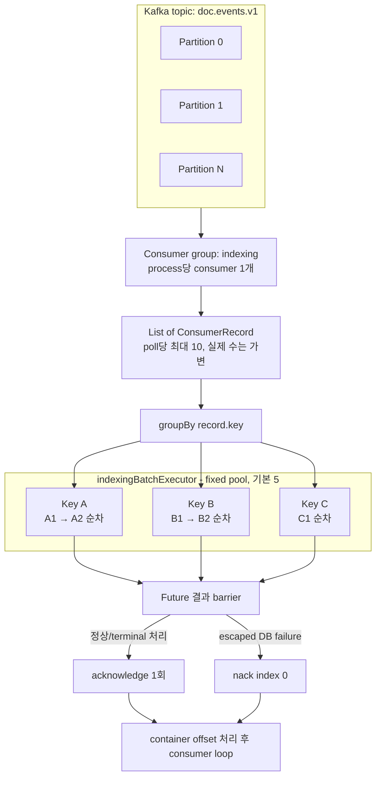
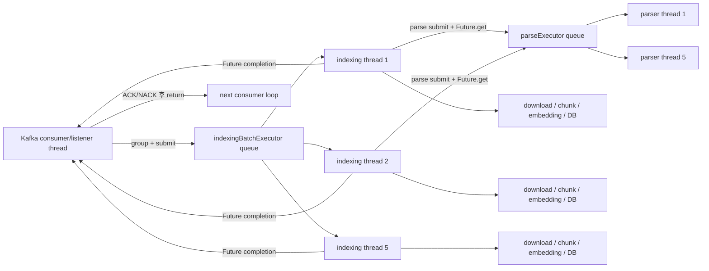
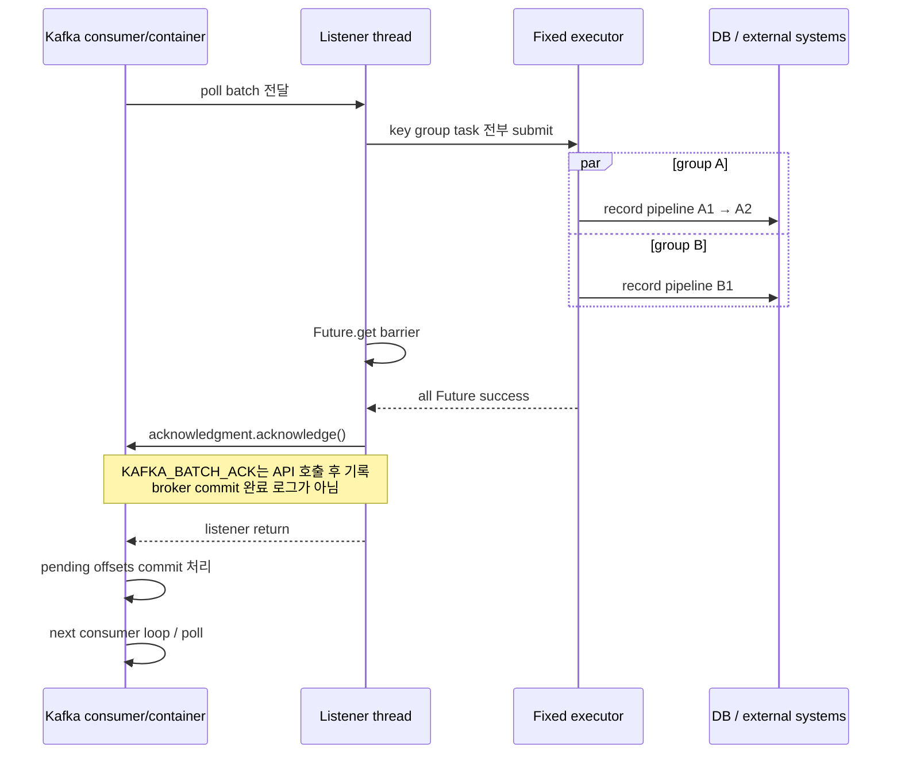
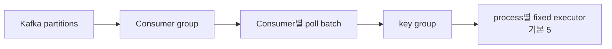

# Kafka Processing Model

이 문서는 2026 공개SW 개발자대회 TmaxTibero 기업과제 「Tmax OpenSQL 기반 AI 문서 관리 및 벡터 동기화 시스템」의 문서 인덱싱 Worker가 Kafka record를 실행하는 모델을 설명합니다. 기준은 현재 저장소의 production code, `application.yml`, Gradle dependency resolution, 테스트와 Dockerfile입니다.

설명하는 범위는 Kafka poll 이후 record가 batch listener에 전달되어 key별 task로 실행되고, 결과가 ACK 또는 NACK으로 연결된 뒤 consumer loop로 돌아가는 과정입니다. 전체 시스템 구조와 DB transaction 설계는 [Worker Architecture](ARCHITECTURE.md), crash·중복·재전달·retry의 상세 복구 정책은 [Failure Handling & Recovery](FAILURE_HANDLING.md)를 참고합니다.

## 1. 문서 목적과 범위

이 Worker의 처리 경계는 다음 세 층으로 나뉩니다.

1. **Kafka 경계**: partition assignment, poll batch, consumer group offset
2. **실행 경계**: listener thread, record-key group, executor task, record pipeline
3. **DB 경계**: Job 상태 transaction과 성공 publication transaction

세 경계는 일치하지 않습니다. 한 Kafka batch가 하나의 DB transaction인 것도 아니고, executor thread가 분리됐다고 listener thread가 즉시 다음 poll로 돌아가는 것도 아닙니다. listener는 제출한 task의 `Future`를 기다리기 때문입니다.

이 문서는 정상 실행 모델과 실패가 listener completion에 미치는 영향까지만 다루며 다음 질문에 답합니다.

- batch가 어떤 단위로 만들어지고 내부 task로 나뉘는가
- 동일 key record의 순서와 서로 다른 key record의 병렬성은 어디까지인가
- listener thread와 인덱싱/파싱 thread의 역할은 무엇인가
- 어떤 결과가 application-level 완료로 취급되는가
- ACK/NACK 호출과 offset commit의 관계는 무엇인가
- processing time이 consumer liveness에 어떤 영향을 주는가
- process, consumer, partition, executor thread를 늘릴 때 병렬성이 어떻게 달라지는가

Job 상태별 재획득, duplicate publish와 redelivery 판정, retryable/permanent 오류 분류 등 **다음 실행에서 어떻게 복구하는가**는 이 문서의 범위가 아니며 [Failure Handling & Recovery](FAILURE_HANDLING.md)에서 설명합니다.

## 2. Processing Model at a Glance



Batch 수신은 병렬 처리 자체가 아닙니다. 병렬성은 listener가 batch를 `record.key()`별로 나눈 뒤 각 group을 executor task로 제출하면서 생깁니다. Kafka consumer thread는 그동안 `Future`를 기다리므로 다음 poll을 계속 수행하지 않습니다.

## 3. Kafka Consumer Model

현재 Worker는 `doc.events.v1` topic을 consumer group `indexing`으로 batch consume합니다.

| Setting | 현재 값 | 역할 |
|---|---:|---|
| listener type | `batch` | 한 listener invocation에 record list 전달 |
| ack mode | `MANUAL` | application이 `Acknowledgment`를 호출 |
| enable auto commit | `false` | Kafka consumer auto commit 비활성 |
| max poll records | 10 | 한 poll의 최대 record 수 |
| max poll interval | 900,000 ms | 두 poll 사이 최대 허용 시간 15분 |
| session timeout | 45,000 ms | heartbeat가 사라진 consumer의 session 판단 기준 |
| heartbeat interval | 3,000 ms | consumer heartbeat 주기 |
| listener concurrency | 1 | process 하나에 Kafka consumer 하나 |

같은 consumer group의 consumer들 사이에 topic partition이 배정됩니다. 한 consumer에 여러 partition이 배정될 수 있으며, 한 번의 poll 결과에도 여러 partition의 record가 함께 들어올 수 있습니다. Listener는 partition별로 task를 나누지 않고 record key를 기준으로 grouping합니다.

## 4. Partitioning과 Ordering

Worker는 Kafka record key를 기준으로 batch를 그룹화합니다. 동일 문서 이벤트가 같은 key와 partition으로 전달된다는 producer 계약 아래, Kafka partition의 record 순서와 Worker의 group 내부 순차 실행으로 같은 문서의 처리 순서를 유지합니다.

한 batch 안에서 같은 key의 record는 입력 순서대로 하나의 executor task에서 순차 실행되고, 서로 다른 key group은 독립 task로 병렬 실행됩니다. Batch 사이에서도 정상 partition ownership 상태에서는 현재 listener callback이 완료된 뒤 다음 consumer loop로 진행합니다.

### 4.1 Ordering boundary

다음 순서는 보장하지 않습니다.

- 서로 다른 key record의 DB 완료 순서
- 서로 다른 partition 사이의 global order
- 같은 document가 서로 다른 key 또는 partition으로 전달된 경우의 순서

같은 partition의 서로 다른 key record도 executor에서는 병렬 실행되므로 DB side effect가 Kafka offset 순서와 다르게 완료될 수 있습니다. Batch completion barrier는 미완료 record보다 offset 처리가 앞서가는 것을 막지만, 서로 다른 group의 side-effect 완료 순서까지 같게 만들지는 않습니다.

## 5. Batch Processing

### 5.1 Batch consumption

Kafka client가 poll한 record collection을 Spring Kafka batch container가 `List<ConsumerRecord<String, String>>`로 listener에 전달합니다. `max.poll.records=10`은 고정 batch size가 아니라 한 poll에서 전달되는 record 수의 상한입니다.

### 5.2 Batch contents

하나의 batch에는 다음이 함께 있을 수 있습니다.

- 같은 partition의 여러 key
- 같은 key의 여러 record
- consumer에 배정된 여러 partition의 record
- `INDEXING_REQUESTED`와 `DOCUMENT_DELETED`

Listener는 event type이나 partition별로 batch를 분리하지 않습니다. key grouping 후 각 record를 executor thread에서 deserialize하고 event type에 따라 indexing runner 또는 deletion handler로 보냅니다.

### 5.3 Batch를 사용하는 효과와 비용

Batch는 한 poll에서 여러 document key를 확보해 in-process executor에 병렬 공급할 수 있게 한다. default `max.poll.records=10`과 executor size 5는 최대 record 수가 pool size의 두 배인 구성입니다.

대신 Kafka offset 처리는 batch completion barrier 뒤로 묶입니다. 한 key group이 오래 걸리면 먼저 끝난 다른 group도 ACK를 기다립니다. Batch는 DB atomicity를 제공하지 않습니다.

### 5.4 In-Batch Scheduling

#### Scheduling algorithm

Listener의 실행 순서는 다음과 같다.

1. `records.groupBy { it.key() }`
2. 각 group list마다 `executor.submit { sameKeyRecords.forEach(::processRecord) }`
3. 반환된 `Future` list를 제출 순서대로 순회
4. 각 `future.get()`으로 완료 또는 exception 확인
5. 결과를 바탕으로 ACK, NACK 또는 exception propagation

Coroutine, `CompletableFuture.allOf`, reactive stream은 사용하지 않습니다. Plain `ExecutorService`와 blocking `Future.get()`을 사용합니다.

#### 예시: A1, B1, A2, C1, B2

입력 batch가 다음 순서라고 가정합니다.

```text
A1, B1, A2, C1, B2
```

Grouping 결과는 다음과 같습니다.

```text
A → A1 → A2
B → B1 → B2
C → C1
```

기본 pool size 5에서는 A, B, C group task가 각각 다른 최대 3개의 executor thread에서 실행될 수 있습니다. A group 안에서는 A1이 반환된 뒤 A2가 실행되고, B도 같은 방식입니다. C1이 먼저 끝나도 listener는 A와 B의 Future까지 확인하기 전 ACK할 수 없습니다.

각 group의 DB transaction은 독립적이므로 한 group이 실패해도 이미 commit된 다른 group의 결과를 batch 차원에서 rollback하지 않습니다. 실패 종류별 ACK/NACK 및 복구 방식은 [Failure Handling & Recovery](FAILURE_HANDLING.md)에서 설명합니다.

#### Completion detection order

Future는 group task를 제출한 순서대로 `get()`한다. 따라서 뒤쪽 Future가 이미 실패했어도 앞쪽의 긴 Future가 끝날 때까지 listener가 그 실패를 관측하지 못할 수 있습니다.

DB failure는 발견한 뒤에도 나머지 Future를 모두 확인하도록 구현되어 있습니다. 예상하지 못한 비-DB failure는 발견 즉시 `ExecutionException`을 던지므로 제출 순서상 뒤에 있는 task가 계속 실행 중인 채 listener callback이 끝날 수 있습니다.

## 6. Thread와 Executor Model



### 6.1 Kafka consumer/listener thread

Consumer thread가 하는 일은 다음과 같다.

- batch 수신과 key grouping
- group task 제출
- `Future.get()` barrier
- DB failure 집계
- `Acknowledgment.acknowledge()` 또는 `nack()` 호출

실제 document download/parse/chunk/embed/publication은 이 thread에서 직접 실행하지 않는다. 그러나 Future를 blocking wait하므로 consumer thread가 그동안 next poll을 수행할 수 있는 것은 아닙니다.

### 6.2 Indexing batch executor

`indexingBatchExecutor`는 Java 21의 `Executors.newFixedThreadPool(concurrency)`를 사용하며 기본 크기는 5입니다. 서로 다른 key group의 동시 실행 수를 제한하고, pool이 가득 차면 나머지 group task는 queue에서 기다립니다.

`INDEXING_CONSUMER_CONCURRENCY`는 Kafka consumer 수가 아니라 in-process indexing task와 parse pool 크기를 조정합니다.

### 6.3 Parse executor

각 indexing thread는 parsing 단계에서 별도 fixed pool에 parser task를 제출하고 최대 `INDEXING_PARSE_TIMEOUT` 기본 60초 동안 `Future.get()`으로 기다립니다. 따라서 parsing 중에는 indexing thread 하나와 parser thread 하나가 함께 점유됩니다.

Timeout이면 `future.cancel(true)`와 `shutdownNow()` 가능한 구조지만 parser가 interrupt에 협조하지 않으면 parser thread가 실제로 계속 점유될 수 있습니다.

### 6.4 Retry thread occupancy

Retry는 Kafka redelivery나 별도 scheduler가 아니라 같은 `IndexingPipelineRunner.run()` loop 안에서 수행된다. Retryable failure가 `RETRY_WAIT`으로 기록되면 `ThreadSleepRetryWaiter`가 DB 시각 기준 남은 시간 동안 `Thread.sleep()`한다.

이 sleep은 indexing executor thread를 pool에 반환하지 않는다. 따라서 retry/backoff 중인 document group 하나가 기본 5개 slot 중 하나를 계속 차지한다. 해당 group의 뒤 record도 같이 대기한다.

### 6.5 Queue와 natural backpressure

Unbounded queue 자체에는 application-level capacity limit이 없습니다. 다만 정상 success/DB-NACK 경로에서는 listener가 현재 batch 완료까지 반환하지 않으므로 한 consumer가 다음 batch를 계속 poll해 queue를 무한히 채우는 구조는 아닙니다.

Default batch에서는 group task 수가 최대 10이고, 5개가 실행 중이면 나머지가 queue에서 기다립니다. `INDEXING_BATCH_SIZE`를 크게 올리면 한 batch가 만드는 queued task도 그만큼 늘 수 있습니다.

예상하지 못한 비-DB failure는 뒤 Future를 모두 기다리지 않고 listener로 전파되므로 이미 제출된 task가 남을 수 있습니다. Container error handling이 listener를 다시 호출하면 이전 invocation task와 새 task가 겹쳐 queue가 한 batch 범위를 넘을 가능성이 있습니다. 이 경로의 실제 broker/container 동작은 통합 테스트되지 않았다.

## 7. Record Processing Lifecycle과 Execution Boundary

각 record는 indexing executor thread에서 event type에 따라 indexing 또는 deletion 경로로 전달됩니다.

```text
ConsumerRecord
→ JSON deserialization
→ event routing
→ INDEXING_REQUESTED: IndexingPipelineRunner
   또는 DOCUMENT_DELETED: DocumentDeletionHandler
→ event handling completed
```

`INDEXING_REQUESTED`는 Job 획득 이후 validation, download, parse, chunk, embedding, publication 순서로 진행합니다. Parsing 계산은 별도 parse executor에서 수행하고 결과를 기다리며, embedding 호출도 synchronous하게 수행합니다.

Listener 관점의 record 완료는 현재 실행 정책이 정상 반환했다는 의미입니다. Job 상태별 skip·재획득, duplicate publish/redelivery 판정과 terminal failure 정책은 [Failure Handling & Recovery](FAILURE_HANDLING.md)에서 설명합니다.

| Boundary | 범위 |
|---|---|
| Kafka poll batch | listener에 전달된 record 목록 |
| key group task | 같은 record key의 record 목록 |
| record pipeline | 한 record의 event handler 실행 |
| Kafka acknowledgment | batch 처리 결과를 확인한 뒤 listener에서 호출 |

Kafka poll batch와 key group은 DB transaction 단위가 아닙니다. DB transaction의 상세 경계는 [Worker Architecture](ARCHITECTURE.md), 실패 후 재실행과 상태 수렴은 [Failure Handling & Recovery](FAILURE_HANDLING.md)에서 다룹니다.

## 8. Batch Completion과 Offset Management

### 8.1 Success condition

Batch ACK 조건은 다음과 같다.

1. 모든 key group Future를 제출한다.
2. 제출 순서대로 `Future.get()`이 정상 반환합니다.
3. escaped `DataAccessException`이 하나도 집계되지 않는다.
4. `ack.acknowledge()`를 한 번 호출합니다.

Record별 ACK나 partial batch ACK API는 사용하지 않습니다.

### 8.2 ACK sequence



`AckMode.MANUAL`에서는 acknowledgment가 container에 처리 완료 offset을 전달한다. Current Spring Kafka container의 `syncCommits` 기본값이 true이므로 container가 실제 commit을 수행할 때 synchronous commit 경로를 사용합니다. 그러나 application은 broker commit 결과 callback을 별도로 기록하지 않으며 `KAFKA_BATCH_ACK` 로그도 `acknowledge()` 호출 직후, listener return 전에 출력된다. 따라서 이 로그를 broker commit 완료 증거로 사용하면 안 된다.

### 8.3 Offset boundary

정상 ACK 시 현재 poll batch에서 처리된 partition별 마지막 record 다음 offset이 commit 대상이 된다. Batch가 여러 partition의 record를 포함하면 각 partition의 offset이 함께 처리됩니다.

DB에서는 record별 transaction이 이미 독립 commit될 수 있지만 Kafka offset은 batch barrier 뒤에서 처리됩니다. 이 차이 때문에 일부 DB 성공과 uncommitted Kafka record가 동시에 존재할 수 있습니다.

### 8.4 DB failure와 NACK

Executor Future의 direct cause가 `DataAccessException`이면 listener는 첫 DB failure를 저장하고 나머지 Future도 모두 기다립니다. 하나라도 있으면 다음을 호출합니다.

```text
ack.nack(0, INDEXING_DB_HEALTH_PAUSE_NACK_DELAY)
```

Default delay는 5초다. Batch listener의 index 0 NACK이므로 index보다 앞서 commit할 record는 없고, 현재 batch의 record 전체가 partition별 seek/redelivery 대상이 될 수 있습니다. NACK delay 동안 consumer 전체가 pause되는 효과가 있으며 단일 실패 record만 별도 retry하는 모델이 아닙니다.

NACK 호출 후 listener는 즉시 return한다. 이미 성공한 group의 DB transaction은 rollback되지 않는다. 이후 redelivery의 idempotency와 상태별 복구는 [Failure Handling & Recovery](FAILURE_HANDLING.md)에서 다룹니다.

### 8.5 Unexpected exception

Non-DB `ExecutionException`과 listener wait의 `InterruptedException`은 explicit ACK/NACK 없이 container로 전파된다. 이 저장소에는 별도 `CommonErrorHandler` configuration이 없으므로 live container의 재호출 횟수와 delay를 application 정책으로 정의하지 않는다.

또한 pipeline 내부에서 처리 정책에 의해 정상 반환된 오류는 listener의 explicit ACK/NACK 판단에서 이미 결론 난 task로 보인다. Listener까지 exception이 전파되는 구체적인 오류 분류와 상태 기록 실패의 복구 정책은 [Failure Handling & Recovery](FAILURE_HANDLING.md)에서 설명합니다.

## 9. Processing Time과 Consumer Liveness

### 9.1 Executor 분리가 poll thread를 자유롭게 하지는 않는다

실제 indexing은 executor thread에서 수행되지만 listener thread는 모든 Future가 끝날 때까지 blocking한다. 따라서 이전 poll에서 record를 받은 시점부터 listener가 return하고 다음 poll로 갈 때까지의 전체 batch 시간이 `max.poll.interval.ms` budget에 포함된다.

### 9.2 Heartbeat와 poll interval

| Mechanism | 현재 값 | 이 Worker에서의 의미 |
|---|---:|---|
| `heartbeat.interval.ms` | 3초 | process가 살아 있는 동안 consumer membership heartbeat를 보냅니다. |
| `session.timeout.ms` | 45초 | process 종료/통신 단절로 heartbeat가 사라진 경우의 broker 판단 축입니다. |
| `max.poll.interval.ms` | 15분 | process가 살아 있어도 listener callback 때문에 poll로 돌아오지 못하는 경우의 판단 축입니다. |

Worker thread에서 실행한다고 heartbeat와 poll 문제가 모두 해결되는 것은 아닙니다. Heartbeat는 유지될 수 있지만 consumer thread의 다음 poll은 batch completion barrier 뒤에 있기 때문에 15분을 넘을 수 있습니다.

### 9.3 Batch time model

한 poll batch의 record 수를 `N`, 서로 다른 record key 수를 `K`, executor thread 수를 `M`이라 하자. 현재 default는 `N ≤ 10`, `M = 5`다.

같은 key group `g`의 시간은 다음과 같다.

```text
T_group(g) = Σ T_record(r),  r ∈ group(g)
```

각 record는 retry를 포함한다.

```text
T_record
  = Σ T_attempt(i)
  + Σ T_backoff(i)
```

Group task들은 fixed pool에서 실행되므로 batch 시간은 단순히 항상 `max(T_group)`이 아닙니다.

```text
T_batch
  = makespan_M(T_group(1), ..., T_group(K))
  + listener/commit scheduling overhead
```

- `K ≤ M`: 충분한 thread가 있다면 대체로 가장 느린 group이 지배한다.
- `K > M`: queue에서 다음 group이 기다리므로 여러 execution wave가 생깁니다.
- 한 key에 record가 몰리면 해당 group 안에서 합산되어 executor thread 수를 늘려도 그 group은 병렬화되지 않는다.

Consumer membership을 안정적으로 유지하려면 실제 운용에서 poll 사이 시간이 `900초`보다 작아야 합니다. 이 저장소에는 이를 end-to-end로 검증하는 test가 없습니다.

### 9.4 Default retry backoff로 계산 가능한 하한

Worker attempt 기본 상한은 5이고 backoff는 `30초 × attempt_count` 선형입니다. 다섯 번째 attempt에서 끝난다면 sleep은 attempt 1~4 실패 뒤 발생합니다.

```text
한 record의 최대 Worker-level backoff
= 30 + 60 + 90 + 120
= 300초
```

이 값에는 download, parse, embedding, DB 시간이 포함되지 않습니다.

| Default batch shape | In-process scheduling | backoff만으로 생길 수 있는 batch 시간 |
|---|---|---:|
| 10 record, key 10개 | pool 5에서 최대 5 group 동시, 이후 queued group | 모든 record가 retry 소진 시 최소 약 2 wave × 300초 = 600초 |
| 10 record, key 1개 | group 하나에서 10 record 직렬 | 모든 record가 retry 소진 시 10 × 300초 = 3,000초 |
| key 일부 편중 | 긴 group과 queued group의 조합 | key별 record 수와 pool scheduling에 따라 달라지며 가장 긴 group이 크게 지배 |

같은-key 10건 경로는 backoff sleep만으로 15분 poll interval을 넘는다. 서로 다른 key 10건도 backoff 후 남는 이론상 여유는 약 300초뿐이며 실제 attempt 실행시간이 추가된다.

### 9.5 Attempt time의 확인 가능한 요소

| 단계 | 확인된 시간 관련 설정 | Processing thread 영향 |
|---|---|---|
| S3 download | API call timeout 기본 30초 | indexing thread block |
| parsing | parse timeout 기본 60초 | indexing thread와 parser thread 모두 점유 |
| embedding | Spring AI/OpenAI client default request timeout 60초, client retry 최대 3 | embedding request batch를 순차 호출하며 indexing thread block |
| Worker retry | 최대 5 attempt, 총 backoff 최대 300초/record | sleep 동안 indexing thread 점유 |
| DB publication | query/transaction timeout 별도 설정 없음, chunk 최대 기본 5,000행을 행별 UPSERT | indexing thread block |

Embedding은 document를 여러 API request로 나눌 수 있고 각 request에서 provider retry가 발생할 수 있습니다. DB에도 end-to-end record timeout이 없습니다. 따라서 `T_attempt`의 신뢰 가능한 전체 상한을 현재 code/config만으로 계산할 수 없습니다.

### 9.6 현재 safety margin 판단

현재 설정만으로 “15분 안에 항상 다음 poll로 돌아온다”고 판단할 수 없습니다. 오히려 같은 key 집중, inline retry, provider retry, 여러 embedding request, 행별 DB UPSERT가 겹치면 초과 가능한 경로가 명확합니다.

## 10. Scaling과 Backpressure

Kafka 수준의 병렬성은 topic partition 수와 consumer 수에 의해 제한되고, 한 consumer 안에서는 현재 batch의 서로 다른 key group을 executor가 추가로 병렬 처리합니다.



Partition 수를 `P`, group consumer 수를 `C`라 하면 동시에 partition을 소유해 consume하는 consumer 수는 `min(P, C)`를 넘지 않습니다. 한 consumer 안의 실제 key-group 병렬성은 executor 크기와 현재 batch의 서로 다른 key 수에 의해 제한됩니다.

Partition이 하나여도 한 poll batch에 서로 다른 key가 여러 개 있으면 executor가 여러 group을 병렬 실행할 수 있습니다. 반대로 partition이나 executor thread가 많아도 같은 key에 record가 집중되거나 embedding API, object storage, DB가 병목이면 처리량이 비례해 증가하지 않습니다.

### 10.1 Backpressure와 Bottleneck

#### Natural backpressure

Listener가 현재 batch barrier를 기다리는 구조는 consumer가 다음 batch를 계속 받아 application memory에 쌓는 것을 억제합니다. 처리 속도가 input보다 느리면 주된 backlog는 executor queue보다 Kafka consumer lag으로 나타납니다.

이 backpressure의 비용은 한 느린 group이 consumer의 next poll과 batch ACK를 지연한다는 점입니다.

#### 주요 bottleneck

| Bottleneck | 발생 조건 | 영향 |
|---|---|---|
| 같은 key 집중 | 한 문서에 batch record가 몰림 | group 내부 직렬화로 executor 병렬성을 충분히 활용하지 못함 |
| 긴 단일 document | 큰 파일, 많은 chunk/embedding request | group Future와 batch ACK 지연 |
| inline retry/backoff | 일시 오류로 retry 대기 | executor thread를 sleep 상태로 점유 |
| embedding latency/quota | 여러 group이 동시에 API 호출 | latency와 retry 증가, pool slot 장기 점유 |
| batch completion barrier | 한 group이 오래 걸림 | 먼저 성공한 group도 ACK와 next poll 대기 |

## 11. Processing Design Decisions

### 11.1 Batch listener

- **Context**: 한 poll의 여러 document 작업을 확보해 한 consumer 안에서도 병렬화할 필요가 있습니다.
- **Decision**: batch listener와 `max.poll.records`를 사용합니다.
- **Consequence**: key group 병렬화가 가능하지만 ACK/NACK과 next poll이 가장 느린 task에 묶입니다.

### 11.2 Record-key grouping

- **Context**: 같은 문서의 연속 event는 순차 실행하고 다른 문서는 병렬 실행해야 합니다.
- **Decision**: `ConsumerRecord.key()`별 group task를 만들고 group 내부 `forEach`를 사용합니다.
- **Consequence**: 단순한 in-memory scheduling으로 순차성이 생기지만 producer key/partition contract를 Worker가 검증하지 않습니다.

### 11.3 Fixed executor

- **Context**: 외부 API와 local resource를 사용하는 document group의 무제한 동시 실행을 피해야 합니다.
- **Decision**: 기본 5개 thread의 fixed pool을 사용합니다.
- **Consequence**: active concurrency는 제한되지만 queue는 unbounded이고 retry sleep이 slot을 점유합니다.

### 11.4 Blocking completion barrier

- **Context**: executor에 제출했다는 사실만으로 record 처리가 끝난 것은 아닙니다.
- **Decision**: listener가 `Future.get()`으로 결과를 기다립니다.
- **Consequence**: 처리 전 ACK를 막지만 executor 분리에도 consumer poll interval은 전체 batch 시간의 영향을 받는다.

### 11.5 Manual batch ACK와 DB NACK

- **Context**: Job별 DB 결과를 확인한 뒤 Kafka offset을 진행해야 합니다.
- **Decision**: 정상 결론이면 batch ACK 한 번, escaped DB failure면 index 0 NACK을 사용합니다.
- **Consequence**: application completion과 offset 진행이 연결되지만 partial success record도 재전달될 수 있고 DB/Kafka atomicity는 없습니다.

## 12. Known Processing Limitations

1. **Executor offload가 poll lifecycle을 분리하지 않습니다.** Listener가 Future barrier를 기다리므로 전체 batch 시간이 15분 `max.poll.interval.ms`에 포함됩니다.

2. **현재 default worst case가 poll interval을 넘을 수 있습니다.** 같은 key 10건이 각각 retry budget을 소진하면 backoff만 50분이며 실제 pipeline 시간은 여기에 더해집니다.

3. **Retry가 thread를 반납하지 않습니다.** `Thread.sleep()` 중인 Job은 indexing pool slot을 계속 점유합니다.

4. **Non-DB failure는 완전한 barrier를 깨뜨릴 수 있습니다.** Future 제출 순서에 따라 뒤 task가 실행 중인 채 listener exception이 container로 전파될 수 있습니다.

5. **Batch completion barrier의 영향 범위가 넓습니다.** 한 group이 오래 걸리면 먼저 성공한 다른 group도 batch ACK와 next poll을 기다립니다.

## 13. Related Documents

- [README](../README.md)
- [Worker Architecture](ARCHITECTURE.md): Worker의 책임과 경계, building block, 데이터·transaction 구조와 architecture decision
- [Failure Handling & Recovery](FAILURE_HANDLING.md): 장애 모델, retry, redelivery, 상태별 복구와 보장 범위
