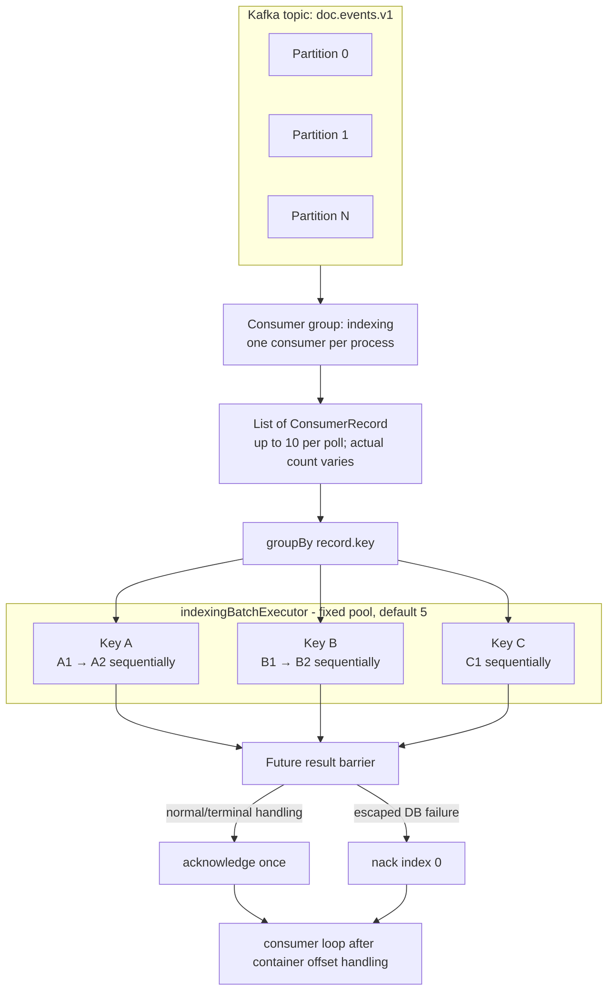
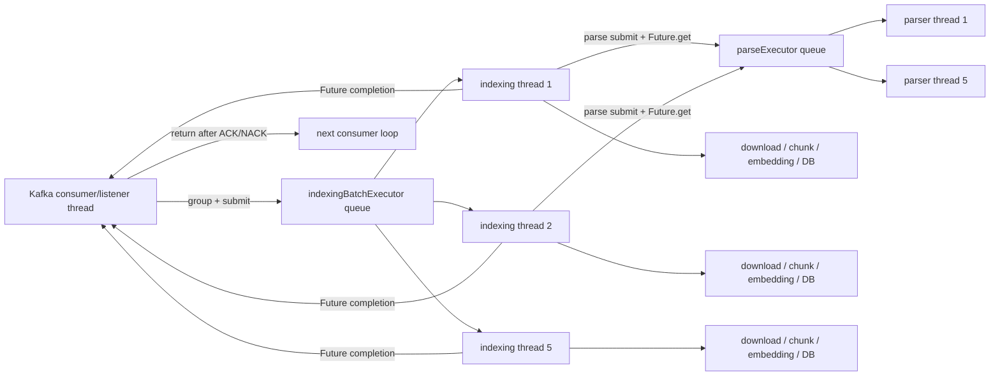
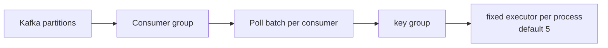

# Kafka Processing Model

This document describes the model used by the document indexing Worker for the
2026 Open Source Software Developer Competition's TmaxTibero corporate challenge,
“AI Document Management and Vector Synchronization System Based on Tmax
OpenSQL,” to execute Kafka records. It is based on the repository's current
production code, `application.yml`, resolved Gradle dependencies, tests, and
Dockerfile.

Its scope begins after a Kafka poll: records are delivered to the batch listener,
executed as per-key tasks, connected to either ACK or NACK, and returned to the
consumer loop. See [Worker Architecture](ARCHITECTURE_EN.md) for the overall
system structure and database transaction design, and [Failure Handling &
Recovery](FAILURE_HANDLING_EN.md) for detailed recovery policies covering
crashes, duplication, redelivery, and retries.

## 1. Purpose and Scope

The Worker's processing boundaries have three layers:

1. **Kafka boundary**: partition assignment, poll batch, consumer-group offset
2. **Execution boundary**: listener thread, record-key group, executor task,
   record pipeline
3. **Database boundary**: job-state transactions and the successful publication
   transaction

These boundaries do not coincide. One Kafka batch is not one database
transaction, and moving work to executor threads does not mean the listener
thread immediately returns to the next poll. The listener waits for the
submitted tasks' `Future` instances.

This document covers the normal execution model and how failures affect listener
completion, answering the following questions:

- How is a batch formed and divided into internal tasks?
- To what extent are same-key record ordering and different-key parallelism
  provided?
- What are the roles of the listener, indexing, and parsing threads?
- What result is treated as application-level completion?
- How do ACK/NACK calls relate to offset commits?
- How does processing time affect consumer liveness?
- How does parallelism change when the number of processes, consumers,
  partitions, or executor threads increases?

**How to recover on the next execution**, including state-specific job
reacquisition, duplicate-publish versus redelivery decisions, and
retryable/permanent error classification, is outside this document's scope and
is described in [Failure Handling & Recovery](FAILURE_HANDLING_EN.md).

## 2. Processing Model at a Glance



Receiving a batch does not itself provide parallel processing. Parallelism
arises when the listener divides the batch by `record.key()` and submits each
group as an executor task. The Kafka consumer thread waits for the `Future`
instances and therefore does not continue polling during this time.

## 3. Kafka Consumer Model

The Worker currently batch-consumes the `doc.events.v1` topic as part of the
`indexing` consumer group.

| Setting | Current value | Role |
|---|---:|---|
| listener type | `batch` | Deliver a record list in one listener invocation |
| ack mode | `MANUAL` | The application calls `Acknowledgment` |
| enable auto commit | `false` | Disable Kafka consumer auto-commit |
| max poll records | 10 | Maximum number of records in one poll |
| max poll interval | 900,000 ms | Maximum allowed interval of 15 minutes between polls |
| session timeout | 45,000 ms | Session threshold when consumer heartbeats disappear |
| heartbeat interval | 3,000 ms | Consumer heartbeat interval |
| listener concurrency | 1 | One Kafka consumer per process |

Topic partitions are assigned among consumers in the same consumer group. One
consumer may own multiple partitions, and the result of one poll may contain
records from several partitions. The listener groups tasks by record key, not by
partition.

## 4. Partitioning and Ordering

The Worker groups a batch by Kafka record key. Under the producer contract that
events for the same document use the same key and partition, Kafka's partition
order and sequential execution inside a Worker group preserve the order for one
document.

Within one batch, same-key records execute sequentially in input order as one
executor task, while different key groups execute in parallel as independent
tasks. Across batches, under normal partition ownership, the next consumer loop
begins after the current listener callback completes.

### 4.1 Ordering Boundary

The following ordering is not guaranteed:

- Database completion order for records with different keys
- Global order across different partitions
- Order when events for the same document use different keys or partitions

Even records with different keys in the same partition execute in parallel on
the executor, so their database side effects can complete in a different order
than their Kafka offsets. The batch-completion barrier prevents offset handling
from advancing past unfinished records, but does not make side-effect completion
order identical across groups.

## 5. Batch Processing

### 5.1 Batch Consumption

The Spring Kafka batch container passes the record collection obtained by the
Kafka client poll to the listener as a
`List<ConsumerRecord<String, String>>`. `max.poll.records=10` is not a fixed
batch size; it is the maximum number of records returned by one poll.

### 5.2 Batch Contents

One batch may contain all of the following:

- Multiple keys from the same partition
- Multiple records with the same key
- Records from multiple partitions assigned to the consumer
- Both `INDEXING_REQUESTED` and `DOCUMENT_DELETED`

The listener does not divide a batch by event type or partition. After key
grouping, each executor thread deserializes its records and routes them by event
type to either the indexing runner or deletion handler.

### 5.3 Benefits and Costs of Batching

A batch obtains several document keys from one poll and supplies them in
parallel to an in-process executor. The default `max.poll.records=10` and
executor size of 5 allow at most twice as many records as pool threads.

In exchange, Kafka offset handling waits behind the batch-completion barrier. If
one key group takes a long time, other groups that finish earlier also wait for
ACK. A batch does not provide database atomicity.

### 5.4 In-Batch Scheduling

#### Scheduling Algorithm

The listener executes in this order:

1. `records.groupBy { it.key() }`
2. For each group list, call
   `executor.submit { sameKeyRecords.forEach(::processRecord) }`.
3. Traverse the returned `Future` list in submission order.
4. Check completion or exceptions with each `future.get()`.
5. ACK, NACK, or propagate an exception based on the results.

It does not use coroutines, `CompletableFuture.allOf`, or reactive streams. It
uses a plain `ExecutorService` with blocking `Future.get()`.

#### Example: A1, B1, A2, C1, B2

Assume the input batch has this order:

```text
A1, B1, A2, C1, B2
```

Grouping produces:

```text
A → A1 → A2
B → B1 → B2
C → C1
```

With the default pool size of 5, the A, B, and C group tasks can execute on up
to three different executor threads. Within group A, A2 begins after A1 returns;
group B behaves the same way. Even if C1 finishes first, the listener cannot ACK
until it has also checked the Futures for A and B.

Each group's database transactions are independent. A failure in one group does
not roll back results already committed by another group at the batch level.
ACK/NACK and recovery by failure type are described in [Failure Handling &
Recovery](FAILURE_HANDLING_EN.md).

#### Completion Detection Order

The listener calls `get()` on Futures in group-task submission order. Therefore,
even if a later Future has already failed, the listener may not observe that
failure until an earlier long-running Future completes.

The implementation continues checking all remaining Futures after finding a
database failure. An unexpected non-database failure immediately throws an
`ExecutionException`, so a task later in the submission order may remain active
when the listener callback terminates.

## 6. Thread and Executor Model



### 6.1 Kafka Consumer/Listener Thread

The consumer thread:

- Receives batches and groups by key
- Submits group tasks
- Applies the `Future.get()` barrier
- Aggregates database failures
- Calls `Acknowledgment.acknowledge()` or `nack()`

Actual document download, parsing, chunking, embedding, and publication do not
execute directly on this thread. However, because the thread blocks while
waiting for Futures, it cannot perform the next poll in the meantime.

### 6.2 Indexing Batch Executor

`indexingBatchExecutor` uses Java 21's
`Executors.newFixedThreadPool(concurrency)` with a default size of 5. It limits
the number of different key groups that execute simultaneously. When the pool
is full, the remaining group tasks wait in the queue.

`INDEXING_CONSUMER_CONCURRENCY` controls the size of the in-process indexing-task
and parsing pools, not the number of Kafka consumers.

### 6.3 Parse Executor

At the parsing stage, each indexing thread submits a parser task to a separate
fixed pool and waits with `Future.get()` for at most the default
`INDEXING_PARSE_TIMEOUT` of 60 seconds. Thus, parsing occupies one indexing
thread and one parser thread simultaneously.

On timeout, the structure can call `future.cancel(true)` and `shutdownNow()`,
but the parser thread may remain occupied if the parser does not cooperate with
interruption.

### 6.4 Retry Thread Occupancy

Retries occur inside the same `IndexingPipelineRunner.run()` loop, not through
Kafka redelivery or a separate scheduler. When a retryable failure is recorded
as `RETRY_WAIT`, `ThreadSleepRetryWaiter` calls `Thread.sleep()` for the remaining
interval based on database time.

This sleep does not return the indexing-executor thread to the pool. A document
group in retry/backoff therefore continues to occupy one of the default five
slots. Later records in the same group wait as well.

### 6.5 Queue and Natural Backpressure

The unbounded queue itself has no application-level capacity limit. However, on
normal success and database-NACK paths, the listener does not return until the
current batch completes, so one consumer does not continuously poll new batches
and fill the queue without bound.

With the default batch, at most 10 group tasks are created. If five are running,
the rest wait in the queue. Increasing `INDEXING_BATCH_SIZE` can increase the
number of tasks queued by one batch accordingly.

An unexpected non-database failure propagates to the listener without waiting
for every later Future, so previously submitted tasks can remain. If container
error handling invokes the listener again, tasks from the previous invocation
and the new invocation may overlap, allowing the queue to grow beyond one batch.
Actual broker/container behavior on this path has not been integration-tested.

## 7. Record Processing Lifecycle and Execution Boundary

Each record is routed on an indexing-executor thread to either the indexing or
deletion path based on event type.

```text
ConsumerRecord
→ JSON deserialization
→ event routing
→ INDEXING_REQUESTED: IndexingPipelineRunner
   or DOCUMENT_DELETED: DocumentDeletionHandler
→ event handling completed
```

After job acquisition, `INDEXING_REQUESTED` proceeds through validation,
download, parsing, chunking, embedding, and publication. Parsing computation is
submitted to a separate parse executor and awaited, while embedding calls also
execute synchronously.

From the listener's perspective, record completion means that the current
execution policy returned normally. State-specific skipping and reacquisition,
duplicate-publish/redelivery decisions, and terminal-failure policy are
described in [Failure Handling & Recovery](FAILURE_HANDLING_EN.md).

| Boundary | Scope |
|---|---|
| Kafka poll batch | List of records delivered to the listener |
| Key-group task | List of records with the same record key |
| Record pipeline | Execution of one record's event handler |
| Kafka acknowledgment | Called in the listener after checking the batch result |

Neither a Kafka poll batch nor a key group is a database transaction boundary.
Detailed database transaction boundaries are described in [Worker
Architecture](ARCHITECTURE_EN.md); execution after failure and state convergence
are described in [Failure Handling & Recovery](FAILURE_HANDLING_EN.md).

## 8. Batch Completion and Offset Management

### 8.1 Success Condition

A batch is ACKed when:

1. All key-group Futures have been submitted.
2. Each `Future.get()` returns normally in submission order.
3. No escaped `DataAccessException` has been collected.
4. `ack.acknowledge()` is called once.

The Worker does not use per-record ACK or the partial-batch ACK API.

### 8.2 ACK Sequence

```mermaid
sequenceDiagram
    participant K as Kafka consumer/container
    participant L as Listener thread
    participant E as Fixed executor
    participant D as DB / external systems

    K->>L: Deliver poll batch
    L->>E: Submit every key-group task
    par group A
        E->>D: record pipeline A1 → A2
    and group B
        E->>D: record pipeline B1
    end
    L->>L: Future.get barrier
    E-->>L: all Futures successful
    L->>K: acknowledgment.acknowledge()
    Note over L,K: KAFKA_BATCH_ACK is logged after the API call;<br/>it is not a broker commit-completion log
    L-->>K: listener return
    K->>K: Process pending offset commits
    K->>K: next consumer loop / poll
```

With `AckMode.MANUAL`, the acknowledgment passes the processed offset to the
container. The current Spring Kafka container defaults `syncCommits` to true, so
it uses a synchronous path when it performs the actual commit. However, the
application does not separately record a callback containing the broker commit
result. The `KAFKA_BATCH_ACK` log is emitted immediately after `acknowledge()` and
before listener return. It must not be treated as evidence that the broker
commit completed.

### 8.3 Offset Boundary

On a normal ACK, the commit target for each partition is the offset immediately
after the last record processed from that partition in the current poll batch.
If a batch contains records from multiple partitions, their offsets are handled
together.

Per-record database transactions may already have committed independently, while
Kafka offsets remain behind the batch barrier. This difference allows successful
database work and uncommitted Kafka records to coexist.

### 8.4 Database Failure and NACK

If the direct cause of an executor Future is a `DataAccessException`, the
listener stores the first database failure and continues waiting for every
remaining Future. If it finds any database failure, it calls:

```text
ack.nack(0, INDEXING_DB_HEALTH_PAUSE_NACK_DELAY)
```

The default delay is five seconds. Because this is a batch listener NACK at
index 0, there are no earlier records to commit. The full current batch may be
subject to seek and redelivery by partition. The NACK delay pauses the entire
consumer; it is not a model that retries only one failed record.

The listener returns immediately after NACK. Database transactions from groups
that already succeeded are not rolled back. Subsequent redelivery idempotency
and state-specific recovery are described in [Failure Handling &
Recovery](FAILURE_HANDLING_EN.md).

### 8.5 Unexpected Exception

A non-database `ExecutionException` or an `InterruptedException` while the
listener is waiting propagates to the container without an explicit ACK/NACK.
This repository has no separate `CommonErrorHandler` configuration, so the
number of live-container reinvocations and their delay are not defined as
application policy.

An error handled to normal return by the pipeline's processing policy already
appears to the listener's explicit ACK/NACK decision as a concluded task. See
[Failure Handling & Recovery](FAILURE_HANDLING_EN.md) for exact error
classification and the recovery policy when state recording fails and an
exception reaches the listener.

## 9. Processing Time and Consumer Liveness

### 9.1 Executor Offloading Does Not Free the Poll Thread

Actual indexing runs on executor threads, but the listener thread blocks until
all Futures complete. Therefore, the entire batch time from receiving records in
the previous poll until the listener returns and the next poll begins counts
against the `max.poll.interval.ms` budget.

### 9.2 Heartbeat and Poll Interval

| Mechanism | Current value | Meaning for this Worker |
|---|---:|---|
| `heartbeat.interval.ms` | 3 seconds | Send consumer-membership heartbeats while the process is alive. |
| `session.timeout.ms` | 45 seconds | Broker threshold when heartbeats disappear because of process termination or communication loss. |
| `max.poll.interval.ms` | 15 minutes | Threshold when the process remains alive but cannot return to poll because of the listener callback. |

Moving work to Worker threads does not solve both heartbeat and poll issues.
Heartbeats may continue, but the consumer thread cannot make its next poll until
the batch-completion barrier, which may take longer than 15 minutes.

### 9.3 Batch-Time Model

Let `N` be the number of records in one poll batch, `K` the number of distinct
record keys, and `M` the number of executor threads. The current defaults are
`N ≤ 10` and `M = 5`.

The time for one key group `g` is:

```text
T_group(g) = Σ T_record(r),  r ∈ group(g)
```

Each record includes retries:

```text
T_record
  = Σ T_attempt(i)
  + Σ T_backoff(i)
```

Because group tasks run in a fixed pool, batch time is not always simply
`max(T_group)`.

```text
T_batch
  = makespan_M(T_group(1), ..., T_group(K))
  + listener/commit scheduling overhead
```

- `K ≤ M`: With enough threads, the slowest group generally dominates.
- `K > M`: Groups wait in the queue, creating multiple execution waves.
- If records concentrate on one key, their times add within that group;
  increasing the executor thread count does not parallelize the group.

To maintain stable consumer membership, actual operating time between polls
must remain below `900 seconds`. This repository has no end-to-end test for that
condition.

### 9.4 Lower Bound Calculable from Default Retry Backoff

The default maximum number of Worker attempts is 5, with linear backoff of
`30 seconds × attempt_count`. If the fifth attempt terminates the job, sleeps
occur after attempts 1 through 4 fail.

```text
Maximum Worker-level backoff for one record
= 30 + 60 + 90 + 120
= 300 seconds
```

This value does not include download, parsing, embedding, or database time.

| Default batch shape | In-process scheduling | Batch time possible from backoff alone |
|---|---|---:|
| 10 records, 10 keys | Up to 5 groups concurrently in a pool of 5, then queued groups | If every record exhausts retries, at least about 2 waves × 300 seconds = 600 seconds |
| 10 records, 1 key | 10 records sequentially in one group | If every record exhausts retries, 10 × 300 seconds = 3,000 seconds |
| Some keys heavily concentrated | Combination of long and queued groups | Depends on records per key and pool scheduling; the longest group strongly dominates |

The same-key path with 10 records exceeds the 15-minute poll interval from
backoff sleep alone. Even the 10-distinct-key case leaves only about 300 seconds
of theoretical margin after backoff, before actual attempt time is added.

### 9.5 Verifiable Components of Attempt Time

| Stage | Verified time-related setting | Impact on processing threads |
|---|---|---|
| S3 download | Default API call timeout of 30 seconds | Blocks an indexing thread |
| Parsing | Default parse timeout of 60 seconds | Occupies both an indexing thread and parser thread |
| Embedding | Spring AI/OpenAI client default request timeout of 60 seconds, up to 3 client retries | Calls embedding request batches sequentially while blocking an indexing thread |
| Worker retry | Up to 5 attempts, total backoff up to 300 seconds per record | Occupies an indexing thread during sleep |
| Database publication | No separate query/transaction timeout; up to 5,000 chunks by default, UPSERTed row by row | Blocks an indexing thread |

A document may be split across multiple embedding API requests, each of which
may trigger provider retries. The database also has no end-to-end record timeout.
Consequently, a reliable overall upper bound for `T_attempt` cannot be computed
from the current code and configuration alone.

### 9.6 Current Safety-Margin Assessment

The current settings do not justify the conclusion that the consumer always
returns to poll within 15 minutes. Clear paths exceed it when same-key
concentration, inline retries, provider retries, multiple embedding requests,
and row-by-row database UPSERT overlap.

## 10. Scaling and Backpressure

Kafka-level parallelism is bounded by topic partition count and consumer count.
Within one consumer, the executor additionally processes distinct key groups
from the current batch in parallel.



Let `P` be the partition count and `C` the number of consumers in the group. The
number of consumers that can simultaneously own and consume partitions cannot
exceed `min(P, C)`. Within one consumer, actual key-group parallelism is bounded
by the executor size and the number of distinct keys in the current batch.

Even with one partition, an executor can process multiple groups in parallel if
one poll batch contains several distinct keys. Conversely, even with many
partitions or executor threads, throughput does not increase proportionally if
records concentrate on one key or if the embedding API, Object Storage, or
database becomes the bottleneck.

### 10.1 Backpressure and Bottlenecks

#### Natural Backpressure

Because the listener waits at the current batch barrier, the consumer cannot
continuously receive new batches and accumulate them in application memory. If
processing is slower than input, the backlog appears primarily as Kafka consumer
lag rather than growth in the executor queue.

The cost of this backpressure is that one slow group delays both the consumer's
next poll and the batch ACK.

#### Main Bottlenecks

| Bottleneck | Condition | Impact |
|---|---|---|
| Concentration on one key | Batch records cluster on one document | Sequential execution within the group prevents full use of executor parallelism |
| One long document | Large file or many chunks/embedding requests | Delays the group Future and batch ACK |
| Inline retry/backoff | A transient failure requires waiting for retry | Occupies an executor thread while it sleeps |
| Embedding latency/quota | Several groups call the API concurrently | Increases latency and retries and occupies pool slots for long periods |
| Batch-completion barrier | One group runs for a long time | Groups that succeeded earlier also wait for ACK and the next poll |

## 11. Processing Design Decisions

### 11.1 Batch Listener

- **Context**: One poll must obtain multiple document tasks so a single consumer
  can process them in parallel.
- **Decision**: Use a batch listener and `max.poll.records`.
- **Consequence**: Key groups can run in parallel, but ACK/NACK and the next poll
  depend on the slowest task.

### 11.2 Record-Key Grouping

- **Context**: Consecutive events for the same document must run sequentially,
  while different documents should run in parallel.
- **Decision**: Create one group task per `ConsumerRecord.key()` and use
  `forEach` within the group.
- **Consequence**: Simple in-memory scheduling provides sequential execution,
  but the Worker does not validate the producer key/partition contract.

### 11.3 Fixed Executor

- **Context**: Concurrency for document groups using external APIs and local
  resources must be bounded.
- **Decision**: Use a fixed pool of five threads by default.
- **Consequence**: Active concurrency is bounded, but the queue is unbounded and
  retry sleeps occupy slots.

### 11.4 Blocking Completion Barrier

- **Context**: Submitting work to an executor does not mean that record
  processing has completed.
- **Decision**: The listener waits for results with `Future.get()`.
- **Consequence**: This prevents an ACK before processing, but even with executor
  offloading the consumer poll interval is affected by the full batch time.

### 11.5 Manual Batch ACK and Database NACK

- **Context**: Kafka offsets should advance only after checking each job's
  database result.
- **Decision**: ACK a normally concluded batch once; NACK from index 0 for an
  escaped database failure.
- **Consequence**: Application completion is linked to offset progress, but
  partially successful records can be redelivered and there is no
  database/Kafka atomicity.

## 12. Known Processing Limitations

1. **Executor offloading does not separate the poll lifecycle.** Because the
   listener waits at the Future barrier, the full batch time counts against the
   15-minute `max.poll.interval.ms`.

2. **The current default worst case can exceed the poll interval.** If 10 records
   with the same key each exhaust their retry budget, backoff alone totals 50
   minutes, before adding actual pipeline time.

3. **Retries do not release their threads.** A job in `Thread.sleep()` continues
   to occupy an indexing-pool slot.

4. **Non-database failure can break the complete barrier.** Depending on Future
   submission order, a listener exception may propagate to the container while
   a later task remains active.

5. **The batch-completion barrier has a broad impact.** If one group takes a long
   time, other groups that finish earlier also wait for batch ACK and the next
   poll.

## 13. Related Documents

- [README](../README_EN.md)
- [Worker Architecture](ARCHITECTURE_EN.md): Worker responsibilities and
  boundaries, building blocks, data/transaction structure, and architecture
  decisions
- [Failure Handling & Recovery](FAILURE_HANDLING_EN.md): Failure model, retries,
  redelivery, state-specific recovery, and guarantees
